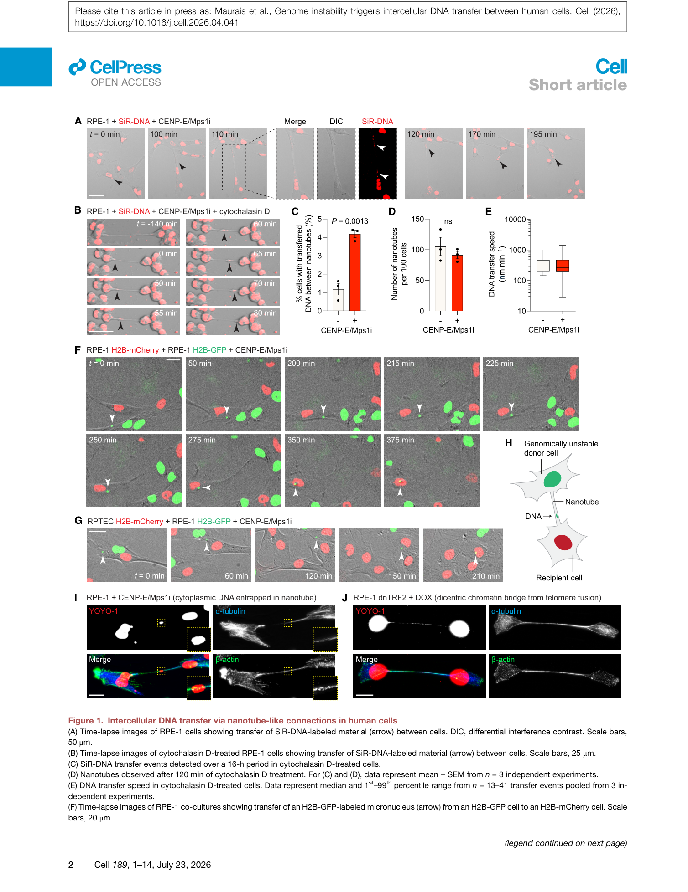
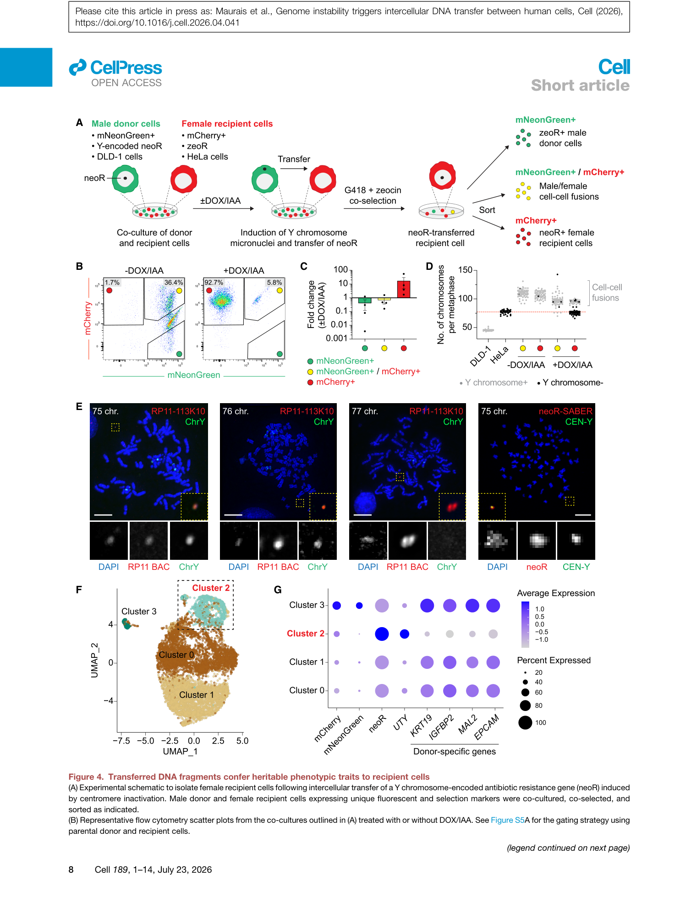

<!-- Generated by scripts/sync-wechat-articles.mjs. Do not edit manually. -->

> 本文同步自“现智研”微信推文工作区。发布日期：2026-05-29。来源：`articles/20260529/01_intercellular_dna_transfer.md`。

# 基因组不稳定之后，DNA 还能“传”给隔壁细胞？

如果一段染色体在细胞分裂中跑错了位置，通常我们会把它理解为这个细胞自己的麻烦：形成微核、触发 DNA 损伤反应，或者带来新的染色体重排。

这篇 Cell 文章把问题往前推了一步：这些跑到细胞质里的核 DNA，是否会影响旁边的细胞？

作者给出的答案很惊人：会。人类细胞之间可以通过依赖细胞接触、由细胞骨架支撑的纳米管样结构，把细胞质中的 DNA 片段转移给邻近细胞。更重要的是，转移过去的 DNA 并不只是“垃圾货物”，其中一部分可以在受体细胞中长期维持，甚至表达功能基因，给受体细胞带来可遗传的表型变化。

## 这项研究看到了什么？

研究团队首先用活细胞成像观察到，SiR-DNA 标记的 DNA 物质可以沿着细胞间连接结构移动。诱导细胞骨架扰动后，这类转移事件更容易被捕捉到；在 H2B-GFP 和 H2B-mCherry 标记的共培养体系中，作者还看到了带有染色质标记的微核样结构从一个细胞转移到另一个细胞。

随后，作者用多种方式制造基因组不稳定：有丝分裂纺锤体毒物、离子辐射、Cas9 诱导的染色体断裂。结果显示，不同来源的基因组损伤都能促进 DNA 转移。这说明它不是某一种药物或某一种细胞系的偶发现象，而更像是基因组损伤后暴露出来的一条通路。

## 最关键的问题：转移过去的 DNA 有用吗？

作者设计了一个非常漂亮的功能验证：让供体细胞的 Y 染色体携带抗生素抗性基因，再诱导 Y 染色体错误分离并形成微核。如果受体细胞最终获得抗性，就说明 DNA 转移不只是显微镜下的移动，而是发生了功能性遗传物质转移。

结果显示，诱导 Y 染色体错误分离后，受体细胞中相关阳性群体最高可比对照增加 55 倍。进一步的 FISH、PCR、RT-PCR、蛋白检测和单细胞 RNA 测序都支持一个结论：来自供体 Y 染色体的 DNA 片段可以以染色体外 DNA 的形式保留，并产生转录和蛋白表达。

## 为什么这件事重要？

我们通常把肿瘤中的基因组不稳定看成“细胞自治”的过程：某个细胞错了，后代跟着错。但这篇文章提示，损伤 DNA 可能通过细胞间转移影响邻近细胞，从而把基因组不稳定的影响范围扩大。

这对癌症演化尤其值得关注。肿瘤组织里细胞密度高、基因组损伤多、微核和染色体碎片常见。如果类似机制在体内也成立，肿瘤细胞之间可能存在一种类似“水平基因转移”的遗传信息传播方式。这不等同于细菌中的水平转移，但概念上很接近：遗传材料可以跨越细胞谱系边界。

## 需要谨慎的地方

这项研究主要是在细胞模型中完成，体内发生频率、哪些肿瘤类型更依赖这一机制、转移片段是否会系统性促进耐药和转移，还需要更多研究回答。

但它已经给了一个清晰信号：基因组不稳定的后果，可能不止发生在“出错的那一个细胞”里。细胞之间的物理连接，也许正在改写我们对肿瘤遗传演化边界的理解。

原文：Maurais et al. Genome instability triggers intercellular DNA transfer between human cells. Cell, 2026.

仅供学术交流，不构成医疗建议。

