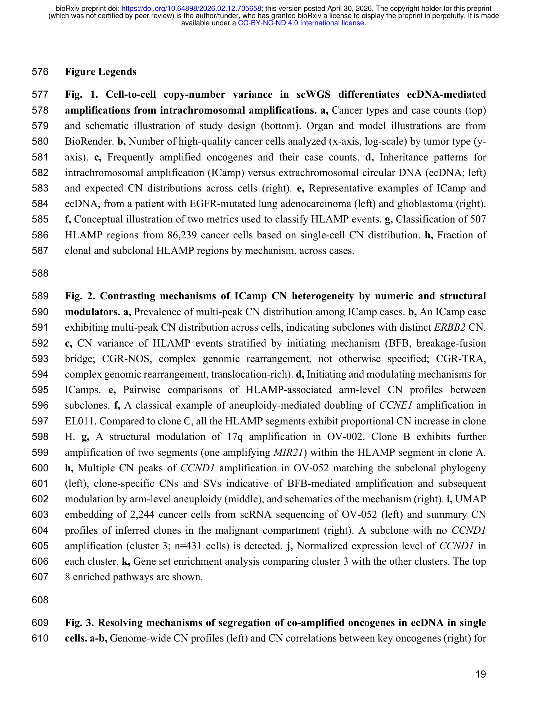
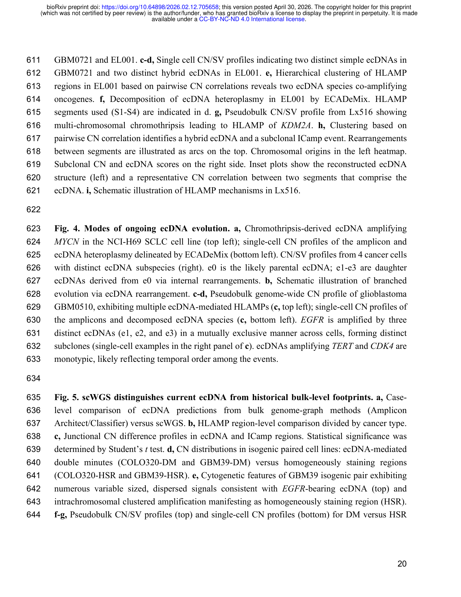

<!-- Generated by scripts/sync-wechat-articles.mjs. Do not edit manually. -->

> 本文同步自“现智研”微信推文工作区。发布日期：2026-05-29。来源：`articles/20260529/02_oncogene_amplification_86000_cells.md`。

# 8.6 万个单细胞基因组揭示：癌基因扩增不止一种“长法”

癌症里最常见、也最棘手的遗传事件之一，是癌基因高水平扩增。比如 EGFR、MYC、ERBB2、MDM2 等基因被复制很多份，肿瘤细胞就可能获得更强的生长优势。

但“扩增”只是结果。真正决定肿瘤如何演化、如何异质、如何耐药的，是扩增片段以什么形式存在：整合在染色体里，还是以 ecDNA 这种染色体外环状 DNA 的形式漂浮在细胞核中。

这篇 bioRxiv 预印本分析了 93 位患者和 9 个实验系统中的 86,239 个高质量癌细胞单细胞全基因组测序数据，试图回答一个核心问题：能不能从单细胞拷贝数分布中，读出癌基因扩增背后的机制？

## 关键发现一：ecDNA 和染色体内扩增的“分布形状”不同

如果扩增片段整合在染色体内，细胞分裂时通常更接近对称继承，因此不同细胞的拷贝数更容易聚在一个或几个窄峰上。作者称这类事件为 intrachromosomal amplification，简称 ICamp。

ecDNA 没有着丝粒，分裂时更容易不均等分配。因此，ecDNA 介导的扩增在单细胞层面呈现更宽、更连续、带有长尾的拷贝数分布，甚至会出现极高拷贝数的离群细胞。

基于这种差异，作者开发了机器学习分类器 eicicle。在 507 个高水平扩增区域中，模型将 72 个区域归为 ecDNA，435 个区域归为 ICamp。FISH 验证显示，被判定为 ecDNA 的模型中能看到分散的染色体外信号，而 ICamp 模型中则表现为染色体内聚集信号。

## 关键发现二：组织背景很重要

一个很有意思的结果是，ecDNA 型扩增并不是在所有癌种中平均出现。研究中 ecDNA 主要来自胶质母细胞瘤、小细胞肺癌和 EGFR 突变非小细胞肺癌；相反，尽管三阴性乳腺癌和卵巢癌有很多高水平扩增事件，却更常表现为 ICamp 的拷贝数峰形。

这提示 ecDNA 介导的癌基因扩增可能需要“允许它存在”的组织背景。换句话说，ecDNA 不是所有肿瘤都会选择的进化路线，而是一条有生态位偏好的路线。

## 关键发现三：ecDNA 也会继续演化

过去我们常把 ecDNA 看作一个扩增单元，但这项研究显示，ecDNA 内部可以发生重排，产生不同亚型。比如在某些胶质母细胞瘤中，EGFR 可以被多个不同 ecDNA 物种反复获得，呈现趋同演化。

这件事很重要：如果一个肿瘤细胞群里存在多个 ecDNA 亚型，那么单次取样、bulk WGS 或普通拷贝数分析很可能只看到平均信号，却看不到真正驱动耐药和复发的细胞群结构。

## 这给临床转化什么启发？

第一，判断“有没有扩增”还不够，未来更需要判断“扩增在哪里、如何继承、是否还在持续演化”。

第二，单细胞层面的拷贝数分布可能成为识别活跃 ecDNA 的重要读数。作者也指出，单细胞基因组识别与 bulk genome graph 预测之间存在明显不一致；后者有时会捕捉到历史痕迹，而不是当前仍被维持的 ecDNA。

第三，ecDNA 的治疗靶向可能需要按癌种、组织背景和克隆结构分层，而不能把所有癌基因扩增简单合并讨论。

原文：Lee et al. Evolution of oncogene amplification across 86,000 cancer cell genomes. bioRxiv, 2026.

仅供学术交流，不构成医疗建议。

