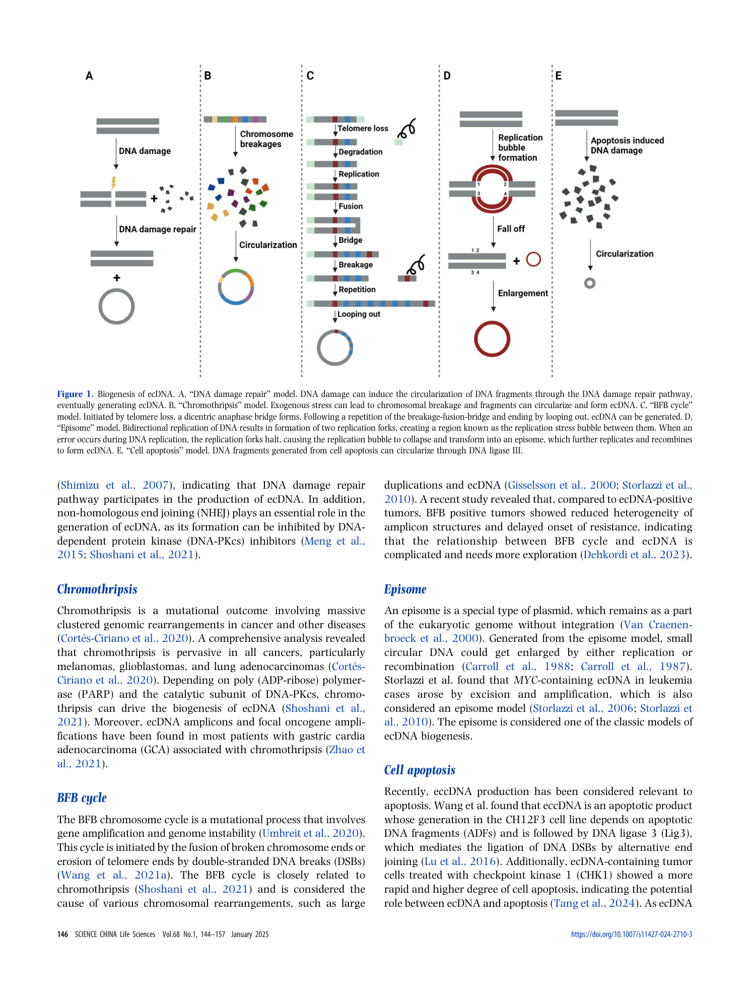
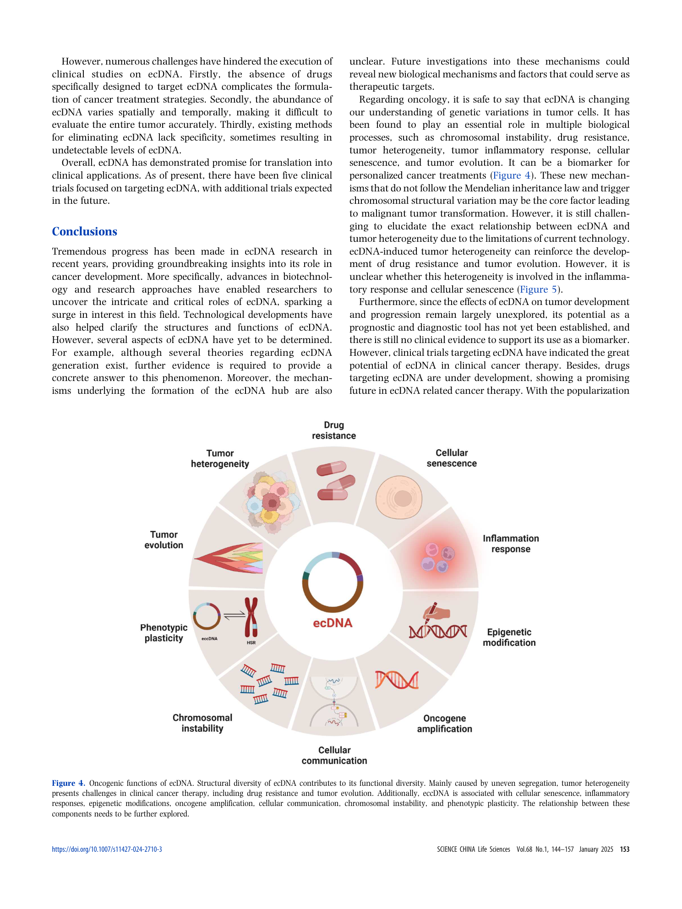

<!-- Generated by scripts/sync-wechat-articles.mjs. Do not edit manually. -->

> 本文同步自“现智研”微信推文工作区。发布日期：2026-05-29。来源：`articles/20260529/03_ecdna_as_oncogenic_driver.md`。

# ecDNA：癌细胞里的“外挂染色体”，为什么可能成为治疗新靶点？

ecDNA，全称 extrachromosomal DNA，是一种主要出现在肿瘤细胞中的染色体外 DNA。它通常呈环状，可以自我复制，并携带完整或部分基因片段。

如果说染色体是细胞遗传信息的“主硬盘”，ecDNA 更像癌细胞临时加装的高拷贝外挂模块：它不受经典染色体遗传规则完全约束，却能快速放大癌基因、加速肿瘤异质性和耐药演化。

这篇 Science China Life Sciences 综述系统梳理了 ecDNA 的产生、检测、功能和治疗潜力。对刚进入这一领域的读者来说，它很适合作为一张地图。

## ecDNA 为什么危险？

第一，它可以承载癌基因扩增。许多研究发现，ecDNA 上常携带 MYC、EGFR、MDM2、CDK4 等驱动基因。一旦这些基因以高拷贝形式存在，癌细胞就可能获得更强的增殖优势。

第二，它能制造肿瘤异质性。ecDNA 没有着丝粒，细胞分裂时不能像染色体那样稳定平均分配。结果是：同一个肿瘤内部，不同细胞可能拥有不同数量的 ecDNA，癌基因剂量也随之波动。这种不均一性为治疗压力下的选择提供了材料。

第三，它可能影响药物敏感性。某些耐药克隆可能通过保留、丢失或重塑 ecDNA 来改变癌基因拷贝数，从而在不同药物环境下切换状态。

## ecDNA 不只是“放大器”

综述强调，ecDNA 的功能不止是把癌基因拷贝数提高。它还可能参与染色体不稳定、炎症反应、细胞衰老、表观遗传调控、肿瘤免疫原性和细胞间通讯。

尤其值得关注的是 ecDNA hub。多个 ecDNA 可以在细胞核内聚集，使增强子和启动子发生跨分子互作，从而进一步提高癌基因表达。这意味着 ecDNA 不只是 DNA 拷贝数问题，也可能是三维基因调控问题。

## 治疗上能不能打 ecDNA？

综述提到，围绕 ecDNA 的治疗思路正在出现，包括干预 DNA 损伤修复、复制压力、染色体不稳定、ecDNA 维持和 ecDNA 相关转录调控等方向。

但目前仍有几个难点：

1. ecDNA 的形成机制还没有完全明确。
2. 临床样本中如何稳定、标准化地检测 ecDNA，仍需要技术成熟。
3. ecDNA 与预后、疗效和耐药之间的因果关系，需要更多前瞻性证据。
4. 靶向 ecDNA 可能带来新的选择压力，肿瘤是否会转向染色体内扩增或其他逃逸机制，也需要观察。

## 一句话总结

ecDNA 正在改变我们对癌症基因变异的理解。它不是染色体之外的边角料，而可能是肿瘤快速演化、异质性和耐药的重要发动机。

未来如果能把 ecDNA 检测、克隆演化分析和治疗分层结合起来，它有机会从“生物学现象”走向“临床决策变量”。

原文：Zhu, Huangfu et al. Exploring the potential of extrachromosomal DNA as a novel oncogenic driver. Science China Life Sciences, 2025.

仅供学术交流，不构成医疗建议。

