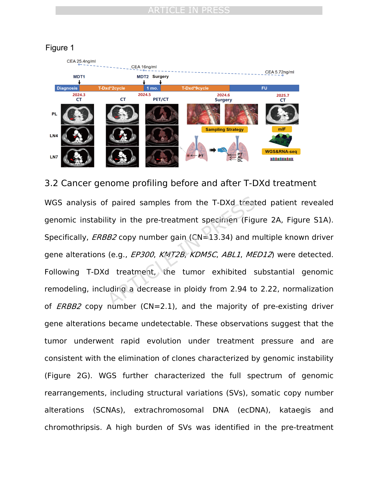
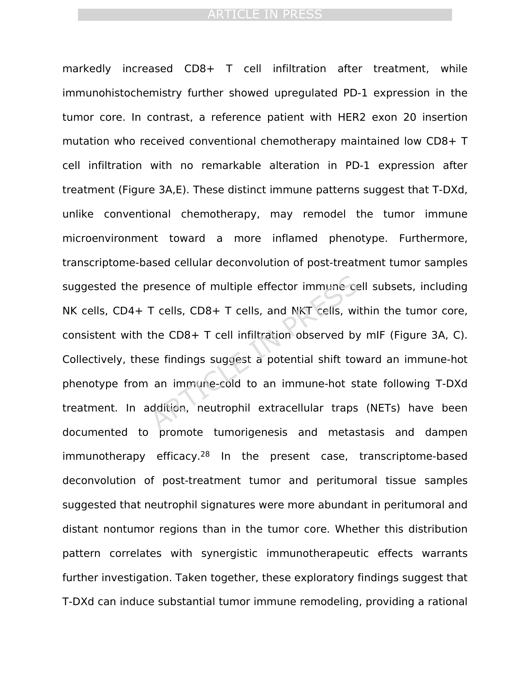

<!-- Generated by scripts/sync-wechat-articles.mjs. Do not edit manually. -->

> 本文同步自“现智研”微信推文工作区。发布日期：2026-05-29。来源：`articles/20260529/05_tdxd_her2_nsclc_ecdna.md`。

# HER2 突变肺癌新辅助 T-DXd：一次病例里的基因组与免疫重塑

HER2 exon 20 insertion 是非小细胞肺癌中的重要驱动改变。对于晚期 HER2 突变 NSCLC，T-DXd 已经显示出疗效；但在可手术、局部晚期患者中，把 T-DXd 用作新辅助治疗，证据仍然有限。

这篇 Scientific Reports in press 手稿报道了一例 HER2 exon 20 insertion 局部晚期肺腺癌患者接受新辅助 T-DXd 的病例，并结合全基因组测序和免疫微环境分析，观察治疗前后肿瘤的变化。

## 临床上发生了什么？

患者为 74 岁男性，右下肺病灶 4.0 × 2.1 cm，纵隔淋巴结受累，临床分期 cT2aN2M0，IIIA 期。驱动基因检测提示 HER2 exon 20 insertion。考虑年龄和合并症，患者未选择标准免疫化疗，而是在知情同意后接受 T-DXd 单药新辅助治疗，剂量为 5.4 mg/kg，每 3 周一次，共 2 个周期。

第一次疗效评估显示肿瘤缩小 47%，随后完成右下肺叶切除和淋巴结清扫。术后病理降期至 ypT1N2M0，残余活肿瘤细胞约 60%。截至 2025 年 10 月随访，患者已达到 16 个月无病生存。

## 基因组层面：ecDNA 相关克隆被明显重塑

治疗前样本显示明显基因组不稳定：ERBB2 拷贝数增益达到 CN=13.34，并伴随多种驱动相关改变。T-DXd 后，肿瘤倍性从 2.94 降至 2.22，ERBB2 拷贝数恢复到 CN=2.1，多数治疗前存在的驱动改变变得不可检测。

更有意思的是 ecDNA。治疗前肿瘤中存在两个 ecDNA 扩增子：一个位于 chr17，携带 ERBB2/CDK12；另一个位于 chr12，携带 MDM2/CDK4。治疗后，chr17 的 ERBB2/CDK12 ecDNA 信号消失；chr12 的 MDM2/CDK4 相关事件则表现为非环状的局灶扩增，提示治疗压力下发生了明显克隆筛选和结构重塑。

## 免疫微环境：从冷到热的线索

多重免疫荧光显示，T-DXd 后肿瘤核心 CD8+ T 细胞浸润明显增加，PD-1 表达也上调。相比之下，另一例接受常规化疗的 HER2 exon 20 insertion 参考患者，并未出现类似的 CD8+ T 细胞浸润和 PD-1 变化。

转录组去卷积也支持这一观察：术后肿瘤核心中可见 NK 细胞、CD4+ T 细胞、CD8+ T 细胞和 NKT 细胞等效应免疫细胞信号。作者据此提出，T-DXd 可能不仅杀伤肿瘤细胞，还可能把免疫微环境推向更炎症化的状态。

## 也要看到局限

这是一项探索性病例研究，而不是前瞻性临床试验。T-DXd 组只有一例患者，参考病例也不是严格匹配对照。因此，不能据此直接推断新辅助 T-DXd 的总体疗效，也不能证明免疫微环境变化一定由 T-DXd 单独造成。

同时，T-DXd 相关间质性肺病风险仍需高度关注。该病例在影像和组织分析中观察到肺部间质改变相关线索，作者也讨论了 SPP1、巨噬细胞、肥大细胞等可能参与机制，但这些仍属于假设生成阶段。

## 这篇文章的价值

它的价值不在于“证明一种新标准治疗”，而在于提供了一个可研究的样本：HER2 突变肺癌在 T-DXd 压力下，可能同时发生肿瘤克隆清除、ecDNA 结构重塑和免疫微环境改变。

未来如果能在更大样本中验证这些现象，ecDNA 与免疫状态也许可以成为判断 ADC 新辅助治疗反应的重要生物学窗口。

原文：Li et al. Tumor genome and microenvironment alteration by trastuzumab deruxtecan as neoadjuvant therapy for HER2-mutant NSCLC. Scientific Reports, 2026.

仅供学术交流，不构成医疗建议。

