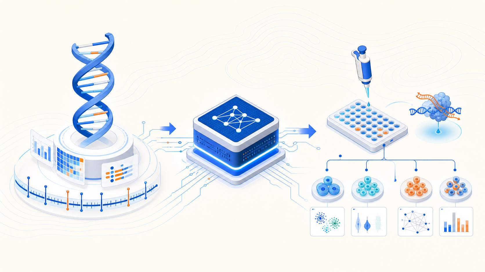
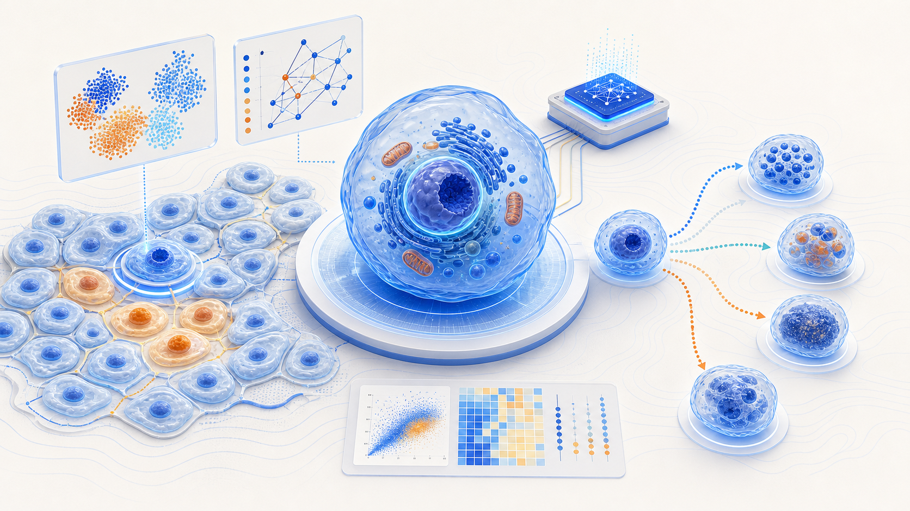
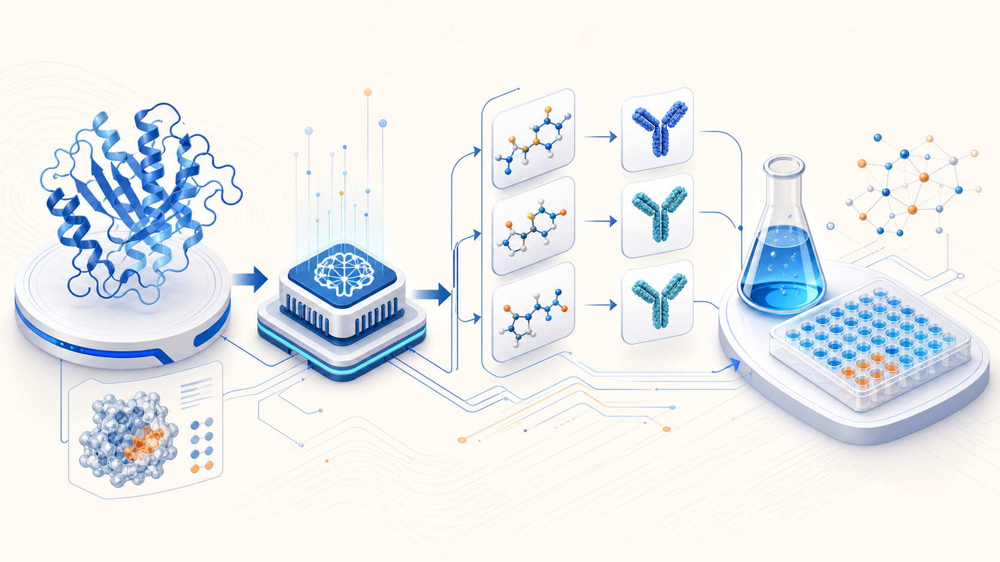
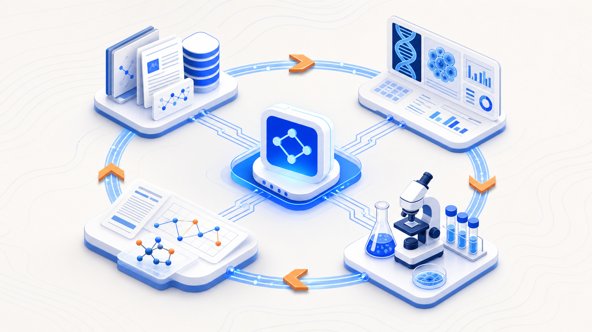

<!-- Generated by scripts/sync-wechat-articles.mjs. Do not edit manually. -->

> 本文同步自“现智研”微信推文工作区。发布日期：2026-06-01。来源：`articles/20260601/ai_in_biology_cshl90.md`。

# AI 不再只是工具：CSHL 第 90 届 Symposium 释放了哪些生命科学信号？

2026 年 5 月 26–31 日，Cold Spring Harbor Laboratory（CSHL）举行了第 90 届 Quantitative Biology Symposium。

这项始于 1933 年的系列会议，长期站在生命科学前沿。今年的主题只有四个词：

**AI in Biology。**

一篇会后发布的 LinkedIn 笔记，对会议中的部分报告进行了整理。结合 CSHL 官方议程，可以看到一个清晰趋势：

**人工智能正在从生物学的辅助分析工具，逐步变成驱动下一代科学发现的基础设施。**

过去，生命科学常常面临数据不足的问题。如今，单细胞测序、空间组学、蛋白结构、病理影像和高通量实验带来了海量数据。真正稀缺的，已经不只是数据，而是把数据转化为知识、因果关系和可验证假说的能力。

## 1. 基因组学：从读取序列走向理解调控

在基因组学领域，AI 模型正在尝试回答一个经典问题：

**一段 DNA 序列发生改变后，细胞究竟会发生什么？**

新一代基因组基础模型，不再局限于预测某个变异是否“有害”，而是希望同时推断：

- 基因表达是否改变
- 剪接模式是否异常
- 染色质可及性如何变化
- 转录因子结合是否受到影响
- 三维基因组结构是否被重塑

这对肿瘤研究尤其重要。癌症基因组中不仅有点突变，还有扩增、缺失、倒位、染色体碎裂和 ecDNA 等复杂结构变异。未来真正有价值的模型，需要把这些改变放回细胞状态和组织环境中理解。

但目前的挑战也很明确：罕见细胞类型、疾病状态、结构变异以及多突变组合的数据仍然不足。模型可以发现相关性，却未必真正掌握因果机制。

## 2. 从观察数据转向因果扰动

现代生命科学已经积累了大量“细胞现在是什么样”的数据。

但科研真正关心的往往是另一个问题：

**如果改变一个基因、加入一种药物、切换一种微环境，细胞接下来会怎样？**

这也是为什么 CRISPR 筛选、饱和突变实验和高通量报告基因实验越来越重要。它们提供的不是静态描述，而是扰动后的因果信息。

未来值得期待的科研模式是 **lab-in-the-loop**：

1. AI 根据已有知识提出最值得验证的实验。
2. 实验平台完成扰动和测量。
3. 新数据反馈给模型。
4. 模型更新假说，并提出下一轮实验。

在这个闭环中，AI 不只是“读结果”，还开始参与决定“下一步做什么”。

## 3. Virtual Cell：在计算机里先做一次实验

Virtual Cell，也就是数字细胞，是近年 AI 生物学最受关注的方向之一。

它的理想目标不是制作一个静态细胞图谱，而是建立可以模拟细胞行为的计算模型。例如：

- 模拟基因敲除后的变化
- 模拟药物处理后的反应
- 模拟疾病进展和耐药演化
- 模拟细胞在不同组织环境中的状态转换

真正困难的地方在于，细胞不是孤立存在的。它会受到免疫细胞、基质、营养条件、空间位置和时间过程的共同影响。

因此，Virtual Cell 的下一阶段，需要把单细胞组学、空间转录组、病理影像和动态扰动数据结合起来。模型不仅要知道细胞“是什么”，还要预测它“会变成什么”。

## 4. 蛋白设计：AI 正从预测走向创造

AlphaFold 让蛋白结构预测进入了新阶段。但现在，研究者已经不满足于预测天然蛋白质的样子。

AI 正在被用于设计：

- 新型功能蛋白
- 抗体
- 酶
- 细胞治疗工具
- 具有特定结合能力的分子

换句话说，AI 正从“解释自然界已有的蛋白质”，转向“创造自然界尚未出现的蛋白质”。

这一方向同样受到现实条件约束：计算机可以快速生成大量候选序列，但湿实验验证仍然昂贵且缓慢。如何让生成模型和自动化实验平台真正协同，是下一步的关键。

## 5. 空间生物学：位置本身就是信息

过去的组学研究常常把组织拆散成单细胞，再分析每个细胞的表达特征。

但在真实组织中，细胞所处的位置、周围有哪些邻居、是否靠近血管、免疫细胞是否能够进入肿瘤核心，都可能决定疾病进展和治疗响应。

空间转录组、蛋白定位和病理影像模型正在补上这一维度。

对肿瘤研究而言，这意味着未来不能只讨论“某个细胞表达了什么”，还要问：

**这个细胞在哪里？它与谁相邻？它所处的生态位如何塑造其命运？**

## 6. AI Agents：未来科研助手会做什么？

另一个不断升温的方向，是面向科学研究的 AI Agents。

理想状态下，科研 Agent 可以完成一系列长流程任务：

- 阅读和筛选文献
- 整理数据库
- 生成分析代码
- 调用生物信息学流程
- 比较模型结果
- 提出可验证假说
- 形成研究报告

这并不意味着 AI 会简单替代科学家。

真正重要的问题是：如何建立可靠的人机协作模式？如何验证 Agent 的推理过程？如何让论文、实验记录、阴性结果和数据处理步骤更容易被机器读取和追溯？

AI Scientist 的价值，不是把科研变成自动流水线，而是帮助研究者更快地探索更大的假说空间。

## 7. 对肿瘤进化与 ecDNA 研究的启发

如果把这些趋势放到肿瘤异质性和 ecDNA 研究中，可以看到几个很具体的方向。

### 基因组基础模型 + ecDNA 结构变异

ecDNA 不是简单的基因拷贝数增加。它涉及环状扩增子、断点、染色体碎裂、三维互作和癌基因转录调控。

未来模型需要同时理解“结构”和“功能”。

### 单细胞与空间组学 + 克隆演化

不同 ecDNA 拷贝数的肿瘤细胞，可能具有不同适应能力和药物敏感性。单细胞和空间组学可以帮助我们观察这些克隆如何竞争、迁移和形成耐药生态位。

### Virtual Cell + 药物压力模拟

如果数字细胞能够预测药物处理后的状态转换，就有机会模拟：

- ecDNA 的不均等分配
- 肿瘤克隆筛选
- 耐药亚群扩张
- 联合治疗的最佳时机

### AI Agent + 实验闭环

科研 Agent 可以从文献和数据库中提出候选靶点，自动生成分析代码，并根据实验结果迭代下一轮假说。

这可能是 AI 真正融入科研日常的入口。

## 结语

这场会议释放出的信号，不是“AI 可以帮助生物学家提高效率”这么简单。

更深层的变化是：

**生物学正在从描述生命，走向预测生命、模拟生命，甚至设计生命。**

AI 模型能否真正推动下一代医学创新，最终仍取决于高质量数据、因果扰动实验和严谨验证。但可以确定的是，AI 已经不再站在生命科学研究的外围。

它正在进入实验设计、机制推演和知识发现的核心环节。

---

参考资料：

1. Kavita Kulkarni. *Life is programmable, once data becomes knowledge*. LinkedIn, 2026.
2. Cold Spring Harbor Laboratory. *90th Symposium: AI in Biology*. 2026.

延伸阅读：

- LinkedIn 原文：https://www.linkedin.com/pulse/cshl-ai-biology-symposium-kavita-kulkarni-tfgge/
- CSHL 官方会议页面：https://meetings.cshl.edu/meetings.aspx?meet=SYMP

仅供学术交流，不构成医疗建议。

