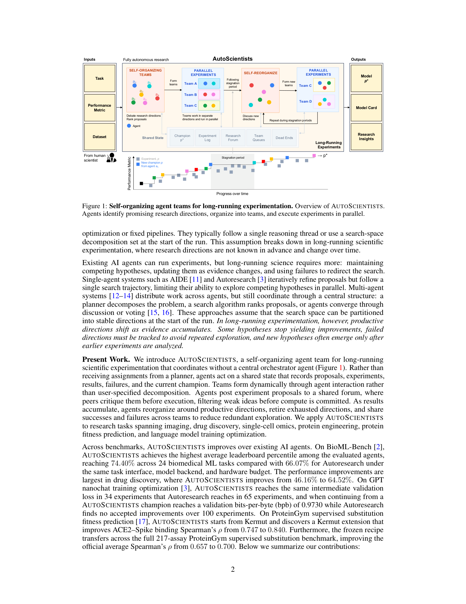
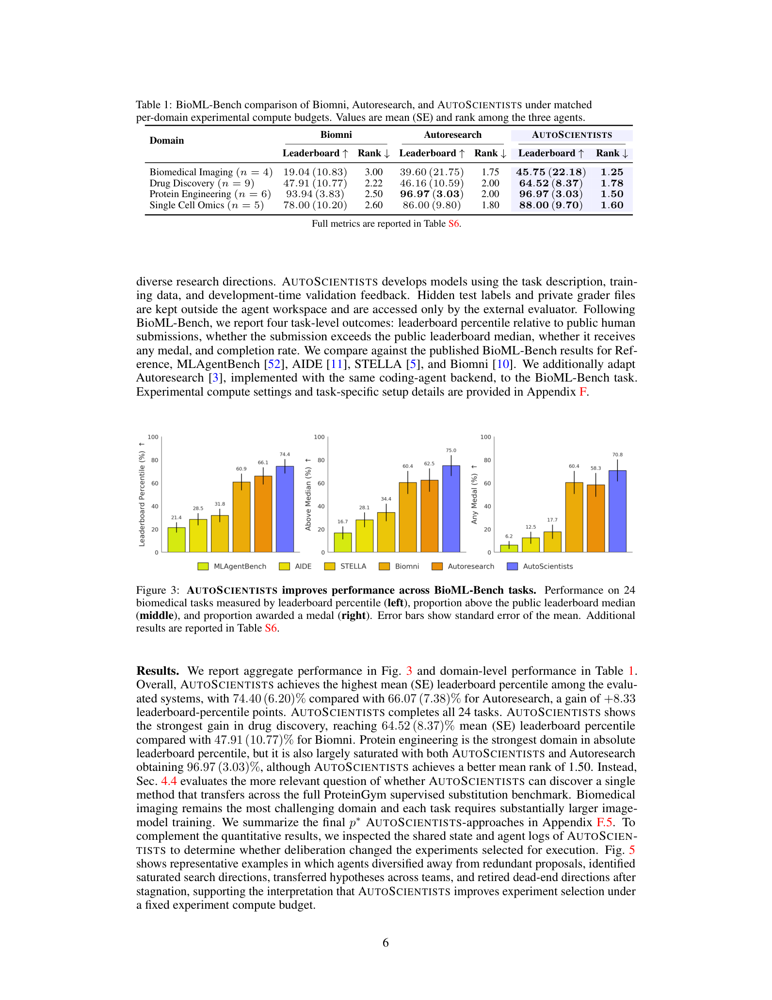
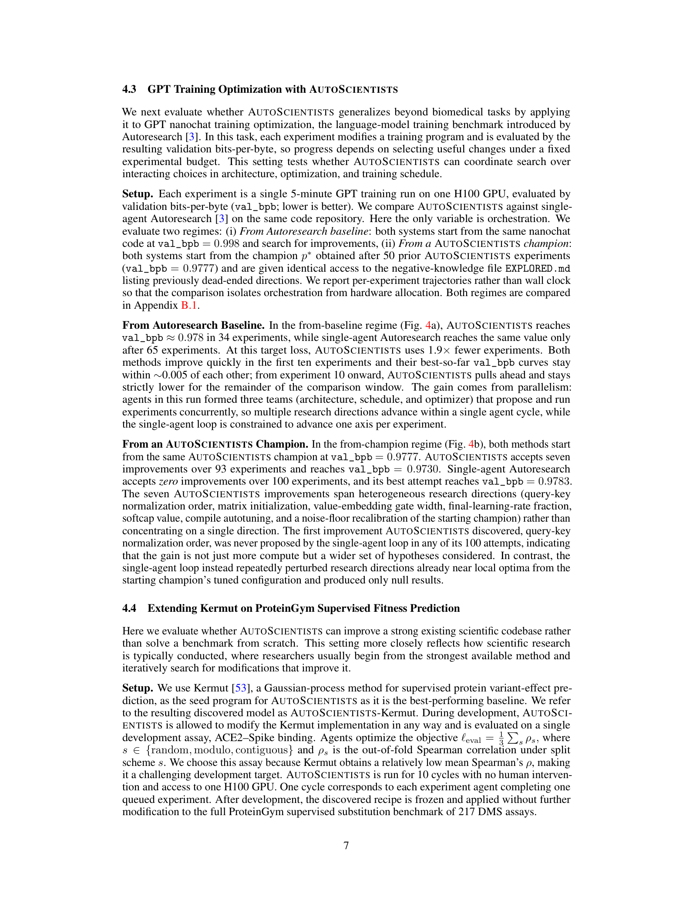
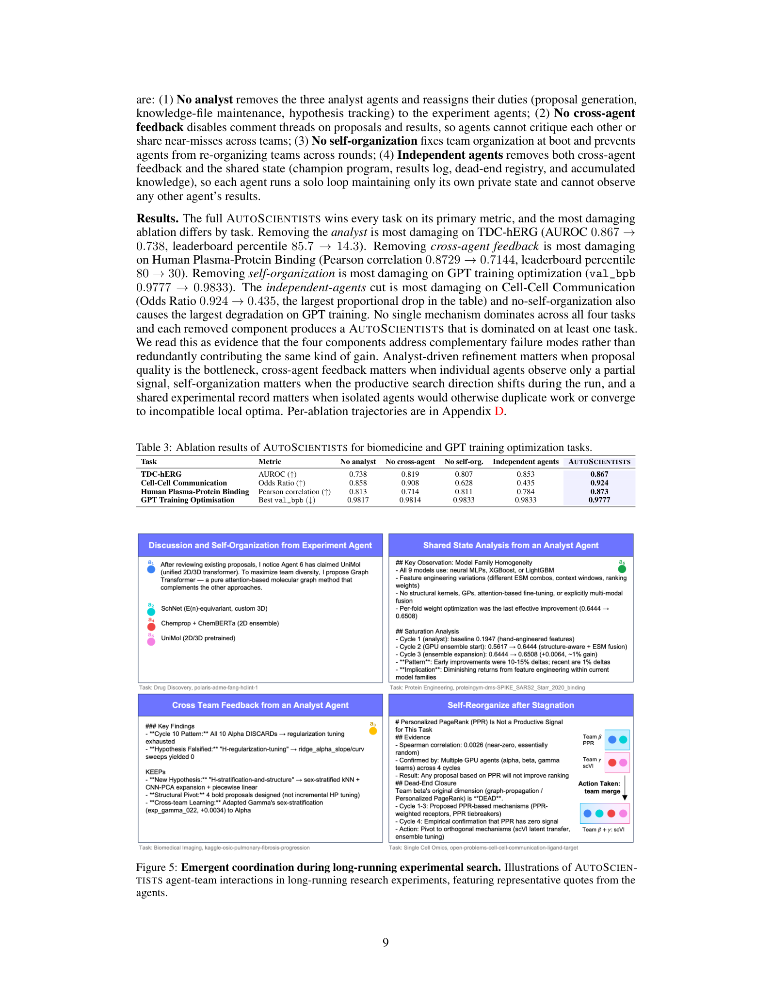

<!-- Generated by scripts/sync-wechat-articles.mjs. Do not edit manually. -->

> 本文同步自“现智研”微信推文工作区。发布日期：2026-06-03。来源：`articles/20260603/autoscientists_agent_teams.md`。

# AI 科学家不再单打独斗：哈佛团队提出自组织科研智能体 AUTOSCIENTISTS

过去一年，AI Agent for Science 迅速升温。

很多系统已经可以读文献、写代码、跑实验、调模型，甚至自动提出下一轮研究方向。但一个现实问题很快浮出水面：

**科研不是一条直线。**

真正的科学研究往往是长期、反复、并行的过程。一个方向可能突然停滞，一个失败实验可能提示新的路线，多个假说需要同时探索，团队成员之间也需要不断交换证据。

这篇新预印本提出的 AUTOSCIENTISTS，正是试图把“科研团队”的组织方式引入 AI Agent 系统。

论文标题是：

**AUTOSCIENTISTS: Self-Organizing Agent Teams for Long-Running Scientific Experimentation**

作者来自 Harvard University 和 Marinka Zitnik 团队。

## 1. 这篇文章想解决什么问题？

现有 AI 科研智能体大多有两个局限。

第一，很多系统像一个“单人研究员”，沿着一条轨迹不断试错。它可以迭代，但很难同时维持多个竞争假说。

第二，一些多智能体系统依赖中心规划器，把目标和分工一开始就定好。但长期科研中，真正有价值的方向经常是在实验过程中慢慢浮现的。

因此，作者提出一个核心问题：

**能不能让 AI Agent 像科研团队一样，自主形成小组、并行探索、记录失败、在停滞时重新组织？**

AUTOSCIENTISTS 的设计就是围绕这个问题展开。

## 2. AUTOSCIENTISTS 是怎么工作的？

这个系统不是让一个 Agent 从头跑到尾，而是由多个 Agent 共同维护一个共享实验状态。

这个共享状态包括：

- 当前最优模型或方案
- 实验日志
- 研究论坛
- 团队任务队列
- 已经证明走不通的方向
- 新的研究假说和模型卡片

Agent 会围绕有希望的假说自组织成多个团队。每个团队可以讨论方向、提出实验、互相批评，然后再消耗计算资源去执行。

当某个方向长期没有进展时，系统会触发重新组织：Agent 重新讨论、重新分队，并探索新的方向。

这和真实科研很像：不是一直沿着一条路线死磕，而是在证据积累后调整团队布局。

## 3. 生物医学任务：平均表现超过已有 Agent

作者首先在 BioML-Bench 上测试 AUTOSCIENTISTS。

BioML-Bench 包含 24 个端到端生物医学机器学习任务，覆盖：

- 生物医学影像
- 药物发现
- 蛋白工程
- 单细胞组学

在匹配实验计算预算的情况下，AUTOSCIENTISTS 达到平均 leaderboard percentile **74.4%**，高于 Autoresearch 的 **66.07%**，提升 **8.33 个百分点**。

其中，提升最明显的是药物发现任务：AUTOSCIENTISTS 达到 **64.52%**，而 Autoresearch 为 **46.16%**。

这个结果说明，对于复杂生物医学建模任务，单个 Agent 的线性试错并不总是最有效。多团队并行探索、共享失败经验和重新组织，可能更接近真实科研过程。

## 4. 长期实验：不是跑一次，而是持续改进

为了测试长期实验能力，作者还把 AUTOSCIENTISTS 用在 GPT nanochat 训练优化任务上。

在一个基线设置中，AUTOSCIENTISTS 用 **34 次实验** 达到验证集 bits-per-byte 约 **0.978**；Autoresearch 需要 **65 次实验** 才达到同样水平，相当于 **1.9 倍加速**。

更有意思的是第二个实验：当从一个已经很强的 AUTOSCIENTISTS champion 开始时，单智能体 Autoresearch 在 100 次实验中没有找到任何被接受的改进；而 AUTOSCIENTISTS 在 93 次实验中找到 **7 个 accepted improvements**，最终把 val_bpb 推到 **0.9730**。

这其实很关键。

很多自动科研系统在早期容易找到改进，但一旦进入平台期，就会重复尝试相似方向。AUTOSCIENTISTS 的共享 dead-end registry 和团队重组机制，正是为了减少这种重复失败。

## 5. 蛋白适应度预测：发现可迁移的方法

第三组结果来自 ProteinGym。

在 ACE2-Spike binding 的开发任务上，AUTOSCIENTISTS 基于 Kermut 发现了一个改进方案，把 Spearman 相关从 **0.747** 提升到 **0.840**，相对提升 **12.5%**。

更重要的是，作者把这个方案冻结后，直接应用到 ProteinGym 的全部 **217 个 DMS assays**。结果显示，平均 Spearman ρ 从 Kermut 的 **0.657** 提升到 **0.700**，相对提升 **6.5%**。

也就是说，AUTOSCIENTISTS 不是只在一个任务上“刷分”，而是发现了某种具有一定迁移性的建模 recipe。

不过作者也指出，该方法在排序指标上提升明显，但 MSE 略有增加。这提醒我们：AI 自动发现的方法仍需要专家判断，尤其是在多目标评价中，不能只看一个 leaderboard 指标。

## 6. 为什么自组织很重要？

作者做了消融实验，分别去掉：

- analyst agent
- cross-agent feedback
- self-organization
- shared state / independent agents

结果显示，完整 AUTOSCIENTISTS 在四个测试任务上都赢了。

更有意思的是，不同模块在不同任务里重要性不同：

- proposal 质量是瓶颈时，analyst 更重要
- 信号不完整时，跨 Agent 反馈更重要
- 研究方向发生变化时，自组织更重要
- 容易重复踩坑时，共享实验记录更重要

这说明 AUTOSCIENTISTS 的优势不是来自某一个花哨模块，而是多个机制共同补足长期科研中的不同失败模式。

## 7. 对生物医学研究有什么启发？

这篇文章对生物医学研究尤其有启发。

以肿瘤、ecDNA、单细胞组学和药物发现为例，一个真实项目往往包括：

- 文献与数据库整理
- 组学数据预处理
- 模型选择与特征工程
- 多种验证指标比较
- 失败假说记录
- 新实验方向提出
- 与湿实验结果反复对齐

这很难由一个 Agent 一口气完成。

更合理的模式可能是：

一个 Agent 负责文献与假说，一个 Agent 负责代码和模型，一个 Agent 负责结果审查，一个 Agent 负责失败路径整理，另一个 Agent 负责提出下一轮实验。

AUTOSCIENTISTS 的价值在于，它把这种“团队科学”的结构显式写进了智能体系统。

## 8. 也要看到限制

这篇文章并不是说 AI Agent 已经可以替代科学家。

作者也强调了几个限制：

第一，AUTOSCIENTISTS 并不追求更少的 LLM token。多智能体讨论、并行推理和重组，本身会消耗更多语言模型调用。

第二，在 BioML-Bench 的公平比较中，每个任务限制为一张 H100 GPU，因此系统的并行实验能力并没有完全释放。

第三，Agent 数量目前是预先设定的。未来更理想的系统，应该根据任务难度和平台期情况动态调整团队规模。

第四，自动发现的模型不能直接当作临床或生物学结论。尤其在生物医学应用中，任何结果都需要专家审查和独立验证。

## 结语

这篇文章给 AI for Science 提供了一个很重要的视角：

**下一代 AI 科学家，可能不是一个全能个体，而是一支会自组织、会分工、会记录失败、会在停滞时重组的智能体团队。**

这也许更接近真实科研的样子。

科学发现从来不是单线程推理，而是长期搜索、证据积累、团队协作和失败管理。

AUTOSCIENTISTS 的意义，正在于把这些“科研团队的隐性机制”，转化为可以运行、可以评估、可以改进的智能体系统。

---

原文：

Gao, Fang and Zitnik. *AUTOSCIENTISTS: Self-Organizing Agent Teams for Long-Running Scientific Experimentation*. arXiv:2605.28655v1, 2026.

项目主页：https://autoscientists.openscientist.ai

代码：https://github.com/mims-harvard/AutoScientists

仅供学术交流，不构成医疗建议。

