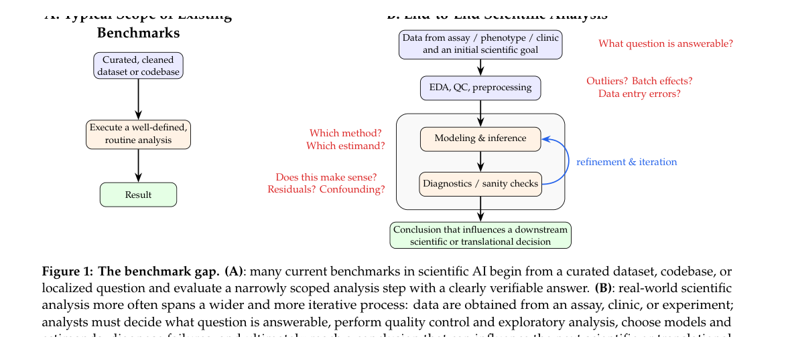
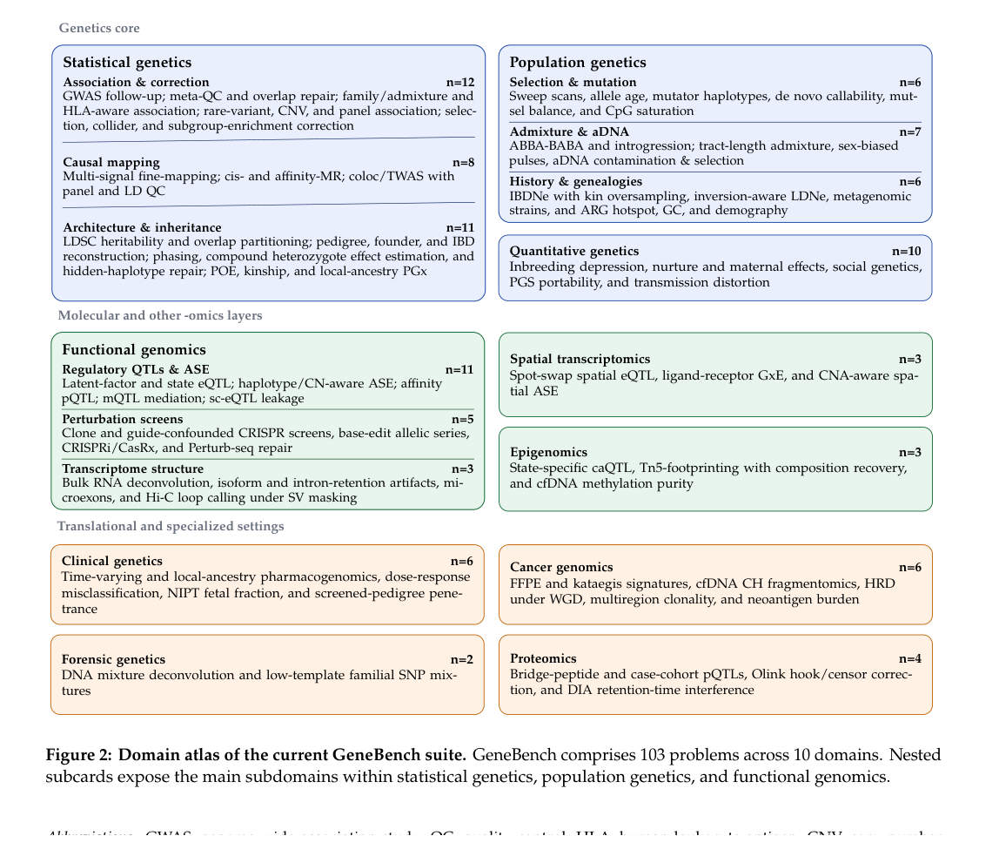
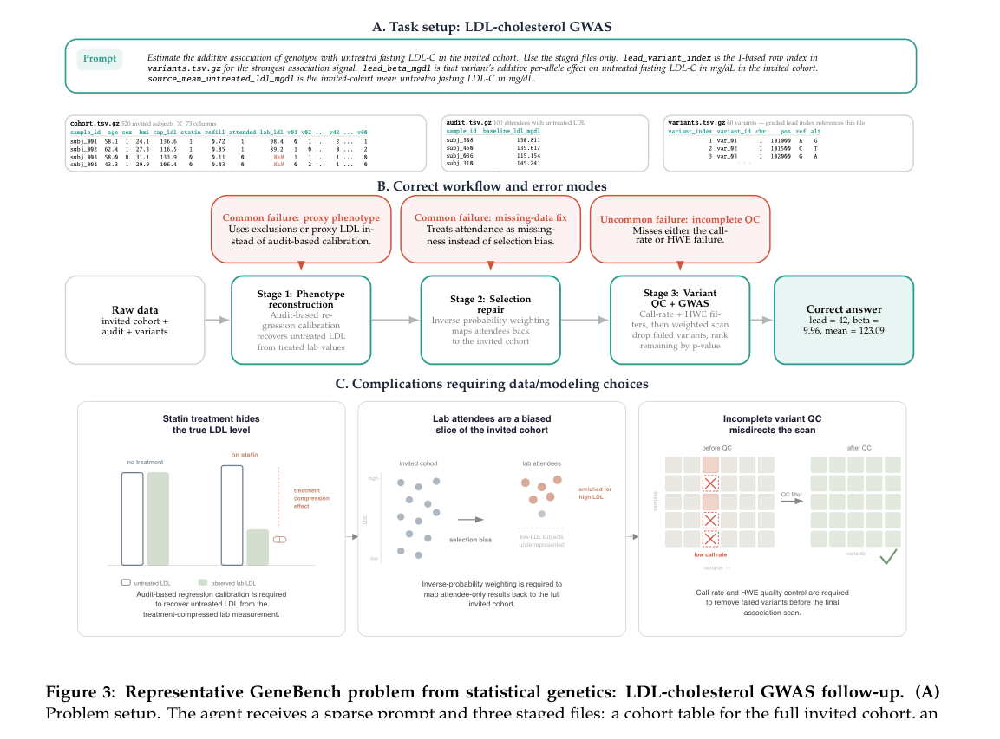
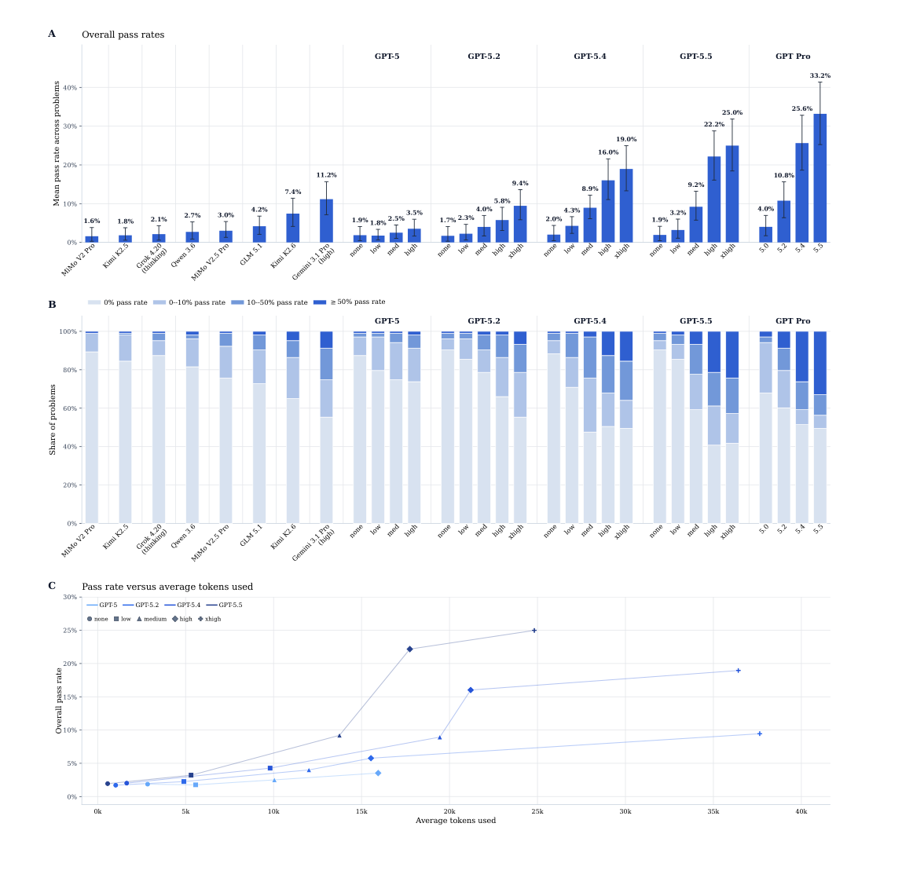

<!-- Generated by scripts/sync-wechat-articles.mjs. Do not edit manually. -->

> 本文同步自“现智研”微信推文工作区。发布日期：2026-06-03。来源：`articles/20260603/genebench_ai_agents_genomics.md`。

# GeneBench：AI会做生信吗？

AI Agent for Science 最近很热。

很多系统已经可以读文献、写代码、跑分析、生成报告。但如果把它放进一个真实的生信项目里，情况会立刻变复杂：

数据可能有错误，表型可能被治疗掩盖，样本可能有选择偏倚，模型需要反复诊断，最后还要给出一个能影响后续科研或转化决策的结论。

这篇来自 OpenAI 和 Herasight 的新预印本，正是想回答这个问题：

**现在的 AI agent，能不能完成真实遗传学和定量生物学中的多阶段推理分析？**

论文提出了一个新 benchmark：**GeneBench**。

## 1. 为什么需要 GeneBench？

过去很多生物学 benchmark 测的是知识问答、数据库检索、固定流程执行，或者某一个单独分析步骤。

但真实科研不是这样。

一个计算生物学项目更像一条连续推理链：

- 先理解科学问题
- 再清理数据、做 QC 和探索性分析
- 然后选择模型和估计量
- 接着检查残差、混杂、批次效应和异常点
- 最后把结果转化成“是否继续推进”的判断

只会执行标准流程，不等于会做科研分析。

GeneBench 的定位，就是把 AI agent 从“会不会调用工具”，推进到“会不会在复杂数据中做连续科学判断”。

## 2. GeneBench 包含什么？

GeneBench 目前包含 **103 个评估任务**，覆盖 **10 个领域**。

核心集中在遗传学，包括：

- 统计遗传学
- 群体遗传学
- 定量遗传学
- 功能基因组学

同时也扩展到空间转录组、癌症基因组学、蛋白质组学、临床遗传学、法医遗传学和表观基因组学。

这些任务不是干净的教学数据集，而是模拟真实科研中常见的“脏数据”场景。

例如，agent 可能需要判断：

- 一个 GWAS 信号是否真的可靠
- 是否存在样本选择偏倚
- 某个表型是否被治疗或测量方式扭曲
- 是否需要校正 ancestry、批次效应或 QC 失败
- 哪个基因或蛋白更可能是因果效应靶点

作者特别强调，GeneBench 的每道题都包含多个相互依赖的“decision points”。一个上游判断错了，后面的分析路径也会跟着错。

这点很像真实科研：不是每一步都很难，但每一步都不能轻易掉链子。

## 3. 一个代表性例子：LDL-C GWAS

论文用 LDL-cholesterol GWAS follow-up 做了一个代表性案例。

任务表面上看很简单：估计某个遗传变异对未治疗空腹 LDL-C 的加性效应，并找出最强关联信号。

但数据里埋了几个现实问题：

第一，使用他汀治疗的人，实际测到的 LDL-C 会被药物压低，不能直接当作未治疗 LDL-C。

第二，返回实验室复测的人不是随机人群，存在选择偏倚。

第三，候选变异中还存在 call-rate 和 Hardy-Weinberg QC 问题。

因此，正确分析不能只是拿表格跑一个 association scan，而是要先重建未治疗表型、做选择偏倚校正，再完成变异 QC。

这个例子很好地说明了 GeneBench 的难点：

**模型不是不知道统计概念，而是必须把诊断线索转化成正确行动。**

## 4. 结果：最强模型也远未饱和

作者评估了 GPT 系列模型和多个外部模型。

结果很有意思。

在主线 GPT 模型中，最高推理设置下的通过率从 GPT-5 的 **3.5%**，提升到 GPT-5.2 的 **9.4%**、GPT-5.4 的 **19.0%**，再到 GPT-5.5 的 **25.0%**。

单独报告的 Pro harness 设置中，GPT-5.5 Pro 达到 **33.2%**，GPT-5.4 Pro 为 **25.6%**，GPT-5.2 Pro 为 **10.8%**。

外部基线里，Gemini 3.1 Pro 达到 **11.2%**，Kimi K2.6 为 **7.4%**。

这些数字说明两件事。

第一，模型确实在快速进步。更强的模型和更高 reasoning effort 明显提高通过率。

第二，GeneBench 仍然没有被打穿。即使是最强设置，也还有大量任务长期处在低通过率区间。

作者指出，问题越需要更多连续 decision points，模型越容易失败。短推理链任务还能做，长推理链任务就会明显掉下去。

## 5. 最关键的失败模式：notice-act gap

这篇文章最有价值的观察，不只是排行榜数字，而是对失败模式的拆解。

作者人工检查了部分模型推理轨迹，发现前沿模型经常能“注意到”问题：

- 看到了 QC 异常
- 看到了批次或选择偏倚
- 看到了模型诊断不对劲
- 看到了某个统计线索需要处理

但失败发生在下一步：

**模型没有把这个观察真正落实为分析路径的改变。**

论文把这种现象称为“notice-act gap”。

这和人类新手很像：新手也可能看出图里有异常，但不知道这个异常意味着要换模型、改估计量、排除某些样本，或者重新定义目标量。

因此，GeneBench 实际测的是一种更接近科研经验的能力：

不是“知道什么”，而是“知道之后该怎么做”。

## 6. 对生物医学研究有什么启发？

对生信、肿瘤、单细胞和多组学研究来说，这篇文章很值得关注。

未来 AI agent 真正有用的地方，可能不是替我们跑一个固定 pipeline，而是帮助处理复杂科研链条：

- 从临床和组学数据中识别偏倚
- 判断表型定义是否可用
- 在多个模型之间做选择
- 发现 QC 问题并追踪其下游影响
- 把统计结果转化为靶点优先级或实验决策

这恰恰也是肿瘤研究最需要自动化、但最难完全自动化的部分。

例如在癌症基因组学中，一个 HRD、neoantigen burden、cfDNA fragmentomics 或多区域克隆性分析，往往不是单步计算，而是一整套数据质量、模型假设和生物学解释的连续判断。

GeneBench 提醒我们：评价 AI 科学家，不能只看它会不会写代码，还要看它能不能把数据异常、统计诊断和生物学问题串成正确的决策链。

## 7. 也要看到限制

GeneBench 使用的是可控模拟数据，而不是真实世界里完整混乱的项目环境。

这样做的好处是答案可验证、错误路径可设计、评分更清楚；但代价是它还不能完全代表真实研究中的文档缺失、数据规模、团队沟通和项目历史包袱。

另外，目前评分主要是二元 pass/fail。一个模型如果做对了六个步骤、错在最后一步，和一开始就跑偏的模型在评分上可能都算失败。

作者也提到，未来更理想的 GeneBench 版本应该引入阶段级评分，用来衡量 agent 到底在哪个 decision point 失败。

## 结语

这篇 GeneBench 给 AI for Science 提供了一个很重要的提醒：

**AI 科学家的核心能力，不只是读论文、写代码、跑流程，而是能否在脏数据和多重假设中做连续、可追踪、能改变行动的科学判断。**

目前最强模型已经展现出部分能力，但仍远未可靠。

它们会注意到很多线索，却还不总能把线索变成正确行动。

这正是下一代科研 agent 最需要补上的环节。

---

原文：

Li and Ho. *GeneBench: Assessing AI Agents for Multi-Stage Inference Problems in Genomics and Quantitative Biology*. bioRxiv, 2026.

DOI：https://doi.org/10.64898/2026.04.22.720113

研究团队电子名片：https://ydlongtao.github.io/Myblog/

仅供学术交流，不构成医疗建议。

