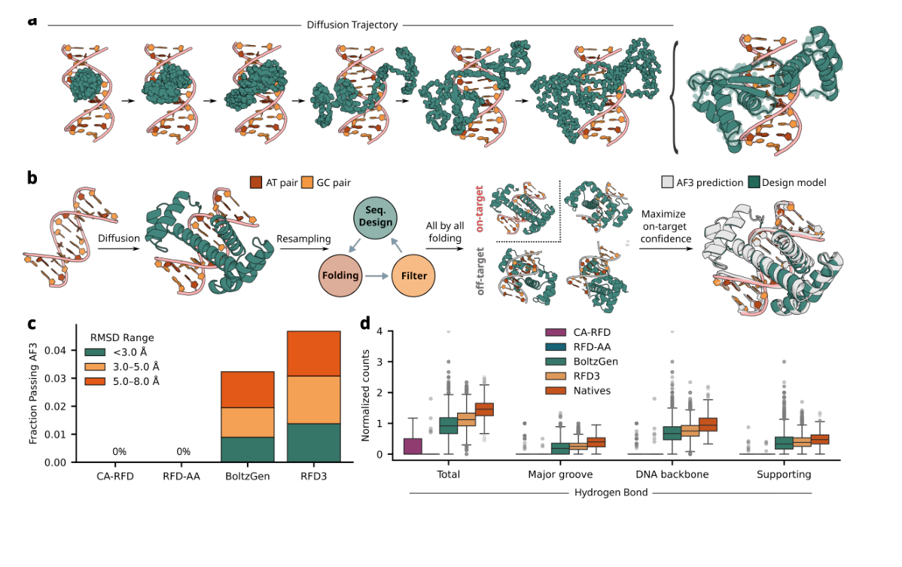
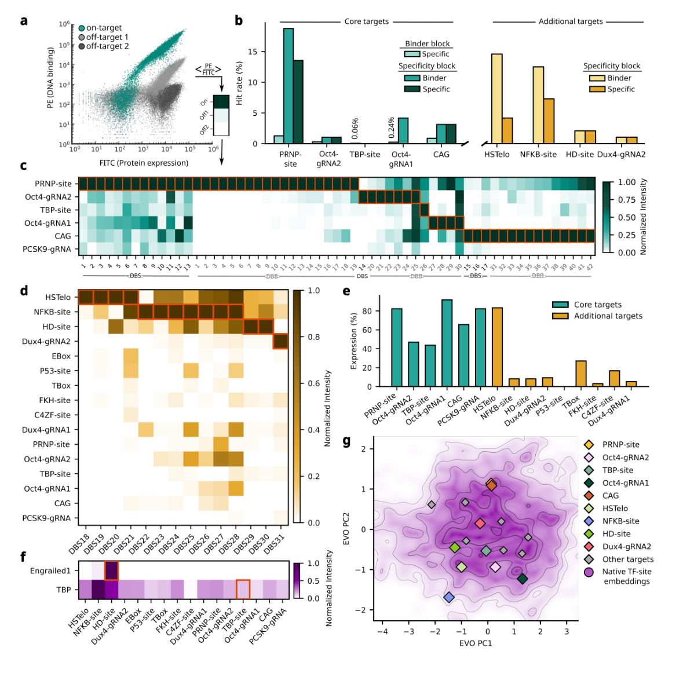
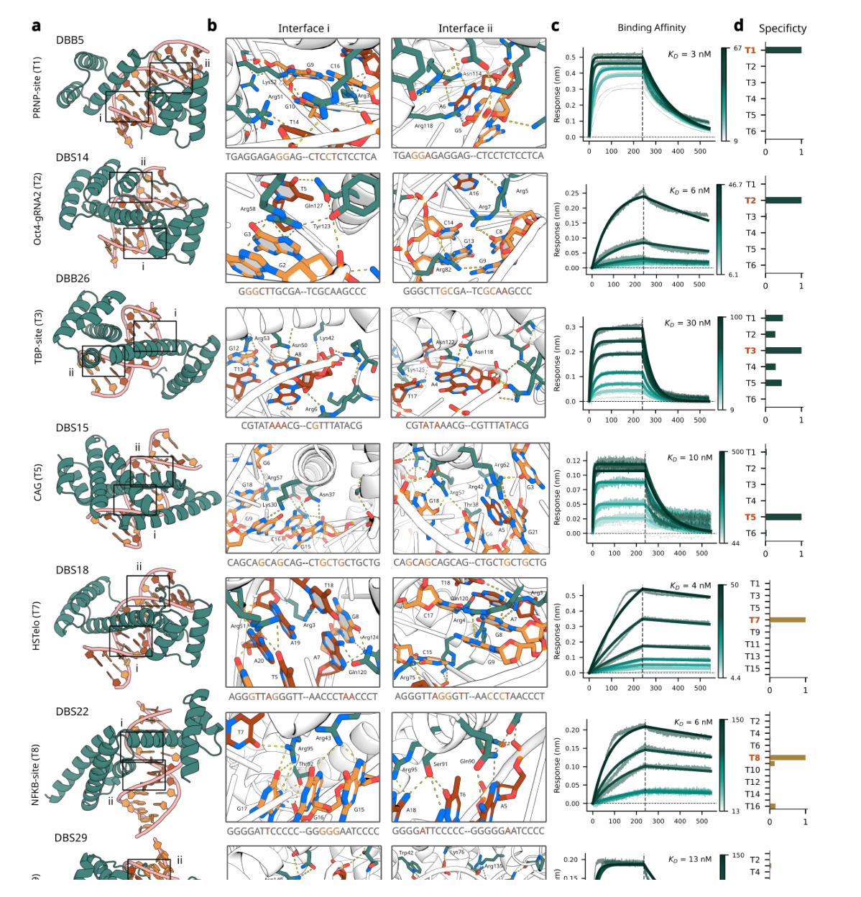
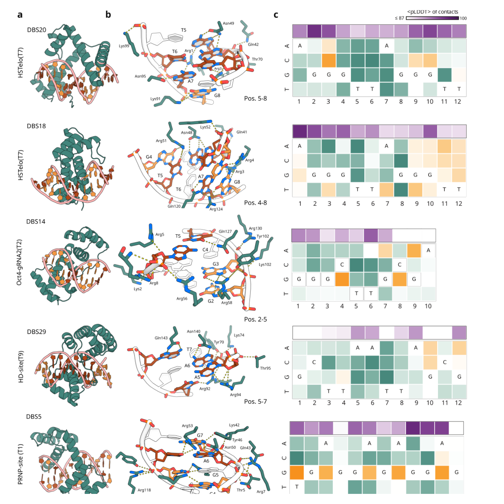

<!-- Generated by scripts/sync-wechat-articles.mjs. Do not edit manually. -->

> 本文同步自“现智研”微信推文工作区。发布日期：2026-06-03。来源：`articles/20260603/generative_dna_binding_proteins.md`。

# Baker：AI设计DNA结合蛋白

蛋白设计正在从“设计一个能结合蛋白的小分子/蛋白”走向更难的一步：

**设计一个能识别指定 DNA 序列的全新蛋白。**

这件事非常有吸引力。

如果我们能为任意 DNA 序列设计专属结合蛋白，未来就可能构建新的转录调控工具、基因组定位工具，甚至更小、更可编程的基因治疗元件。

但它也非常难。

因为不同 DNA 序列的整体形状很相似，真正决定识别特异性的差异，往往藏在碱基边缘、氢键网络、磷酸骨架形状和局部柔性里。

David Baker 团队这篇新预印本，给出了一个重要进展：

**他们用 RFdiffusion3、LigandMPNN 和 AlphaFold3，设计出了能选择性识别特定 DNA 序列的 de novo DNA binding proteins。**

## 1. 为什么 DNA 结合蛋白难设计？

过去要做 DNA 序列识别，常见路线包括 zinc finger、TALE 或 CRISPR-Cas 系统。

这些工具非常重要，但也有各自限制：

- zinc finger 和 TALE 依赖天然蛋白家族，可访问结构空间有限
- CRISPR-Cas 依赖核酸互补配对，但系统较大，且受 PAM 和 off-target 问题影响
- 传统计算设计往往需要大规模实验筛选，成功率不高

而 de novo 设计的目标更野心勃勃：

不从天然 DNA 结合蛋白出发，而是直接为目标 DNA 序列生成全新的蛋白结构。

难点在于，DNA 的 B-form 双螺旋在不同序列之间差异很细微。一个蛋白如果只是“喜欢负电荷的 DNA 骨架”，很容易变成非特异性结合。

所以这篇文章的核心策略是：

**既要设计能强结合目标 DNA 的蛋白，也要显式筛掉可能结合 off-target DNA 的设计。**

## 2. 设计流程：生成、重设计、预测、反向筛选

作者建立了一个以 RFdiffusion3 为核心的设计流程。

大致可以分成几步：

第一，用 RFdiffusion3 在目标 DNA 周围生成蛋白骨架，让蛋白沿着 6-10 bp 的 DNA 区域形成扩展接触。

第二，用 LigandMPNN 重新设计蛋白序列，使序列更匹配生成的结构。

第三，用 AlphaFold3 预测蛋白-DNA 复合物结构，筛掉与设计模型偏离太大的候选。

第四，用 AlphaFold3 同时预测 on-target 和 off-target DNA 结合情况，优先保留对目标序列更有信心、对 off-target 更不稳定的设计。

作者把前半段称为 **binder block**，主要解决“能不能结合”；后半段称为 **specificity block**，主要解决“是不是特异性结合”。

这一步很关键。

对于 DNA 结合蛋白，只做 on-target 正向设计往往不够。因为很多蛋白可能对多条 DNA 都能结合。

真正的突破来自负向设计：用 off-target 预测把“泛 DNA 结合蛋白”筛掉。

## 3. 实验验证：特异性设计成功率提高约 100 倍

作者首先选择了 6 个核心 DNA 目标序列，其中 5 个与治疗相关，另一个是 TATA box。

对于 specificity block，每个目标最终实验测试前 **96 个设计**。

结果显示：

- specificity block 在 6 个核心目标中，为 **4/6** 个目标找到 on-target binder
- 为 **3/6** 个目标找到特异性 binder
- 平均特异性成功率约 **3%**

相比之下，仅 binder block 的平均特异性成功率约 **0.5%**。

也就是说，引入 in silico 特异性筛选后，成功率提高约 **6 倍**。

更重要的是，与作者此前 de novo DNA binder 设计努力相比，综合流程的特异性设计成功率提高约 **100 倍**。

随后，作者又测试了 10 个额外目标，包括天然转录因子结合位点、人端粒重复序列 HSTelo，以及治疗相关靶点附近序列。

在这些更接近真实场景、序列重叠更高的目标中，作者仍然为 4 个目标找到了特异性 binder。

总体来看，通过 specificity block，作者只需要每个目标测试 96 个设计，就在 **7 个不同目标** 上找到了 **31 个特异性 binder**。

如果加上 binder block 的结果，最终在 **9 个目标** 上获得了特异性设计。

这对于 de novo DNA 结合蛋白设计来说，是一个明显的方法学跃迁。

## 4. 这些蛋白真的强结合吗？

作者进一步表达并纯化了 82 个设计蛋白，其中 46 个在大肠杆菌中可溶表达，并在 SEC 中表现为单体。

随后用 BLI 测定亲和力。

结果显示，多个设计蛋白对目标 DNA 的 KD 达到 **3-30 nM** 范围，属于低纳摩尔级别。

这说明它们不仅在 yeast surface display 中显示结合信号，也能作为纯化蛋白实现强结合。

从结构上看，这些蛋白并不是简单模仿天然转录因子。

作者提到，它们的氨基酸序列与已知蛋白没有关系，整体结构也和天然 DNA 结合蛋白差异很大。

但它们又具备类似天然转录因子的关键特征：

- 与 DNA 形成扩展界面
- 在碱基上形成氢键网络
- 通过磷酸骨架和 minor groove 实现间接读出
- 用蛋白内部相互作用预组织关键侧链

换句话说，生成模型不是复制自然界现成结构，而是在“重新发明”一套能读 DNA 的分子界面。

## 5. 单碱基分辨率：它们能读出哪些位置？

为了进一步测试特异性，作者做了单碱基变体竞争实验。

思路很直接：

把目标 DNA 的每个位置逐一突变，然后观察蛋白结合信号是否下降。

如果某个位置突变后结合明显变弱，说明该位置被蛋白“读到”了。

结果显示，多数代表性设计至少有 **7 个位置** 表现出碱基特异性相互作用。

例如，有的设计能强烈识别中心 GTTA 或 ATTC 序列，有的设计通过 major groove 氢键直接读出碱基，有的则通过 minor groove 形状和 DNA 骨架实现间接识别。

这部分结果很重要。

因为 DNA binding protein 的价值不只是“能粘住 DNA”，而是能区分相近序列。

如果未来要实现基因组位点级别的精准定位，就必须把这种序列读出能力进一步延长和增强。

## 6. 这篇文章的意义

这篇文章最重要的意义，是把 de novo 蛋白设计推进到更接近“可编程基因组识别”的方向。

过去 AI 蛋白设计已经能生成蛋白 binder、小分子 binder、酶和结构 scaffold。

但 DNA 是一个特殊靶标：

它结构重复、带强负电、序列差异细微，容易诱导非特异性结合。

因此，能从零开始设计出对特定 DNA 序列有选择性的蛋白，说明生成式模型已经开始触碰更精细的分子识别问题。

未来可能的应用包括：

- 新型转录因子
- 可编程基因调控模块
- 小型化基因组定位工具
- 与编辑酶、表观编辑器或转录调控域融合的合成生物学工具
- 更灵活的基因治疗递送元件

当然，这还不是终点。

## 7. 仍然存在的限制

作者也非常清楚地指出了限制。

第一，约一半目标在每个 96 个设计的规模下仍然没有找到特异性 binder。

第二，特异性还不是绝对的。当前实验只测试了有限 off-target，距离全基因组特异性还有很长距离。

第三，更严格的 off-target 筛选会降低表达率，提示 folding、binding 和 specificity 之间存在 trade-off。

第四，真正进入细胞环境后，还需要 ChIP-seq 等方法验证是否能在染色质环境中找到目标位点。

作者认为，未来可能需要把多个设计结构域模块化组合，或者延长识别界面，从 7-9 bp 识别扩展到更长序列，才可能达到基因组位点级别的选择性。

## 结语

这篇文章展示了一个非常清晰的趋势：

**AI 蛋白设计正在从“设计能结合的分子”，走向“设计能读出生物信息的分子”。**

DNA 结合蛋白不只是结构问题，也是信息识别问题。

如果生成式模型能学会在原子尺度上读出 DNA 序列，那么未来的基因调控、基因组工程和合成生物学工具箱，可能会拥有一类完全由 AI 设计的新元件。

这一步还早，但方向已经很清楚。

---

原文：

Sehgal, Politanska, Mitra, Kim et al. *Generative design of sequence specific DNA binding proteins*. bioRxiv, 2026.

DOI：https://doi.org/10.64898/2026.04.27.720408

研究团队电子名片：https://ydlongtao.github.io/Myblog/

仅供学术交流，不构成医疗建议。

