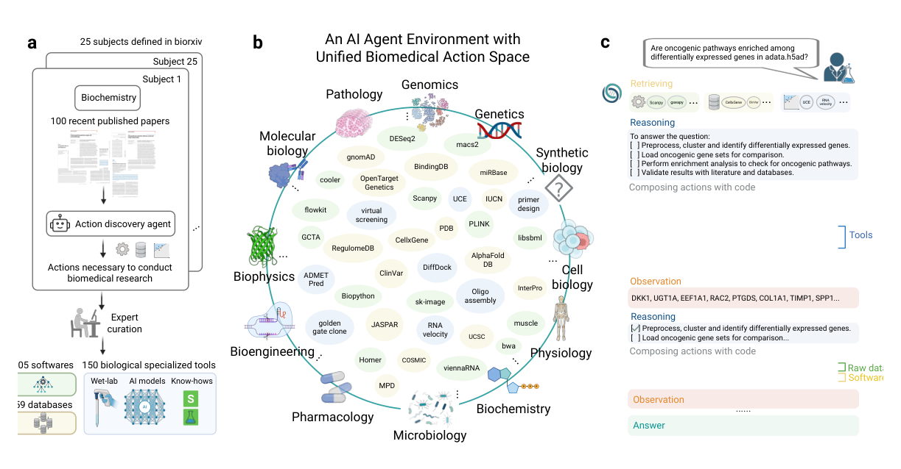
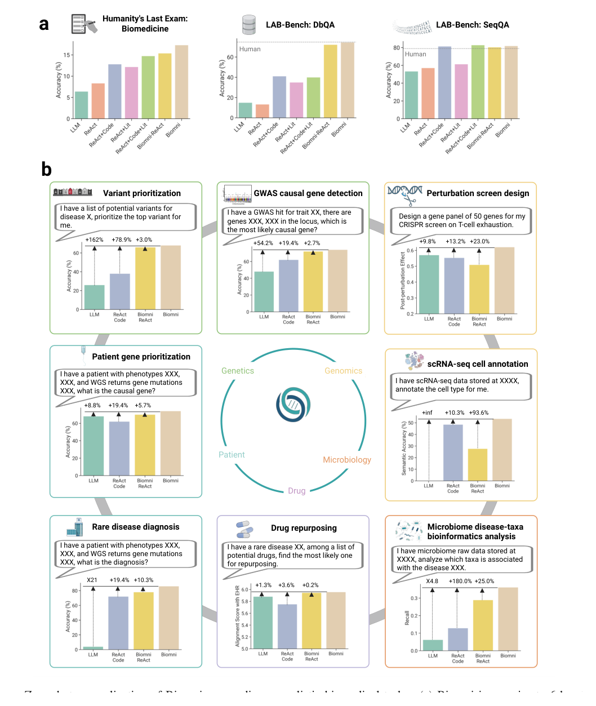
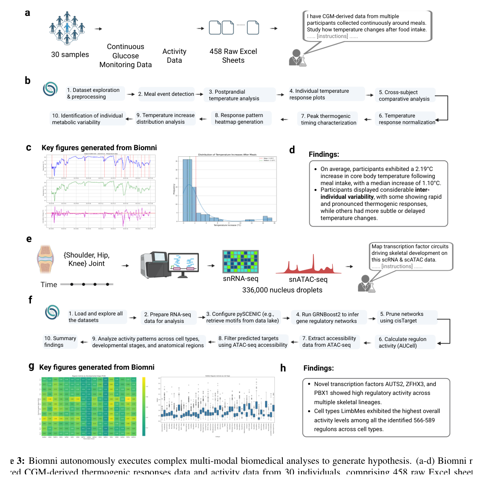
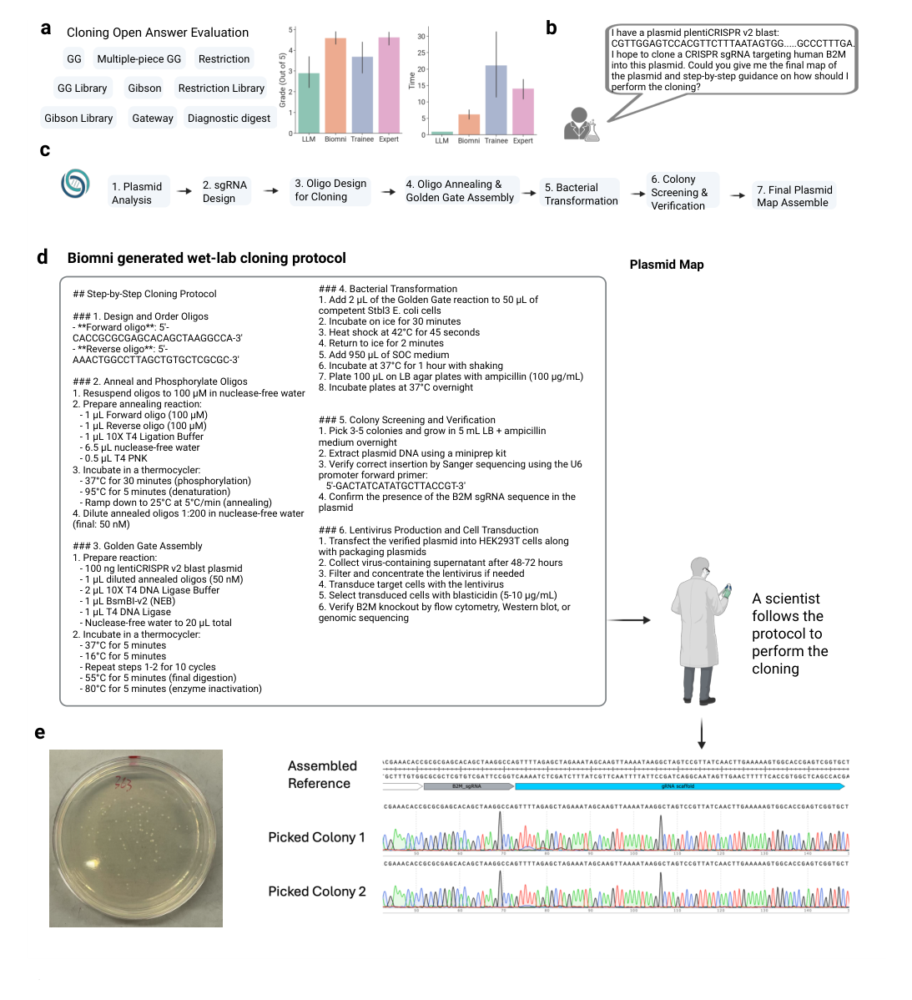

<!-- Generated by scripts/sync-wechat-articles.mjs. Do not edit manually. -->

> 本文同步自“现智研”微信推文工作区。发布日期：2026-06-04。来源：`articles/20260604/biomni_biomedical_ai_agent.md`。

# Biomni：虚拟AI生物学家来了

AI for Science 正在从“会回答问题”，走向“能真正做事”。

过去一年，我们看到很多科研 Agent：有的能读文献，有的能写代码，有的能跑生信分析，有的能辅助实验设计。

但真正的问题是：

**能不能做一个通用的生物医学 AI Agent，让它像虚拟生物学家一样，自己拆解任务、调用工具、分析数据、设计实验，并输出可验证的结果？**

Stanford、Genentech、Arc Institute 等团队这篇新预印本给出了一个很有代表性的答案：**Biomni**。

论文标题是：

**Biomni: A General-Purpose Biomedical AI Agent**

如果用一句话概括：

**Biomni 不是一个单点工具，而是一个面向生物医学研究的“行动系统”：把工具、数据库、软件、协议和代码执行环境组织起来，让大模型真正进入科研工作流。**

## 1. 为什么需要 Biomni？

生物医学研究正在被三件事卡住。

第一，数据越来越多。

测序、单细胞、多组学、可穿戴设备、临床记录和公共数据库都在快速增长。但大量数据并没有被充分分析，不是因为没有价值，而是因为人手和专业能力不够。

第二，工具越来越碎。

一个真实问题可能需要同时用到 Python、R、Bash、公共数据库、统计模型、可视化工具、实验协议和领域知识。

第三，科研工作流越来越长。

真实研究不是“问一个问题、给一个答案”，而是：

- 查资料
- 找数据库
- 选工具
- 写代码
- 清洗数据
- 做统计分析
- 画图
- 解释结果
- 设计下一步实验

这正是普通大模型最容易断掉的地方：它会推理，但没有足够完整的行动空间。

两篇中文参考文章也都强调了这一点：Biomni 的关键不是“懂生物医学知识”，而是把生物医学中可执行的知识组织成一个统一行动空间，让模型从“会想”变成“会做”。

## 2. Biomni 的核心：统一行动空间

Biomni 由两个核心部分组成：

**Biomni-E1**：生物医学行动环境。

**Biomni-A1**：会使用这个环境的通用 Agent。

作者先构建了一个统一的生物医学行动空间。具体做法是：从 bioRxiv 的 **25 个生物医学子领域** 中，选取每个领域最近的论文，让 action discovery agent 自动抽取其中常用的任务、工具、数据库和软件。

经过专家审核后，Biomni-E1 最终整合了：

- **150 个专业生物医学工具**
- **105 个软件包**
- **59 个数据库**

这一步非常关键。

传统科研 Agent 往往是为每个任务写一个固定流程：GWAS 一个流程，药物重定位一个流程，单细胞注释一个流程。

Biomni 的思路不同。

它先不急着定义任务模板，而是先定义“这个领域里有哪些可以执行的动作”。然后让 Agent 根据具体问题，自由组合这些动作。

这也是它被称为 general-purpose biomedical AI agent 的原因。

## 3. 从 tool calling 到 code as action

Biomni 另一个重要设计，是把代码作为统一动作接口。

很多 Agent 系统的工具调用，是把每个工具封装成一个固定函数，然后让大模型选择函数。

但生物医学研究太复杂了。

真实工作流经常需要：

- 循环处理大量文件
- 多步数据清洗
- 条件判断
- 统计建模
- 调用不同软件
- 查询数据库后再继续分析
- 出错后重试和 debug

固定函数接口很难承载这种复杂性。

因此 Biomni-A1 采用更接近 CodeAct 的方式：Agent 先检索相关工具、数据库和软件，再生成结构化计划，然后把每一步转化成 Python、R 或 Bash 代码去执行。

执行结果会反馈给模型，模型再决定是否修正计划、重跑代码，或进入下一步。

这也是两篇中文解读中反复提到的要点：

**代码不是附属输出，而是 Agent 与真实科研世界交互的通用动作语言。**

## 4. 评测：不只是考试题，也做真实任务

作者先在标准问答/推理 benchmark 上测试 Biomni。

在 LAB-Bench 的 DbQA 任务中，Biomni 达到 **74.4%**，接近专家人类水平 **74.7%**，明显高于 ReAct+Code 的 **40.8%**。

在 SeqQA 任务中，Biomni 达到 **81.9%**，超过人类水平 **78.8%**。

在 Humanity’s Last Exam 的生物医学子集上，Biomni 达到 **17.3%**，高于 base LLM 的 **6.0%**、coding agent 的 **12.8%** 和 literature agent 的 **12.2%**。

更重要的是，作者还构建了 8 个真实生物医学任务，覆盖：

- variant prioritization
- GWAS causal gene detection
- CRISPR perturbation screen design
- rare disease diagnosis
- drug repurposing
- scRNA-seq cell annotation
- microbiome disease-taxa analysis
- patient gene prioritization

在这些任务中，Biomni 相对 base LLM 平均提升 **402.3%**，相对 coding agent 提升 **43.0%**，相对 Biomni-ReAct 提升 **20.4%**。

这说明 Biomni 的优势不是单纯来自更强模型，而是来自“模型 + 行动环境 + 代码执行 + 检索规划”的组合。

## 5. 案例一：从 458 个可穿戴文件里生成假设

论文里第一个真实案例，是分析可穿戴设备数据。

研究者给 Biomni 的任务是：分析 30 名参与者的连续血糖监测、体温和活动数据，看看能否发现有意义的产热模式。

原始数据包括 **458 个 Excel 文件**，格式不统一、注释不一致、个体差异很大。

Biomni 自动生成并执行了一个 **10 步分析流程**：

- 探索和预处理数据
- 从血糖峰值推断进食事件
- 提取餐前/餐后体温窗口
- 做个体内归一化
- 比较跨个体温度反应
- 生成图表和报告

最终它发现，进食后核心体温平均上升 **2.19°C**，中位数为 **1.10°C**，并且不同个体之间存在显著差异。

同一案例中，Biomni 还分析了睡眠数据和多组学数据，把 CGM 信号与脂质组、代谢组、蛋白质组特征联系起来。

这个案例有代表性，因为它不是一道干净题，而是典型真实科研数据：文件多、格式乱、变量杂、问题开放。

这类任务往往最耗研究者时间。

## 6. 案例二：自动完成单细胞多组学分析

第二个案例更接近我们熟悉的生信场景。

研究者让 Biomni 分析一个人类胚胎骨骼发育数据集，包括约 **336,162 个单核 RNA-seq 和 ATAC-seq 数据**，并结合空间转录组。

Biomni 自动规划并执行了 10 个阶段：

- 加载和探索数据
- 准备 RNA-seq 分析
- 配置 pySCENIC
- 运行 GRNBoost2 推断调控网络
- 用 cisTarget 剪枝网络
- 用 AUCell 计算 regulon activity
- 提取 ATAC-seq accessibility
- 用染色质可及性过滤预测 target
- 比较不同细胞类型、发育阶段和解剖区域
- 总结结果并生成报告

最终，它不仅复现了 RUNX2 等已知骨形成调控关系，还提出 AUTS2、ZFHX3、PBX1 等潜在未充分报道的调控因子。

这说明 Biomni 不只是跑流程，也能把多组学结果整理成可进一步验证的生物学假设。

## 7. 案例三：设计湿实验克隆方案

更有意思的是湿实验。

作者让 Biomni 完成分子克隆任务，包括设计 sgRNA、设计 oligo、选择 Golden Gate 克隆策略、生成实验步骤、设计测序验证引物，并输出最终质粒图谱。

在一个真实任务中，研究者要求 Biomni 将靶向人 B2M 基因的 guide RNA 克隆进 lentiCRISPR v2 Blast 载体。

Biomni 生成了完整流程：

- 分析质粒结构
- 设计 Cas9 sgRNA
- 生成带 BsmBI overhang 的正反向 oligo
- 给出 oligo annealing 和 Golden Gate cloning 步骤
- 给出细菌转化和抗生素筛选步骤
- 设计 U6 promoter sequencing primer
- 模拟组装并输出最终质粒图谱

研究者按照 Biomni 的方案执行实验。第二天出现克隆菌落，挑取两个克隆后测序，结果都显示 perfect alignment。

这部分很重要。

因为它说明 AI Agent 不只是“写分析报告”，还可以进入实验设计和湿实验执行链条。

## 8. 从中文解读看 Biomni 的更大意义

你给的两篇中文参考文都把 Biomni 放在更大的 Agent 架构里理解，这个角度非常有价值。

第一篇更强调“通用个人智能助理”的类比。

如果 Biomni 是把科学家的任务拆成工具调用、数据库查询、代码分析和实验设计，那么通用个人助理也可以把生活/工作目标拆成跨 app、跨网页、跨文件和跨脚本的数字行动。

第二篇更强调“未来生物学是智能体驱动的”。

它把 Biomni 理解为一种虚拟生物学家：不仅能加速重复工作，还能并行探索大量假设，让科研从线性推进变成大规模并行搜索。

这两个角度合在一起，可以看到 Biomni 的真正启发：

**未来科研 Agent 的核心资产，可能不是某一个大模型，而是一个持续扩展的行动空间。**

模型会换，工具会换，数据库会更新，但只要行动空间和执行日志不断积累，Agent 的能力就会持续增强。

## 9. 开放生态和后续方向

论文中提到，Biomni 已经提供网页界面：

https://biomni.stanford.edu

代码也已经开源：

https://github.com/snap-stanford/biomni

GitHub 项目中还可以看到，Biomni 生态正在继续扩展，包括 MCP 支持、Know-How Library、Biomni-Eval1，以及基于强化学习的 Biomni-R0。

其中 Biomni-R0 被描述为面向生物学推理和工具使用的 reasoning model，目标是通过 agent 交互数据强化长链推理和自我纠错。

这也呼应了论文讨论部分：下一步不仅是把更多工具接进来，还要让 Agent 在规划、执行、失败修正和生物学综合判断上持续变强。

## 10. 仍然要保持清醒

Biomni 很强，但它还不是完全自主科学家。

作者也明确指出，它仍然存在限制：

第一，评估任务只是生物医学的一部分，还没有覆盖全部研究场景。

第二，action discovery 更偏近期文献，可能遗漏经典但仍然重要的方法。

第三，在需要复杂临床判断、新实验思想、分析方法创新或深层生物学综合的任务上，Biomni 仍然不等于人类专家。

第四，任何涉及临床、药物和实验决策的结果，都需要专家复核和独立验证。

所以，Biomni 最合理的位置不是“替代科学家”，而是成为科学家的操作系统和副驾驶。

它能把大量重复、碎片化、跨工具的工作自动化，让人类研究者把更多精力放在提出好问题、判断结果可信度和设计关键验证实验上。

## 结语

Biomni 的意义，不只是又多了一个生物医学 AI 工具。

它提出了一种更系统的科研 Agent 范式：

**用统一行动空间承载领域能力，用代码作为动作接口，用检索增强规划选择资源，用执行反馈闭环修正路径。**

如果说过去的大模型像一个懂很多知识的研究助理，那么 Biomni 更像一个开始拥有实验台、数据库、软件环境和工作日志的虚拟生物学家。

这条路还很长，但方向已经清楚：

未来的 AI for Biology，不会只是“问答系统”，而会越来越像一个可以真正进入科研现场的生物医学操作系统。

---

原文：

Huang, Zhang, Wang, Qu et al. *Biomni: A General-Purpose Biomedical AI Agent*. bioRxiv, 2025.

DOI：https://doi.org/10.1101/2025.05.30.656746

官网：https://biomni.stanford.edu

代码：https://github.com/snap-stanford/biomni

参考中文解读：

https://mp.weixin.qq.com/s/8e5_amR0x-kLncHctuDy-Q

https://mp.weixin.qq.com/s/gegILE2MqJ6eR0Ep_Q3LRA

研究团队电子名片：https://ydlongtao.github.io/Myblog/

仅供学术交流，不构成医疗建议。

