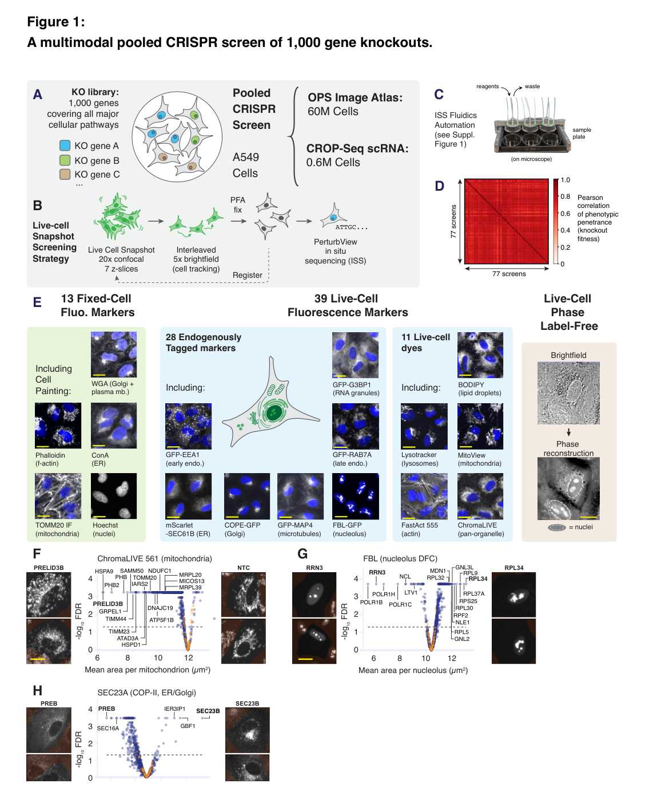
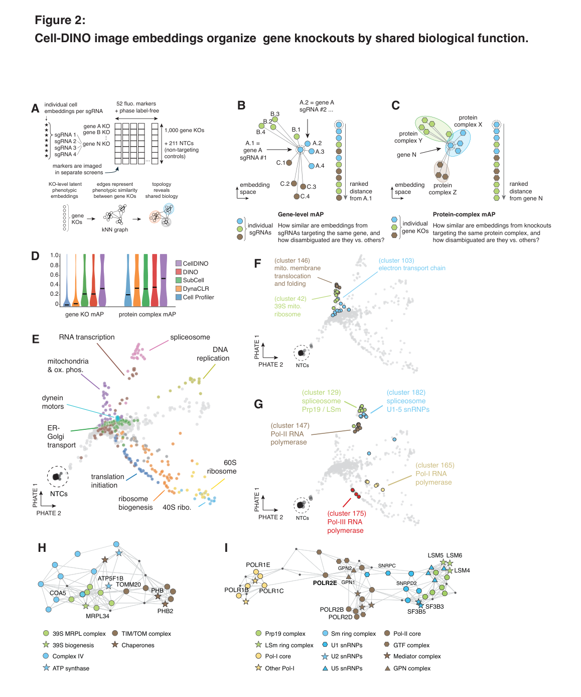
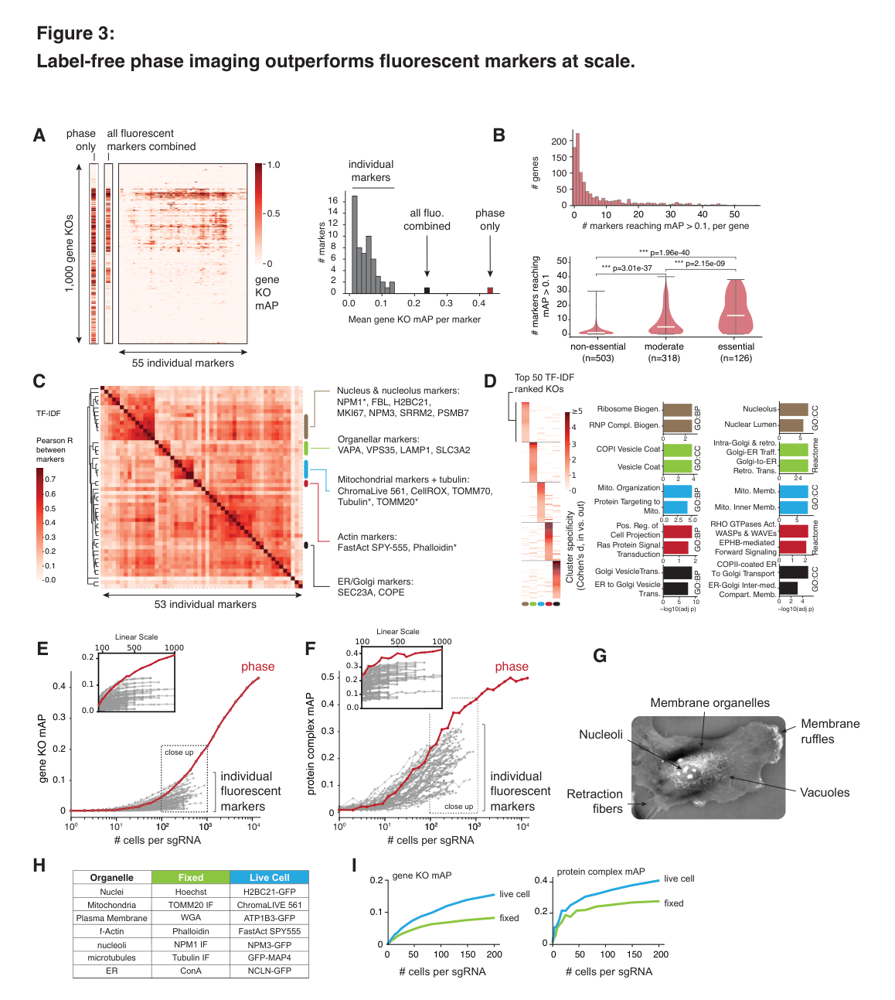
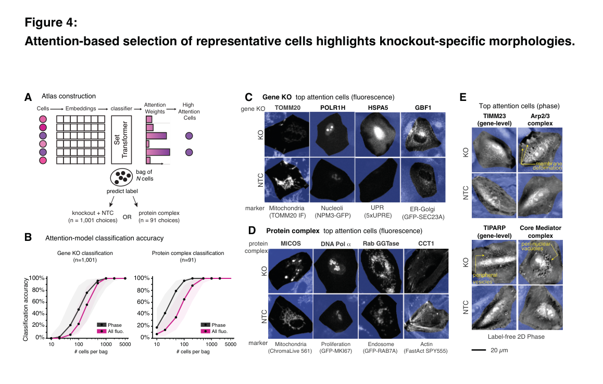
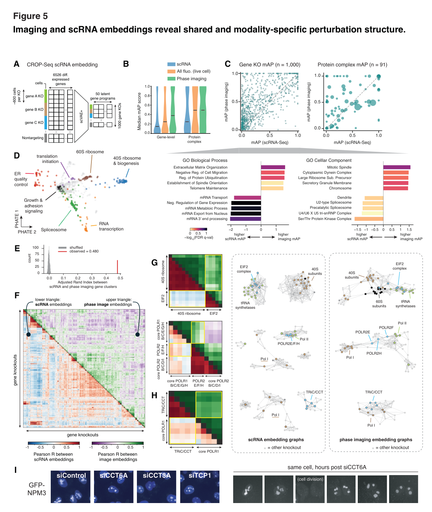

<!-- Generated by scripts/sync-wechat-articles.mjs. Do not edit manually. -->

> 本文同步自“现智研”微信推文工作区。发布日期：2026-06-06。来源：`articles/20260606/morphology_phase_imaging_atlas.md`。

# 相位成像读懂活细胞

如果想理解一个细胞，应该看什么？

过去十年，单细胞 RNA 测序几乎成了“高信息量细胞表型”的代名词。它能一次读取成千上万个基因的表达，帮助我们定义细胞类型、细胞状态和扰动反应。

但它有一个天然限制：

**scRNA-seq 看到的是终点，而且会破坏细胞。**

如果我们想训练 virtual cell 或 biological world model，只知道终点远远不够。细胞是动态系统，真正重要的是它如何随时间、环境和扰动不断变化。

这篇来自 Chan Zuckerberg Biohub 的新预印本，给出了一个非常有意思的答案：

**活细胞形态，尤其是无标记 quantitative phase imaging，可能比我们想象中包含更多生物学信息。**

论文标题是：

**A multimodal perturbation atlas defines the phenotypic resolution of cellular morphology**

## 1. 这篇文章做了什么？

作者构建了一个大型多模态 CRISPR perturbation atlas。

实验系统是 A549 肺腺癌细胞，扰动方式是 pooled CRISPR knockout。整个图谱覆盖：

- **1000 个基因 knockout**
- 每个基因 **4 条 sgRNA**
- **211 条 non-targeting sgRNA** 作为阴性对照
- **39 个 live-cell fluorescence markers**
- **13 个 fixed-cell fluorescence markers**
- 同一批活细胞的 **label-free phase imaging**
- CROP-seq 形式的 **scRNA-seq**

最终数据规模非常大：

- 成像侧约 **56,953,282 个扰动细胞**
- scRNA-seq 侧 **606,075 个细胞**
- phase imaging 每个 gene knockout 平均约 **56,896 个细胞**

这篇文章真正想回答的问题不是“能不能做一个大图谱”，而是：

**不同细胞表型 readout 的分辨率到底有多高？**

换句话说，荧光标记、无标记相位成像和 scRNA-seq，谁更能区分不同基因扰动带来的细胞状态变化？

## 2. 为什么这个问题重要？

现代 AI-driven biology 的一个核心目标，是构建能够预测细胞状态的模型。

如果我们想训练这样的模型，就需要大规模扰动数据。

但大规模数据不只是“越多越好”，更关键的是要知道：

- 哪种数据最有信息量？
- 哪种数据最适合动态观察？
- 哪种数据能低成本扩展到上千万细胞？
- 哪种数据能保留细胞活着时的真实状态？

scRNA-seq 信息量很高，但成本高、破坏细胞、只能看固定终点。

荧光成像可以看结构，但往往需要染料、抗体或 reporter。

而 label-free phase imaging 最大的优势是：

**不需要染色，不破坏细胞，可以在活细胞上大规模、反复、低成本成像。**

如果它真的能读出丰富的细胞状态，那么它就非常适合未来的 live-cell perturbation atlas。

## 3. 图像 embedding 能还原细胞功能模块

为了把图像转化成可比较的扰动表型，作者测试了多种图像特征表示方法。

包括传统 CellProfiler 特征，以及 DynaCLR、SubCell、DINOv3、Cell-DINO 等深度学习 embedding。

作者用 mean average precision，也就是 mAP，来衡量 embedding 是否能把相关扰动聚在一起。

这里有两个尺度：

第一，gene-level mAP：同一个基因的不同 sgRNA 是否具有相似表型。

第二，protein-complex mAP：同一个蛋白复合物的不同亚基 knockout 是否具有相似表型。

结果显示，深度学习表示普遍优于传统手工特征，其中 **Cell-DINO** 表现最好。

更重要的是，这些图像 embedding 不是随机分群，而是能还原细胞生物学结构。

例如：

- 线粒体相关基因形成相邻区域
- RNA polymerase I、II、III 能分成不同模块
- spliceosome、mRNA transcription、translation 等功能区域彼此有清晰拓扑关系

这说明细胞形态图像不只是“好看的显微照片”，而是可以被转化成高维、可计算、可检索的功能表型空间。

## 4. 最核心结论：phase imaging 超过单个荧光 marker

这篇文章最醒目的结果，是对每个成像 marker 的表型分辨率进行比较。

作者分别计算每个 channel 的 gene-level 和 protein-complex mAP。

结果显示：

**label-free quantitative phase imaging 在两个任务上都超过了每一个单独的 fluorescence channel。**

更关键的是，当每条 sgRNA 的细胞覆盖数超过约 **400 个细胞** 后，phase imaging 在 gene-level 和 protein-complex 两个层面都稳定优于所有单个荧光 marker。

为什么会这样？

单个荧光 marker 通常只看一个结构或一个功能维度，比如线粒体、内质网、肌动蛋白或核仁。

而 phase imaging 读到的是整个细胞的 optical mass 分布，包括：

- 细胞轮廓
- 细胞膜结构
- 细胞器组织
- 核形态
- 亚细胞纹理
- 整体空间结构

也就是说，它每张图包含的是 pan-cellular morphology，而不是单一 marker。

当然，phase imaging 也需要更多细胞覆盖，才能从高维形态变化中稳定分辨扰动差异。

但一旦规模上来，它的信息密度就非常高。

## 5. 活细胞成像比固定细胞更有分辨率

作者还比较了 matched markers 的 live-cell 和 fixed-cell 版本。

结果显示，在相同 marker 类型下，live-cell panel 在 gene-level 和 protein-complex mAP 上都超过 fixed-cell panel。

这说明固定、透化、染色等步骤可能会改变或损失部分表型信息。

固定细胞实验当然仍然重要，尤其是抗体标记、原位分子检测、翻译后修饰等场景。

但这篇文章提醒我们：

**如果目标是捕捉细胞状态本身，活细胞测量可能保留了更多自然形态信息。**

这对未来功能基因组学很关键。

因为真正的细胞状态不是一张静态照片，而是一条动态轨迹。

## 6. Attention 帮助解释 knockout 特异性形态

为了让图谱更可解释，作者还训练了一个 set-transformer classifier。

模型输入一组单细胞图像，预测它对应哪个 gene knockout 或哪个 protein complex perturbation。

当模型分类准确后，作者利用内部 attention 权重，找出最能代表某个 knockout 的细胞。

这相当于问模型：

**你为什么认为这一组细胞属于某个扰动？哪些细胞最像这个扰动？**

这个方法找到了很多可解释表型。

例如：

- TOMM20 knockout 的代表细胞直接表现在线粒体 marker 上
- POLR1H knockout 出现核仁变圆，符合 rRNA 转录受扰动
- HSPA5 knockout 激活 ER stress biosensor
- GBF1 knockout 影响 Golgi/ER exit site 相关结构
- phase imaging 中，TIMM23 knockout 显示线粒体碎片化
- Arp2/3 复合物扰动出现 cortical membrane deformation

这说明高维图像 embedding 不只是“黑箱分类”，也可以返回具体细胞和具体形态，作为后续机制研究的入口。

## 7. 和 scRNA-seq 正面对比：不是替代，而是互补

这篇文章最容易被误读的一点，是把 phase imaging 说成“替代 scRNA-seq”。

其实更准确的理解是：

**成像和转录组读的是细胞状态的不同侧面。**

作者用 CROP-seq 对同一 1000 基因扰动库进行了 scRNA-seq profiling，并和成像 embedding 直接比较。

结果显示，在作者的数据条件下，phase imaging 的平均 mAP 超过 scRNA-seq 和 fluorescence readouts。

在个别 gene knockout 层面，phase imaging 对多数扰动的分数也高于 scRNA-seq。

但两者擅长的生物学不同：

- scRNA-seq 更擅长捕捉 mRNA expression、splicing、RNA transport 等转录层面变化
- 成像更擅长捕捉 cellular structure、migration、division 等形态和物理状态变化

有意思的是，两种模态在 co-functional genes 和 protein complexes 的聚类上高度一致，但成像更能捕捉一些高阶通路组织。

例如，eIF2、40S、60S 和 tRNA synthetases 在成像图谱中形成互联社区，但在 scRNA-seq embedding 中更分散。

作者还发现 TRiC/CCT 复合物 knockout 与 RNA polymerase I knockout 在成像空间中高度相关，并通过 siRNA 二次筛选验证了核仁圆化表型。

这说明成像读出的物理表型，可能整合了多个耦合生化过程的下游结果。

## 8. 对 virtual cell 有什么意义？

这篇文章和近期 AI biology、virtual cell 的讨论高度相关。

如果我们要训练一个真正能预测细胞行为的模型，仅靠静态端点数据是不够的。

模型需要看到：

- 扰动如何改变细胞
- 细胞如何随时间移动和重塑
- 同一细胞如何从一个状态过渡到另一个状态
- 形态、分子、功能之间如何耦合

label-free live-cell phase imaging 的价值就在这里。

它不需要染色，不破坏细胞，成本低，可以重复观察同一批细胞，还能捕捉整个细胞的结构状态。

论文中提到，在作者写作时，OPS 的 reagent cost 大约只有 scRNA-seq 的 **1%**。

这意味着它有潜力支撑更大规模、更长时间、更动态的 perturbation atlas。

对于 AI 模型来说，这类数据很可能成为训练 biological world model 的重要底座。

## 9. 也要看到限制

这篇文章结论很强，但边界也很清楚。

第一，实验只在 A549 这一种细胞系中完成。不同细胞类型、原代细胞、类器官和 3D 模型中是否同样成立，还需要验证。

第二，作者比较的是单通道 fluorescence marker。phase imaging 如何与高度 multiplexed fluorescence、Raman imaging、hyperspectral imaging 等技术组合，还需要进一步研究。

第三，并不是所有基因扰动都能被当前成像体系识别。作者提到约 **18%** 的基因没有产生可分辨表型，也可能需要特定 biosensor 或更合适的细胞背景。

第四，phase imaging 不是万能的。它擅长读结构和物理状态，但对某些转录调控、信号通路或分子状态，scRNA-seq 和其他分子 readout 仍然不可替代。

所以，最好的方向不是二选一，而是多模态互补。

## 结语

这篇文章给功能基因组学和 AI biology 提供了一个很重要的提醒：

**细胞形态不是低维、粗糙、过时的表型。**

在大规模扰动、深度学习 embedding 和足够细胞覆盖的条件下，活细胞无标记形态本身就可以成为高分辨率的细胞状态读数。

它既能连接 gene function，也能组织 protein complex 和 pathway，还能为后续机制研究提供可解释的代表性单细胞。

如果未来的 virtual cell 要真正理解细胞如何运动、变形、适应和转变，那么它不能只读转录组。

它也需要学会读细胞的形状。

---

原文：

Liu, Hillsley, Sekhar et al. *A multimodal perturbation atlas defines the phenotypic resolution of cellular morphology*. bioRxiv, 2026.

DOI：https://doi.org/10.64898/2026.06.01.728087

数据资源：https://biohub.ai/ops-explorer

分析代码：https://github.com/czbiohub-sf/ops-paper-analysis

研究团队电子名片：https://ydlongtao.github.io/Myblog/

仅供学术交流，不构成医疗建议。

