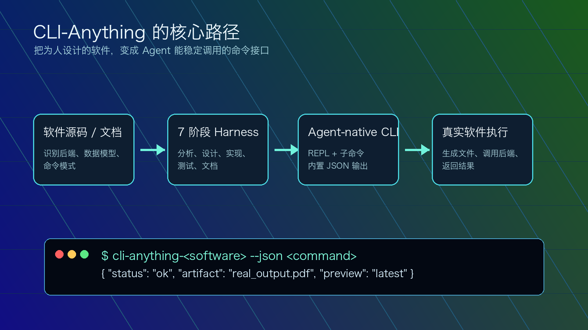
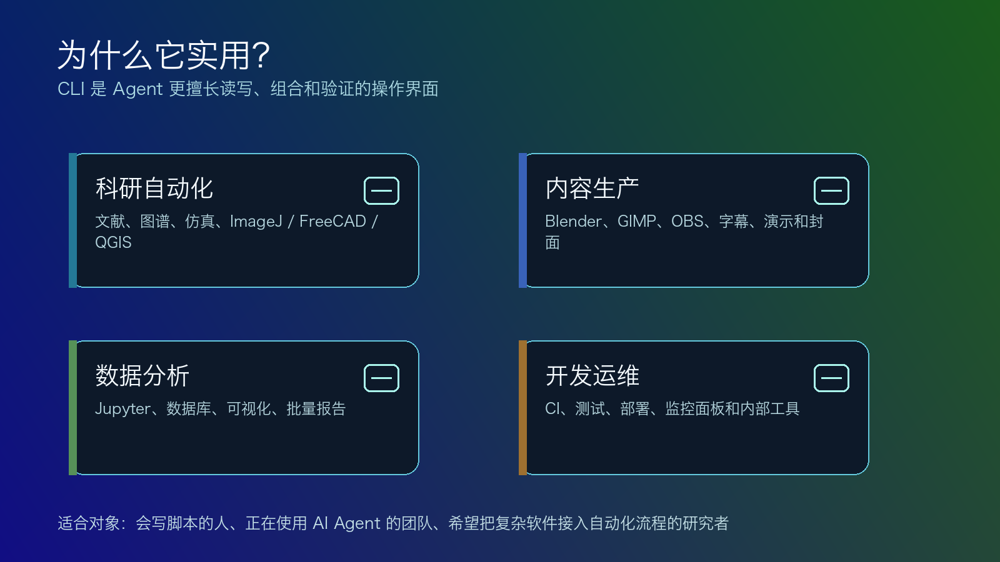
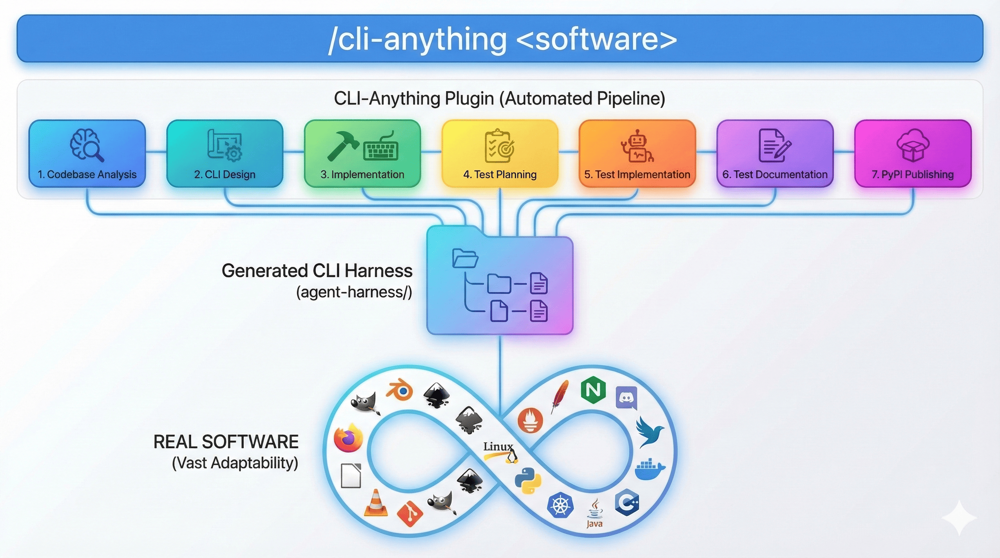

<!-- Generated by scripts/sync-wechat-articles.mjs. Do not edit manually. -->

> 本文同步自“现智研”微信推文工作区。发布日期：2026-06-08。来源：`articles/20260608/cli_anything_tool_intro.md`。

# CLI-Anything：让软件听懂命令

如果说最近两年的 AI Agent 已经学会了写代码、查资料、读文件，那么下一个更现实的问题是：

**它怎么真正使用我们每天依赖的专业软件？**

不是在屏幕上模拟鼠标点击，也不是靠截图猜按钮在哪里，而是像调用函数一样，稳定、可组合、可验证地驱动真实软件。

这正是 HKUDS 新开源项目 **CLI-Anything** 想解决的问题。


项目的核心口号很直接：

**Making ALL Software Agent-Native.**

换成中文就是：

**让所有软件都变成 AI Agent 原生可用的工具。**

截至 2026 年 6 月 8 日，GitHub API 显示 CLI-Anything 已获得超过 **4.2 万 Star**，采用 **Apache-2.0** 开源协议，主语言为 Python。这个热度背后，反映的其实是一个非常现实的趋势：

**Agent 不缺推理能力，缺的是稳定进入真实工具世界的接口。**

## 1. 为什么不是 GUI Agent？

现在很多 computer use Agent 的思路，是让模型看屏幕、识别按钮、移动鼠标、点击菜单。

这个方向很直观，因为它模仿人类使用电脑的方式。

但问题也很明显：

- 截图里的按钮会变
- 分辨率和窗口位置会变
- 动画、加载、弹窗会打乱流程
- 坐标点击很难验证
- 一旦界面小改，自动化就可能失效

对于人类来说，GUI 是友好的。

但对于 Agent 来说，GUI 反而是一层噪声。

Agent 更擅长处理的是：

- 明确的命令
- 结构化参数
- 可解析的 JSON 输出
- 可复现的状态
- 可写入日志的执行轨迹

所以 CLI-Anything 的判断是：

**不要强迫 Agent 像人一样点屏幕，而要让软件提供 Agent 更容易理解的命令行接口。**



## 2. 它到底做什么？

CLI-Anything 不是一个单独替你完成某类任务的小工具。

更准确地说，它是一套 **把软件转换成 Agent-native CLI 的方法论和工具链**。

它会围绕一个目标软件的源码或文档，帮助 Agent 构建一套完整的 CLI harness。这个 harness 通常包括：

- 对软件后端、数据模型和文件格式的分析
- 将 GUI 操作映射到真实 API 或后端命令
- 设计项目管理、导入导出、配置、会话状态等命令组
- 实现 Click 风格的命令行接口
- 支持交互式 REPL 和一次性子命令两种模式
- 为 Agent 提供 `--json` 结构化输出
- 通过真实软件后端进行端到端验证

这和“重新实现一个简化版软件”完全不同。

CLI-Anything 强调的是：

**CLI 负责结构化控制，真正的渲染、导出、转换、执行仍交给原软件。**

比如处理 LibreOffice，就应该生成合法的文档文件，再调用 LibreOffice 后端导出 PDF；处理 Blender，就应该让 Blender 真正渲染图像，而不是造一个看起来像 Blender 的壳。

这点很关键。

因为科研、内容生产和工程工具真正有价值的部分，往往都藏在专业软件几十年积累的后端能力里。

## 3. 两种使用入口

CLI-Anything 当前有两个很实用的入口。

第一种，是直接使用已有生态：

```bash
pip install cli-anything-hub

cli-hub list
cli-hub search <query>
cli-hub info <name>
cli-hub install <name>
cli-hub launch <name>
```

这相当于一个 CLI-Hub 包管理器。

如果社区已经为某个软件做好了 CLI harness，你可以直接搜索、安装、查看信息并启动。

第二种，是当仓库里还没有你想用的软件时，让 Agent 生成新的 harness：

```bash
/cli-anything <software-path-or-repo>
```

README 里给出的典型流程包括 7 个阶段：

1. 分析源码和后端能力
2. 设计命令组、状态模型和输出格式
3. 实现 CLI、REPL、JSON 输出和撤销/重做
4. 规划测试
5. 编写单元测试和端到端测试
6. 生成文档和 Agent 使用说明
7. 安装、验证和迭代优化

从这个角度看，CLI-Anything 更像是一个 **Agent 工具制造机**。

它不是帮你做一次任务，而是帮你把某个软件变成以后能被 Agent 反复调用的基础设施。

## 4. 为什么对科研和内容工作流有用？

对科研团队来说，我们经常遇到这样的自动化需求：

- 批量处理显微图像
- 自动生成论文配图
- 控制仿真软件运行多组参数
- 整理 Zotero、Joplin、Logseq 一类知识库
- 调用 QGIS、FreeCAD、ImageJ 等专业工具
- 用 LibreOffice 或 PowerPoint 批量生成报告
- 把本地脚本、数据分析和公众号发布串成一条流水线

这些任务的共同点是：

它们不是纯聊天问题，而是需要真实软件、真实文件和真实输出。



过去我们有三种常见办法：

第一，写专门脚本。

优点是稳定，缺点是每个软件都要重新研究接口。

第二，调用软件已有 API。

优点是能力强，缺点是很多软件 API 分散、文档复杂，Agent 直接使用时 token 成本很高。

第三，让 GUI Agent 操作界面。

优点是通用，缺点是脆弱。

CLI-Anything 想把这三者结合起来：

**由 Agent 读源码和文档，生成面向 Agent 的结构化 CLI；之后所有任务都走命令行、JSON 和真实后端。**

这对长期工作流很有价值。

一次性任务，用聊天就够了。

但如果某个流程你每周、每天、甚至每个项目都要重复，最值得投资的就是把它变成可复用工具。

## 5. 它和 Codex/Claude Code 的关系

CLI-Anything 并不只面向一个 Agent 平台。

README 里列出了 Claude Code、OpenClaw、OpenCode、Codex、GitHub Copilot CLI 等多种接入方式。其中 Codex 目前以社区贡献的 skill 形式提供支持。

这点也说明了它的定位：

**CLI-Anything 的目标不是成为某个模型的插件，而是给 Agent 时代的软件生态补一层通用接口。**

Agent 平台可能变化，但命令行、文件、JSON、测试和真实后端调用，仍然是非常耐用的工程资产。

这也是我觉得这个项目值得关注的原因。

真正能落地的 Agent，不应该只会“看起来在操作电脑”。

它应该能留下：

- 命令
- 日志
- 文件
- 测试
- 可复现的结果

CLI 恰好是这些东西天然聚集的地方。

## 6. 也要看清边界

当然，CLI-Anything 不是魔法。

它的 README 也明确提到了一些限制：

- 生成高质量 harness 需要足够强的基础模型
- 它依赖可分析的源码或文档
- 对只有闭源二进制的软件，效果会受限
- 单次生成未必覆盖全部功能，可能需要多轮 refine
- 真正生产可用前，需要端到端测试和人工审核

还有一点尤其重要：

**让 Agent 拥有软件控制权，也意味着要认真管理权限。**

对于本地文件、云端账号、发布系统、数据库和 shell 命令，应该遵循几个原则：

- 先在沙盒或测试目录验证
- 重要操作保留人工确认
- 不把 token、密码写进文章或日志
- 对删除、覆盖、发布、转账等高风险命令加保护
- 使用 `--json` 和日志记录，让执行过程可审计

Agent-native 不等于无人监管。

更好的理解是：

**把重复劳动交给 Agent，把判断权留给人。**

## 7. 一句话总结

CLI-Anything 的意义，不只是“又多了一个 AI 工具”。

它代表了一种更务实的 Agent 工程路线：

**与其让 AI 模仿人类点击软件，不如把软件改造成 AI 能稳定调用的命令系统。**

如果未来每个专业软件都有清晰的 CLI、JSON 输出、预览协议和端到端测试，那么 Agent 的能力就不再停留在聊天框里。

它会真正进入科研、设计、工程、内容生产和企业流程。

这可能是 AI Agent 从“演示很酷”走向“每天可用”的关键一步。



## 参考链接

- GitHub 项目：<https://github.com/HKUDS/CLI-Anything>
- CLI-Hub：<https://hkuds.github.io/CLI-Anything/>
- arXiv 技术报告：<https://arxiv.org/abs/2606.03854>
- 参考推文：<https://mp.weixin.qq.com/s/LfT4HFtNIjdOsx5RnJ8mJQ>

---

作者：HFLT_Agent

研究团队电子名片：<https://ydlongtao.github.io/Myblog/>

本文仅供学术交流与工具学习，不构成任何商业推荐。

