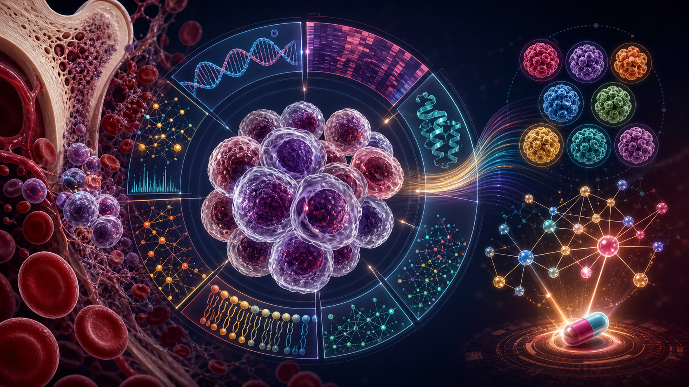
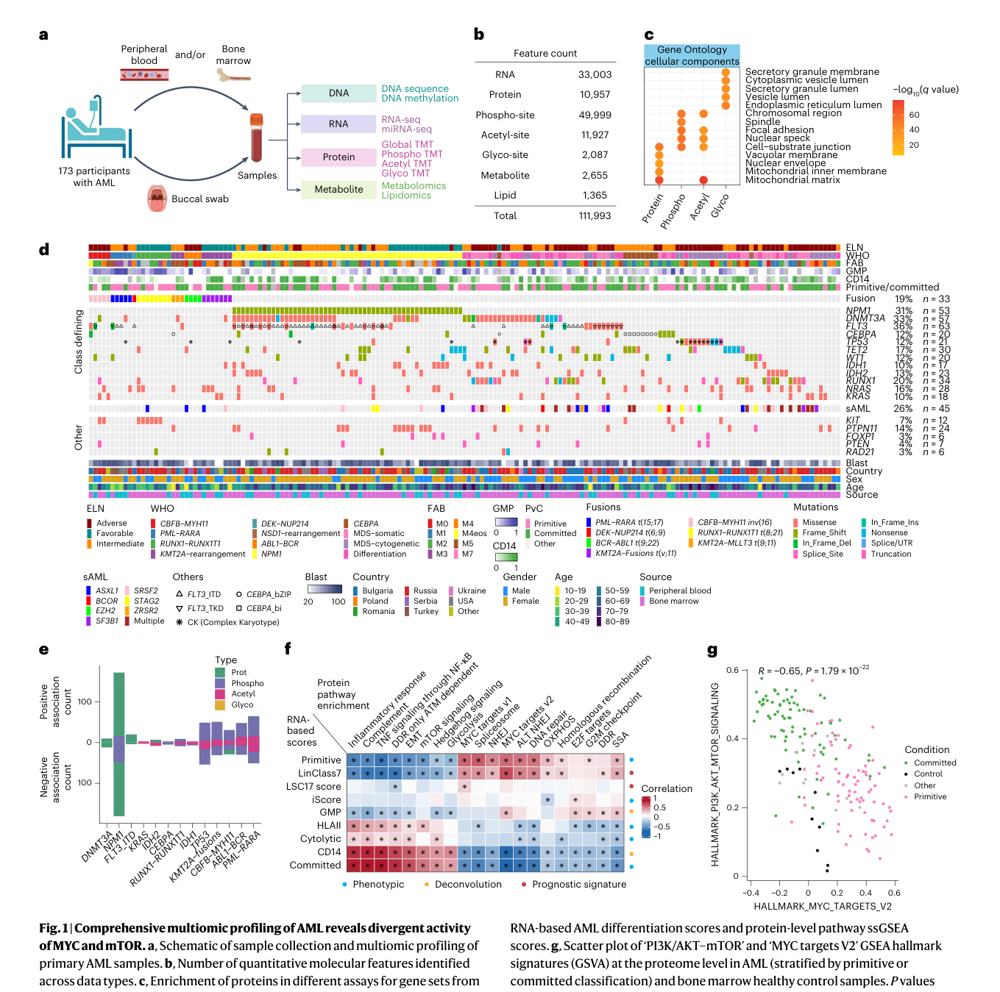
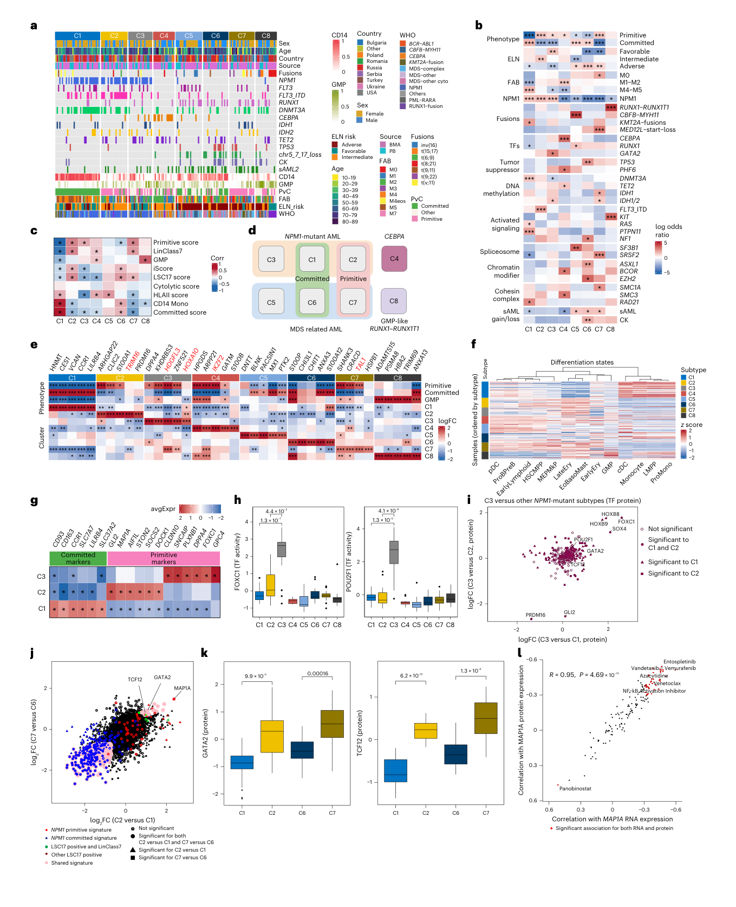
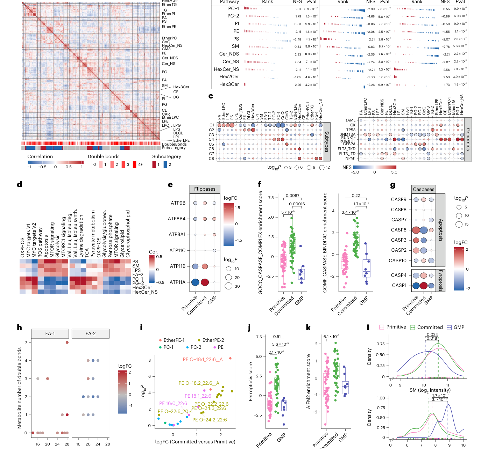
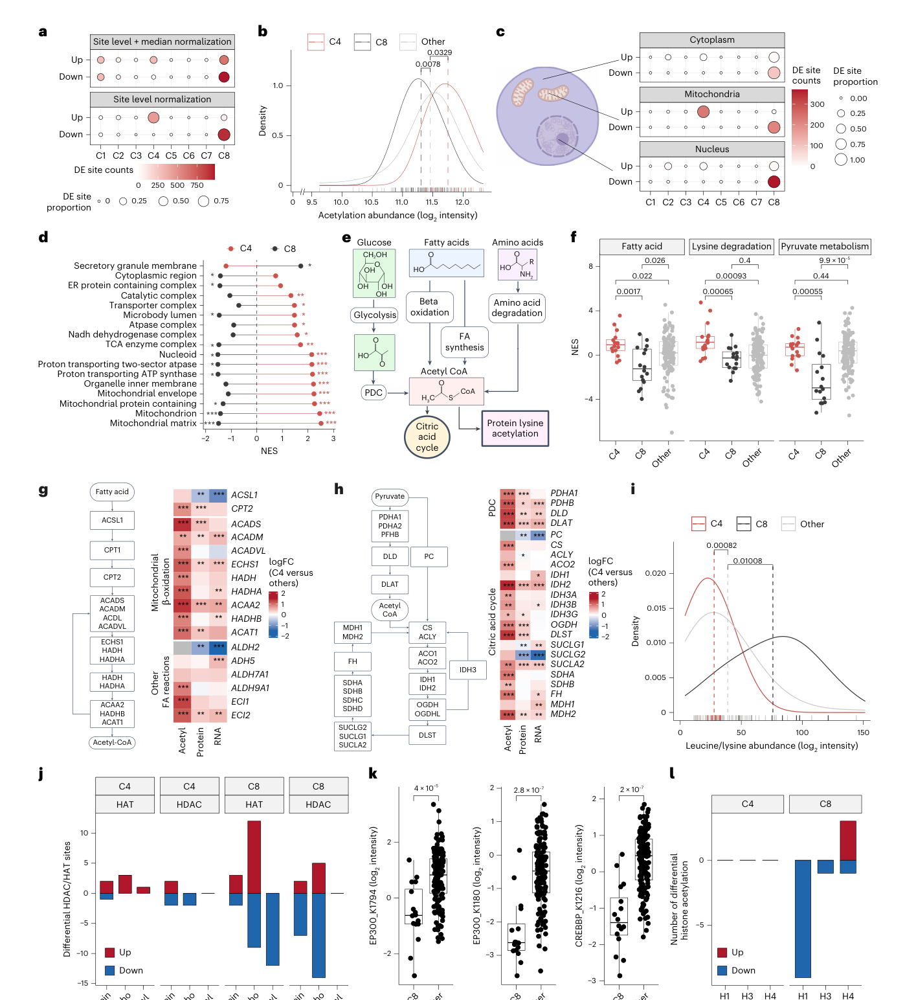
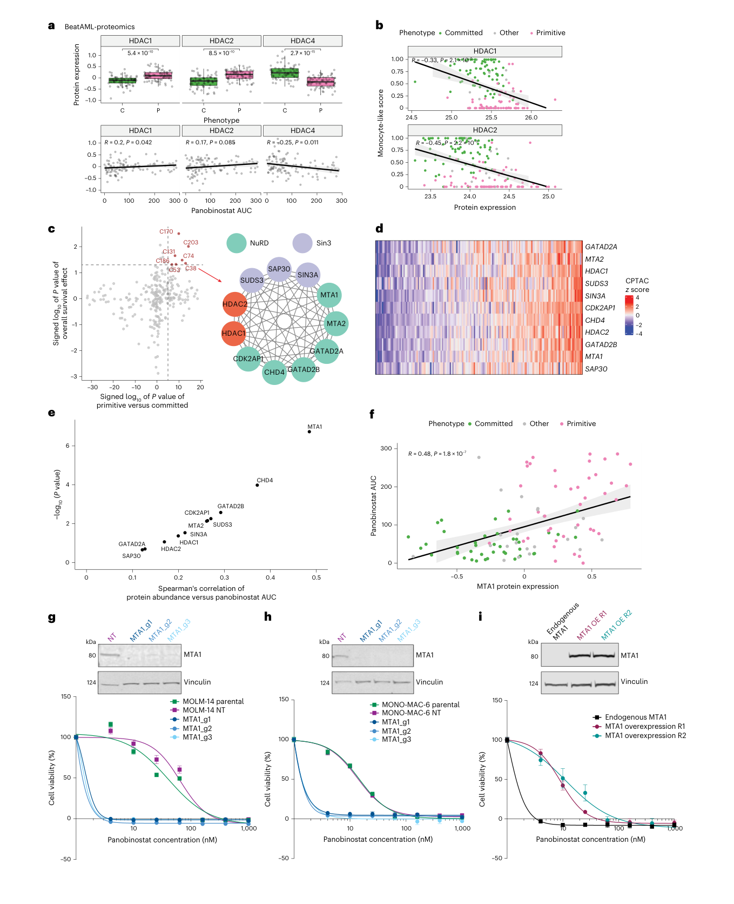

<!-- Generated by scripts/sync-wechat-articles.mjs. Do not edit manually. -->

> 本文同步自“现智研”微信推文工作区。发布日期：2026-06-12。来源：`articles/20260612/aml_multiomics_nature_cancer.md`。

# AML多组学新地图

急性髓系白血病（AML）一直是血液肿瘤里最难“简单分类”的疾病之一。

同样叫 AML，背后的突变、细胞分化状态、代谢方式、药物敏感性可能完全不同。临床上我们已经有 WHO、ELN、FAB 等分类体系，也会看 NPM1、FLT3-ITD、IDH1/2、TP53、CEBPA、融合基因等遗传改变。

但一个现实问题是：

**基因组并不能解释 AML 的全部生物学。**

有些差异真正发生在蛋白层面、翻译后修饰层面、代谢层面和脂质层面。也就是说，如果只看 DNA/RNA，可能会错过真正决定肿瘤状态和治疗反应的那一层。

2026 年 6 月 12 日，Nature Cancer 在线发表了一篇非常系统的 AML 多组学研究：

**Integrated proteogenomic and metabolomic profiling of acute myeloid leukemias to identify molecular subtypes and associated therapy targets**

这篇文章做的事情很直接，但规模很大：

**把 AML 从基因组一路看到蛋白质、翻译后修饰、代谢物和脂质，重新画了一张更接近功能状态的疾病地图。**

## 1. 这篇文章做了什么？

作者分析了 **173 例治疗初治 AML 患者**。

样本来自骨髓或外周血，同时有颊拭子作为胚系 DNA 对照。整个研究包含 13 类组学模态，覆盖：

- DNA 测序
- DNA 甲基化
- RNA-seq
- miRNA-seq
- 全局蛋白质组
- 磷酸化蛋白质组
- 乙酰化蛋白质组
- 糖基化蛋白质组
- 代谢组
- 脂质组

最终共检测到 **111,993 个分子特征**。

这不是一个单纯的“多测几种组学”的资源型工作。它真正要回答的是：

**AML 的遗传驱动、细胞分化状态、蛋白功能网络、代谢状态和药物反应之间，到底如何耦合？**

## 2. AML-8：蛋白层面重新组织 AML

文章最重要的结果之一，是提出了一个蛋白中心的 AML 亚型框架：

**AML-8。**

作者用 RNA 和蛋白表达做相似性网络融合，将 AML 分成 8 个分子亚型。

这 8 个亚型不是简单复刻已有遗传分类，而是同时整合了两个维度：

第一，**基因型轴**。

例如 NPM1 突变、CEBPA 突变、RUNX1-RUNX1T1 融合、MDS 相关改变等，确实会在蛋白层面留下清晰痕迹。

第二，**细胞分化轴**。

AML 并不是只有“突变不同”，它还可以处在 primitive、committed 或 GMP-like 等不同分化状态。这个轴会深刻影响蛋白表达、代谢和药物反应。

比较有意思的是，NPM1 突变 AML 并不是一个均质群体。

作者在 NPM1-mutant AML 中发现一个特殊亚型 C3，表现为 **FOXC1、HOXB8/9、SOX4、POU2F1** 等转录因子异常活跃。

这提示我们：

**同一个经典突变背景下，仍然可能存在完全不同的蛋白调控状态。**

这对精准治疗很重要。因为真正决定药物反应的，不一定是某个突变本身，而可能是这个突变最终塑造出的细胞状态。

## 3. MYC 与 mTOR：AML 代谢状态的两极

这篇文章还有一个非常清晰的主线：

**primitive AML 和 committed AML 在 MYC/mTOR 以及代谢状态上呈现强烈对立。**

作者发现，primitive AML 更偏向 MYC 相关程序和氧化磷酸化，而 committed AML 更偏向 mTOR 信号和糖酵解相关状态。

这不是抽象的通路富集差异，而是在代谢组和脂质组里也能看到对应变化。

例如：

- primitive AML 中 OXPHOS 和部分脂质特征更突出
- committed AML 中糖酵解和磷脂酰胆碱相关特征更明显
- GMP-like AML 则显示更强的分解代谢特征

这部分结果给人的启发是：

**AML 的“亚型”不只是标签，而是一套可测量的能量利用方式、膜脂状态和细胞死亡敏感性。**

这也解释了为什么有些治疗策略不能只按突变来分层。代谢和细胞状态可能决定了同一类药在不同患者中的真实窗口。

## 4. CEBPA 突变 AML 的线粒体高乙酰化

文章还系统分析了多种翻译后修饰，包括磷酸化、乙酰化、糖基化和琥珀酰化。

其中最突出的发现之一，是 **CEBPA 突变富集的 C4 亚型出现明显线粒体蛋白高乙酰化**。

作者认为，这可能与 acetyl-CoA 水平升高和代谢重编程有关。

与之相对，C8 亚型则表现为整体低乙酰化，并且可能与 HDAC/HAT 表达变化有关。

这一点很关键。

过去我们常把代谢和表观遗传当作两条线看：

- 代谢物提供底物
- 表观调控改变染色质和转录

但在肿瘤里，这两者经常是耦合的。

代谢改变可以影响 acetyl-CoA、NAD+、SAM、α-KG、2-HG 等关键分子，进而改变蛋白修饰和染色质状态。AML 这篇文章给出了一个非常具体的例子：

**代谢状态可能直接塑造翻译后修饰图谱，并进一步影响肿瘤亚型。**

## 5. 从图谱到靶点：MTA1 与 panobinostat 耐药

如果这篇文章只停留在分类，它就是一个漂亮的图谱。

但作者进一步往前走了一步：

**用多组学机器学习和功能网络分析寻找治疗靶点。**

他们构建了 AML-specific FunMap 共功能网络，并结合外部 BeatAML 蛋白质组和药物反应数据，寻找与药物敏感性相关的蛋白网络。

其中最重要的验证之一是 **MTA1 与 panobinostat 耐药**。

panobinostat 是一种 HDAC 抑制剂。作者发现 MTA1 蛋白表达与 panobinostat AUC 正相关，也就是 MTA1 越高，细胞对药物越不敏感。

随后他们做了功能实验：

- 在 MOLM-14 和 MONO-MAC-6 细胞中敲除 MTA1，可以恢复对 panobinostat 的敏感性
- 在 quizartinib 耐药 MOLM-14 细胞中过表达 MTA1，会促进 panobinostat 耐药

这让文章从“描述性多组学”走向了“可验证机制”。

也就是说，多组学不是为了画更复杂的热图，而是为了找到：

- 哪些亚型真正不同
- 哪些差异有功能后果
- 哪些蛋白或网络可能成为治疗入口
- 哪些药物组合更适合特定状态

## 6. 对肿瘤研究的启发

这篇 AML 文章对做实体瘤、多组学、耐药机制、ecDNA 或胃癌研究都有启发。

第一，**不要只相信 DNA 层面的分类。**

基因突变是起点，但真正的肿瘤状态往往体现在蛋白、PTM 和代谢层面。

第二，**细胞状态轴可能和基因型同样重要。**

在 AML 里是 primitive/committed/GMP-like；在实体瘤里可能是上皮-间质状态、干性状态、增殖状态、免疫逃逸状态或耐药状态。

第三，**代谢和表观调控应该一起看。**

CEBPA 突变 AML 的线粒体高乙酰化提醒我们，代谢物不是背景噪声，而可能是调控层本身。

第四，**多组学最终要落到可测试的靶点。**

MTA1-panobinostat 的例子说明，网络分析只有接上药物反应和功能实验，才真正有转化价值。

对 ecDNA 研究来说，这点尤其重要。

ecDNA 不只是拷贝数增加，它会重塑转录、染色质、增强子互作、代谢负荷和药物压力下的克隆选择。未来如果能把 ecDNA 状态与蛋白质组、磷酸化组、代谢组、药敏数据连起来，可能会更接近真实的耐药机制。

## 7. 也要看清局限

这项研究很强，但不是终点。

作者也提到了一些限制：

- 这是回顾性队列，很多治疗预测仍需要前瞻性验证
- 样本主要来自特定人群，全球多样性仍不足
- bulk 多组学难以区分细胞组成变化和细胞内调控变化
- 某些亚型样本量有限，统计功效仍受限制
- MAP1A、MTA1 等发现还需要更多独立队列和机制实验支持

所以更准确的理解是：

**这篇文章提供了一张新的 AML 功能地图，但临床应用仍需要验证。**

## 一句话总结

这篇 Nature Cancer 文章最重要的价值，不是证明“多组学很有用”。

它更具体地说明：

**在 AML 中，真正有转化价值的分类，必须同时整合遗传驱动、细胞分化状态、蛋白调控、翻译后修饰、代谢重编程和药物反应。**

这也是未来肿瘤精准医学会越来越依赖的方向：

不只是给肿瘤贴一个突变标签，而是理解它当前处在什么功能状态，以及这个状态最脆弱的治疗入口在哪里。

## 参考信息

- 论文：Chu et al., Nature Cancer, 2026
- DOI：<https://doi.org/10.1038/s43018-026-01175-6>
- 题目：Integrated proteogenomic and metabolomic profiling of acute myeloid leukemias to identify molecular subtypes and associated therapy targets

---

作者：HFLT_Agent

研究团队电子名片：<https://ydlongtao.github.io/Myblog/>

本文仅供学术交流，不构成医学建议或治疗推荐。

