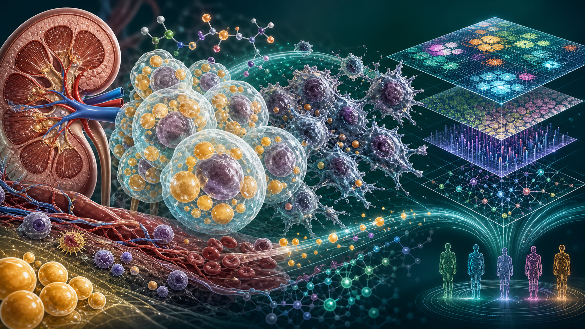
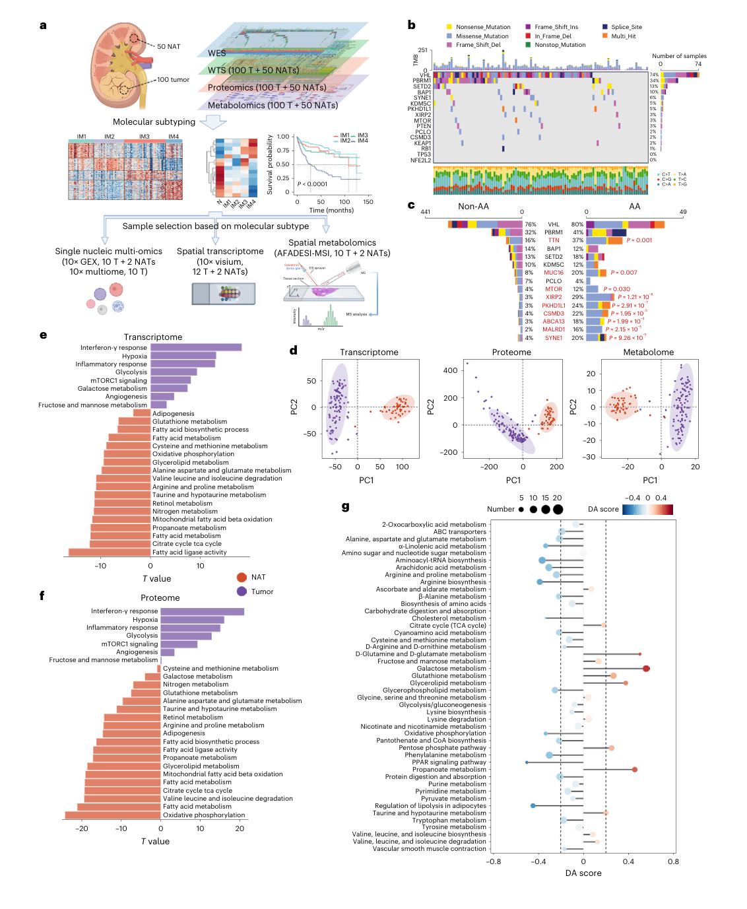
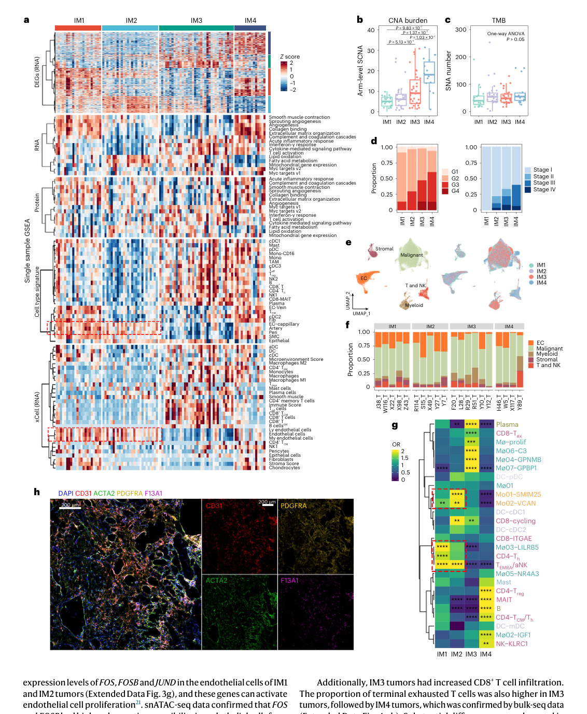
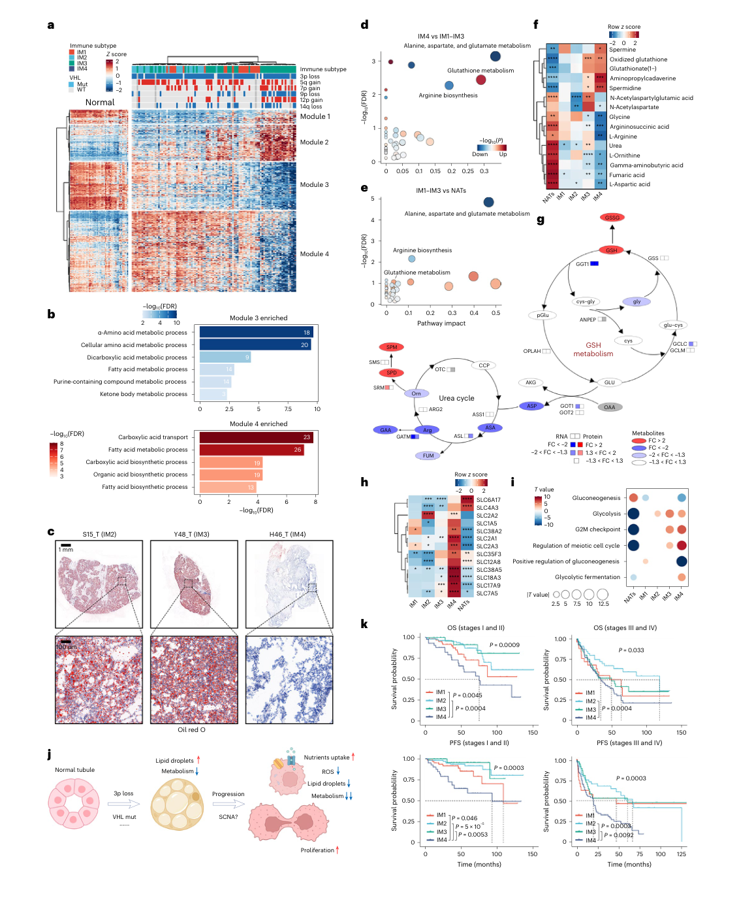
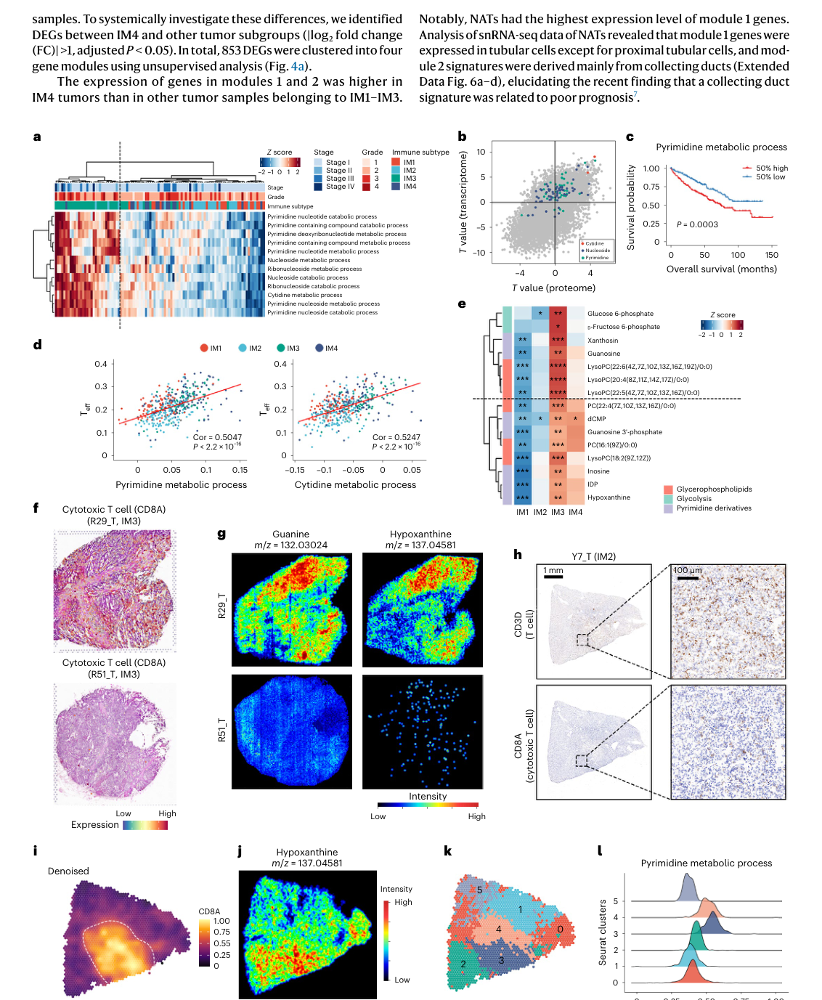
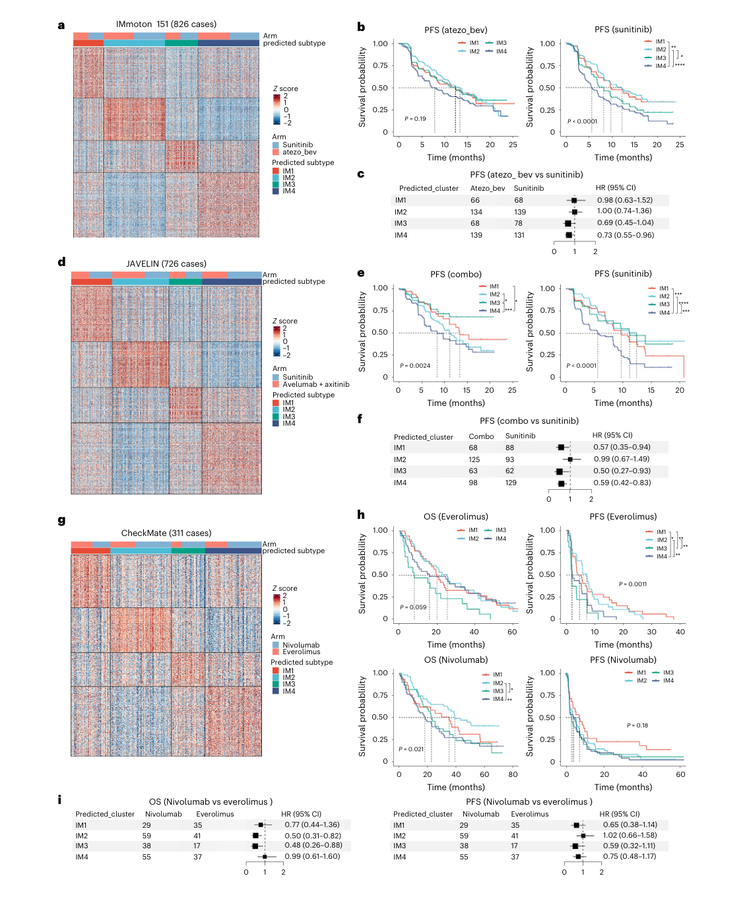

<!-- Generated by scripts/sync-wechat-articles.mjs. Do not edit manually. -->

> 本文同步自“现智研”微信推文工作区。发布日期：2026-06-12。来源：`articles/20260612/ccrcc_dccd_multiomics.md`。

# 肾癌DCCD新亚型

透明细胞肾细胞癌（ccRCC）有一个非常经典的形态学特征：

**肿瘤细胞里充满脂滴，看起来“透明”。**

这也是 clear cell 这个名字的来源。

但如果一个 ccRCC 肿瘤在进展过程中逐渐失去这种“透明细胞”特征，会发生什么？

Nature Genetics 这篇文章给出了一个很有意思的答案：

**一部分 ccRCC 会走向一种去透明细胞分化状态，伴随脂滴减少、代谢重编程、营养摄取增强和更差预后。**

作者把这个状态命名为：

**DCCD-ccRCC：De-clear cell differentiated clear cell renal cell carcinoma。**

## 1. 这篇文章做了什么？

这项研究来自 Tongji Hospital RCC cohort。

作者分析了 **100 例治疗初治 ccRCC 肿瘤样本** 和 **50 例配对癌旁正常组织**，整合了多种组学：

- 全外显子测序
- 转录组
- 蛋白质组
- 代谢组
- 单核多组学
- 空间转录组
- 空间代谢组

也就是说，这篇文章不是只看突变，也不是只看表达，而是试图把 ccRCC 的基因、蛋白、代谢、免疫微环境和空间位置放在同一张图里。

研究一开始就抓住了 ccRCC 的核心生物学：

**代谢异常。**

ccRCC 本身就是一个高度代谢重编程的肿瘤。VHL 改变、HIF 通路激活、脂质堆积、糖酵解变化和免疫微环境异常，都会影响它的进展。

所以这篇文章真正想问的是：

**ccRCC 的代谢重编程，如何和免疫微环境、空间结构、肿瘤进展和预后联系起来？**

## 2. 四种免疫-代谢状态

作者首先用 ccRCC 特异的细胞类型 signature，对肿瘤微环境进行分型，得到四个免疫亚型：

**IM1、IM2、IM3、IM4。**

这四类并不是单纯“免疫细胞多或少”的区别，而是同时反映了免疫浸润、内皮/基质状态、肿瘤细胞状态和代谢特征。

其中最关键的是 IM4。

IM4 肿瘤有几个突出特征：

- 脂滴减少
- 代谢活性降低
- 营养摄取能力增强
- 增殖能力更高
- 预后更差

作者认为，IM4 代表了一种更彻底的去透明细胞分化状态，也就是 DCCD。

这个概念很重要。

过去我们常把 ccRCC 的“透明细胞形态”看作一种病理描述。但这篇文章提示：

**透明细胞特征本身可能是一个动态状态，而不是固定身份。**

当肿瘤逐渐失去脂滴和典型代谢特征时，它可能正在进入更具侵袭性的进展轨迹。

## 3. DCCD：从“脂滴丰富”到“营养摄取增强”

DCCD 最容易理解的一点，是它和脂滴有关。

非 DCCD 的 ccRCC 肿瘤仍然保留较多脂滴，呈现更典型的 clear cell 表型。

而 DCCD 肿瘤中，脂滴明显减少，同时多个代谢通路被重排。作者总结其特征为：

- nutrient uptake 增强
- ROS 降低
- lipid droplets 降低
- metabolic activity 降低
- proliferation 增强

这看起来有些反直觉：

肿瘤更具侵袭性，为什么整体代谢活性反而下降？

一个可能的理解是，DCCD 肿瘤不再依赖经典 ccRCC 的脂质储存和某些代谢程序，而是转向另一种生存策略：

**少储存、多摄取、快增殖。**

这就像肿瘤细胞从“囤积能量”的状态，变成“持续外部摄取并快速推进”的状态。

## 4. 空间组学证明 DCCD 是进展过程

这篇文章最漂亮的地方，是没有只停留在 bulk 多组学。

作者进一步用空间转录组和空间代谢组去看：

**DCCD 是否只是不同患者之间的分类差异，还是同一个肿瘤内部可以逐渐发生的进展过程？**

结果支持后者。

在一些样本里，同一个肿瘤内部可以看到非 DCCD 区域和 DCCD 区域共存。DCCD 区域脂肪酸尤其是长链脂肪酸减少，并且与拷贝数改变、转录状态和空间位置共同变化。

作者还构建了 DCCD score，并用单细胞/空间轨迹分析证明：

**DCCD 不是一个孤立终点，而是 ccRCC 进展的一种常见方向。**

这对早期肿瘤尤其重要。

文章指出，即使在 I 期患者中，DCCD 也与更差结局和更高复发风险相关。这意味着：

**有些看似局限、可手术切除的 ccRCC，可能已经在分子层面走向高风险进展状态。**

## 5. DCCD 可能影响治疗选择

文章还分析了不同 IM/DCCD 状态与治疗反应的关系。

作者比较了免疫治疗和靶向治疗相关队列，提出一个有转化意义的观点：

**非 DCCD 和 DCCD 肿瘤可能需要不同治疗策略。**

文中提示，相比单纯 TKI 治疗，免疫联合方案可能改善 IM3 和 DCCD/IM4 组患者的预后。

当然，这里还不能直接推出临床用药建议。

但它提醒我们：

**ccRCC 的治疗分层不能只看分期和突变，还应该看肿瘤处于怎样的免疫-代谢状态。**

## 6. 对肿瘤研究的启发

这篇文章对实体瘤多组学研究有几个启发。

第一，肿瘤亚型不一定是离散标签，也可能是连续进展轨迹。

DCCD score 的意义就在这里：它把“是否 DCCD”变成了一个可以度量的连续状态。

第二，空间组学非常关键。

如果只做 bulk 测序，我们知道样本里有 DCCD 特征，但不知道这些特征来自哪里、是否与局部克隆扩张有关、是否和代谢物分布一致。

第三，代谢状态可能比突变更接近治疗反应。

ccRCC 的核心不是单个通路改变，而是肿瘤细胞如何重新组织脂质、营养摄取、氧化还原和增殖策略。

第四，早期肿瘤也需要分子风险分层。

如果 I 期 DCCD 已经有更高复发风险，那么传统“早期=低风险”的判断就需要被更精细的分子状态补充。

## 7. 一句话总结

这篇 Nature Genetics 文章最重要的贡献，是提出了 ccRCC 进展中的一种功能状态：

**DCCD-ccRCC：一个脂滴减少、代谢重编程、营养摄取增强、增殖加快且预后更差的去透明细胞分化亚型。**

它提醒我们：

ccRCC 的“透明细胞”不是静态形态，而可能是一条会被肿瘤进展逐步改写的代谢轨迹。

未来如果能把 DCCD score 与病理、空间代谢、术后复发和治疗反应结合起来，它可能成为 ccRCC 风险评估和治疗分层的新入口。

## 参考信息

- 论文：Hu et al., Nature Genetics, 2024
- DOI：<https://doi.org/10.1038/s41588-024-01662-5>
- 题目：Multi-omic profiling of clear cell renal cell carcinoma identifies metabolic reprogramming associated with disease progression

---

作者：HFLT_Agent

研究团队电子名片：<https://ydlongtao.github.io/Myblog/>

本文仅供学术交流，不构成医学建议或治疗推荐。

