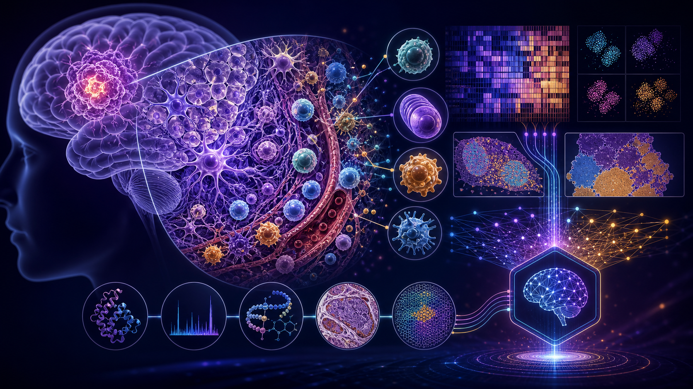
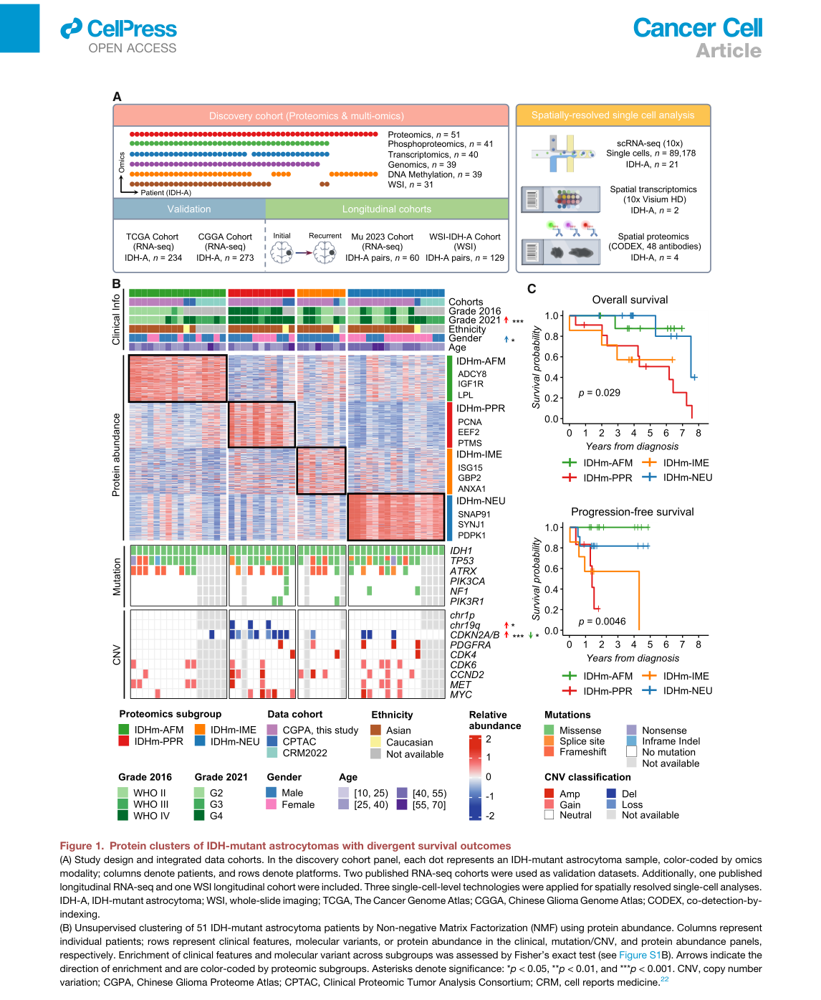
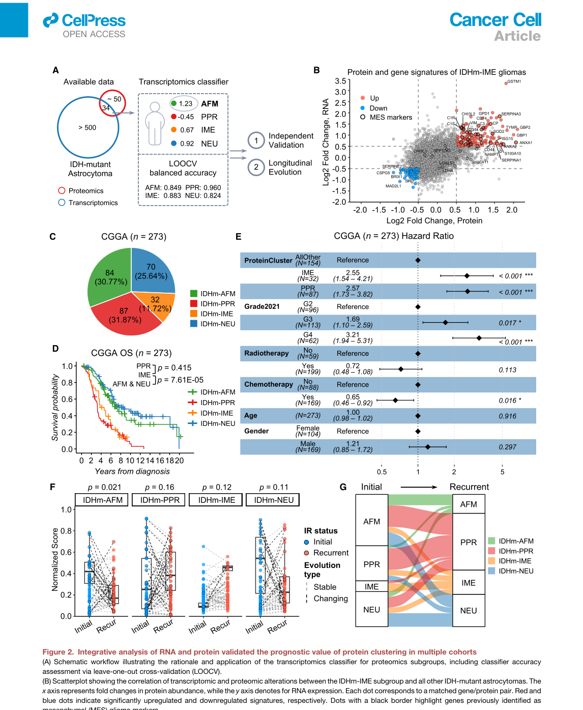
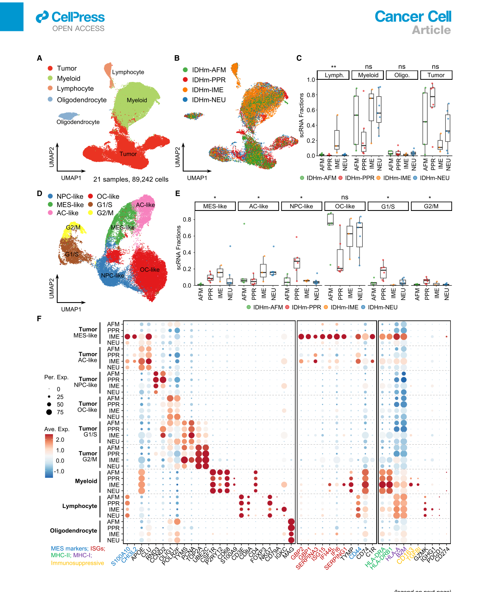
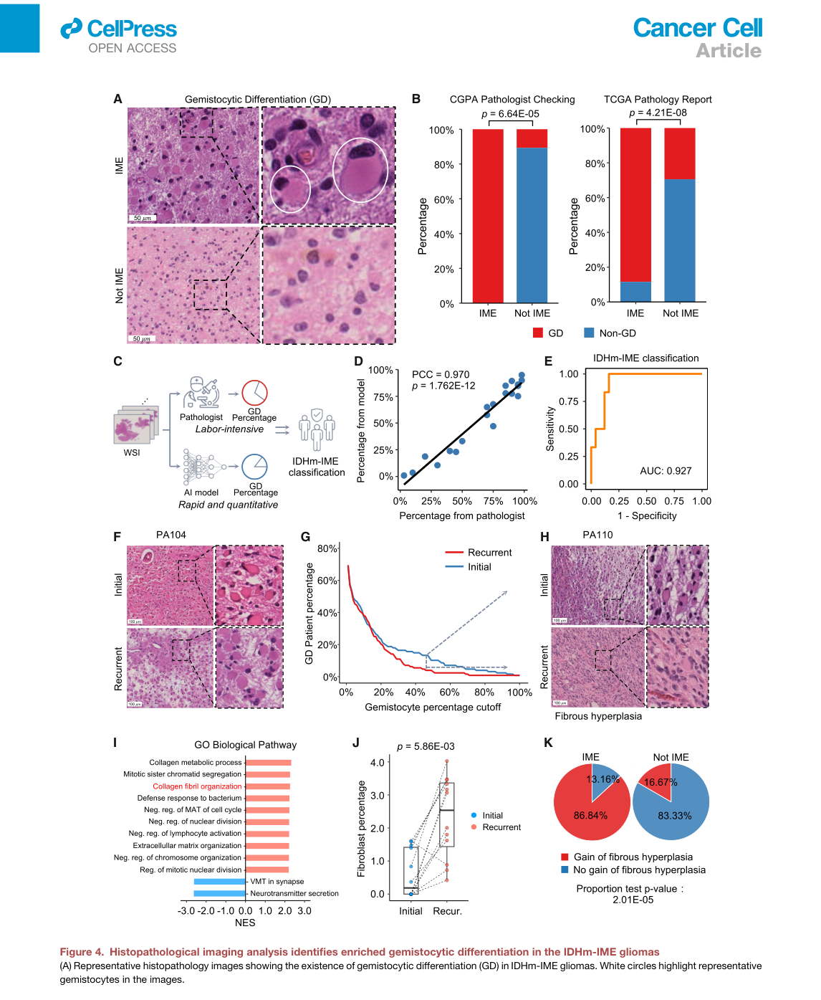
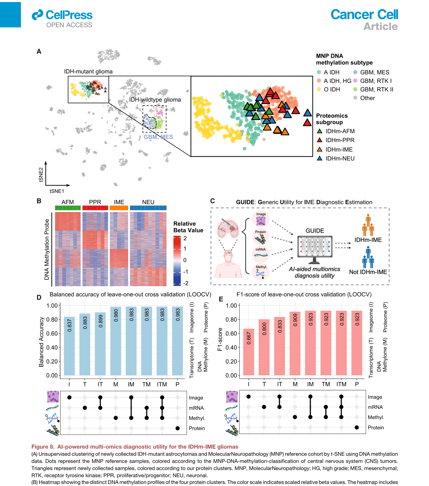

<!-- Generated by scripts/sync-wechat-articles.mjs. Do not edit manually. -->

> 本文同步自“现智研”微信推文工作区。发布日期：2026-06-12。来源：`articles/20260612/idh_astrocytoma_immune_hot.md`。

# 胶质瘤免疫热亚型

IDH 突变星形胶质瘤通常比 IDH 野生型胶质母细胞瘤预后更好。

但这并不意味着它是一个“温和”的肿瘤。

在临床上，一部分 IDH-mutant astrocytoma 仍然会复发、进展，甚至表现出很强的侵袭性。问题在于：

**这些高风险患者能否在分子层面更早识别出来？**

Cancer Cell 这篇文章给出了一个很有价值的答案：

**蛋白质组可以把 IDH 突变星形胶质瘤分成 4 个亚型，其中一个免疫热、间质样、预后差的 IME 亚型尤其值得关注。**

## 1. 为什么要看蛋白分型？

肿瘤分类通常从 DNA 和 RNA 开始。

但蛋白质才是细胞功能最直接的执行层。

同样的突变背景下，不同肿瘤可能有完全不同的蛋白通路、免疫微环境、细胞状态和治疗脆弱性。

这篇研究聚焦 IDH-mutant astrocytoma，整合了多种数据：

- 蛋白质组
- 磷酸化蛋白质组
- 转录组
- 基因组
- DNA 甲基化
- 全切片病理图像
- 单细胞 RNA-seq
- 空间转录组
- CODEX 空间蛋白组

作者首先在发现队列中用蛋白丰度做无监督聚类，得到 4 个蛋白亚型：

- **AFM**：adipogenesis / fatty-acid-metabolism
- **PPR**：proliferative / progenitor
- **IME**：immune / mesenchymal-enriched
- **NEU**：neuronal

其中 PPR 和 IME 都与较差预后相关。

PPR 的差可以理解，因为它更偏增殖/祖细胞状态，并且富集更高级别特征。

真正有意思的是 IME。

**IME 是免疫热的，但预后也差。**

这和很多实体瘤里“免疫热=可能更好”的直觉并不完全一致。

## 2. IME：免疫热但预后差

IME 的全称是 immune/mesenchymal-enriched。

它大约占 IDH-mutant astrocytoma 的一小部分，但临床意义很突出。

文章发现，IME 有几个核心特征：

- 干扰素相关通路增强
- 间质样状态增强
- 淋巴细胞浸润增加
- 浆细胞和耗竭 T 细胞更多
- gemistocytic differentiation 更常见
- 预后较差

作者进一步把转录组分类器应用到 TCGA 和 CGGA 队列，结果显示 IME 在独立队列中同样预后较差。

更重要的是，在初发-复发配对样本中，肿瘤复发时更容易向 PPR/IME 转移。

这说明 IME 不是一个偶然发现。

它可能代表 IDH 突变星形胶质瘤中一种特殊的进展状态：

**免疫细胞进来了，但肿瘤并没有被控制，反而形成了更复杂、更促病程进展的免疫-间质生态位。**

## 3. 单细胞揭示 IME 的免疫微环境

为了理解 IME 为什么“免疫热但预后差”，作者做了单细胞 RNA-seq。

结果显示，IME 肿瘤中淋巴细胞明显增加，尤其是 T 细胞、浆细胞相关信号更突出。

在肿瘤细胞层面，IME 富集 mesenchymal-like 状态，并表达免疫和干扰素刺激相关基因，例如 GBP1 等。

这带来一个关键问题：

为什么免疫浸润没有带来更好结局？

文章的解释方向是：

**IME 的免疫微环境可能不是有效抗肿瘤免疫，而是伴随 T 细胞耗竭、浆细胞浸润、血脑屏障改变和肿瘤-免疫互作的异常生态。**

换句话说，免疫细胞“在场”，并不等于免疫系统“有效工作”。

这点对脑肿瘤尤其重要。

脑肿瘤的免疫微环境与外周实体瘤不同。免疫细胞进入、血管周围聚集、胶质细胞反应和肿瘤细胞间质样转化，可能共同塑造一个促复发的局部生态位。

## 4. 病理图像能识别 IME 线索

IME 还有一个很有临床意义的组织学特征：

**gemistocytic differentiation。**

Gemistocytic astrocytes 通常具有丰富嗜酸性胞质和偏位细胞核。文章显示，IME 样本中 gemistocytic differentiation 明显富集。

作者进一步训练了一个基于全切片图像的 AI 工具，用来从常规病理图像中快速估计这种特征，并辅助识别 IME。

这一步很实用。

因为蛋白质组、空间组学、单细胞数据并不是所有医院都能常规获得。

如果病理图像能够提供 IME 的可见线索，再结合少量分子检测，就更接近真实临床转化。

## 5. GUIDE：多组学诊断工具

文章最后提出了一个 AI-powered multi-omics diagnostic utility：

**GUIDE。**

GUIDE 的目标是识别 IDHm-IME。

它可以整合不同类型数据，包括：

- 病理图像
- 蛋白质组
- mRNA
- DNA 甲基化

即使某些组学缺失，也可以利用已有数据进行分类。

这其实代表了未来肿瘤诊断的一个方向：

**不是所有患者都必须拥有完整多组学数据，但模型应该能根据可获得数据做最优整合。**

有图像就用图像，有转录组就加转录组，有蛋白或甲基化就进一步提升准确度。

这比“必须一次性做全套组学”更现实。

## 6. 对肿瘤研究的启发

这篇文章有几个启发。

第一，蛋白质组可以发现 RNA/DNA 不容易捕捉的功能亚型。

IME 的价值就在这里：它不是单纯由一个突变定义，而是由蛋白通路、免疫状态、病理形态和空间生态共同定义。

第二，免疫热不一定代表预后好。

肿瘤免疫需要区分“浸润”与“有效杀伤”。IME 中的耗竭 T 细胞、浆细胞、血管周围淋巴细胞聚集和间质样肿瘤状态，可能共同导致相反结果。

第三，复发不是简单复制初发肿瘤。

初发-复发配对样本显示，复发时 PPR/IME 比例上升，说明治疗压力和时间演化会改变肿瘤功能状态。

第四，多组学诊断要走向可部署。

GUIDE 的思路很值得借鉴：用 AI 把图像、蛋白、转录组、甲基化等数据灵活整合，而不是要求每个样本都有完整数据。

## 7. 一句话总结

这篇 Cancer Cell 文章最重要的发现，是在 IDH 突变星形胶质瘤中定义了一个特殊的 IME 亚型：

**免疫热、间质样、富集 gemistocytic differentiation，且预后更差。**

它提醒我们：

肿瘤中的免疫浸润不是越多越好，关键要看它和肿瘤细胞状态、空间生态、T 细胞耗竭以及复发演化如何耦合。

未来胶质瘤精准诊断，可能不只是 IDH、1p/19q、CDKN2A/B 这些分子标签，而是要进一步纳入蛋白状态、病理图像和免疫空间结构。

## 参考信息

- 论文：Tang et al., Cancer Cell, 2025
- DOI：<https://doi.org/10.1016/j.ccell.2025.08.006>
- 题目：Protein-based classification reveals an immune-hot subtype in IDH mutant astrocytoma with worse prognosis

---

作者：HFLT_Agent

研究团队电子名片：<https://ydlongtao.github.io/Myblog/>

本文仅供学术交流，不构成医学建议或治疗推荐。

