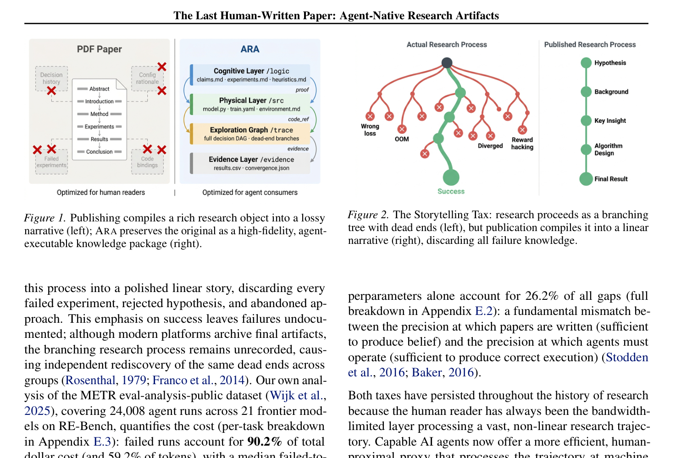
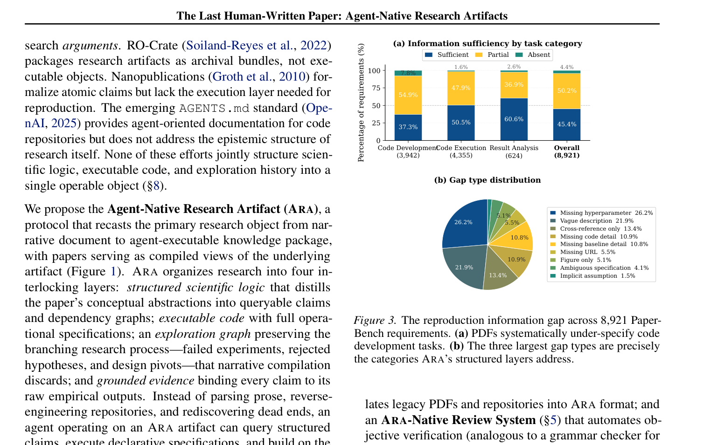
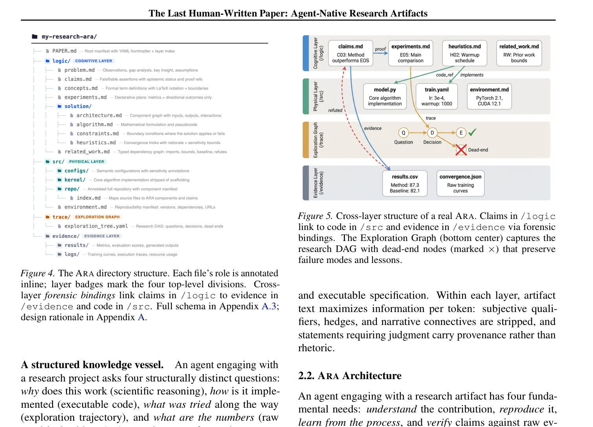
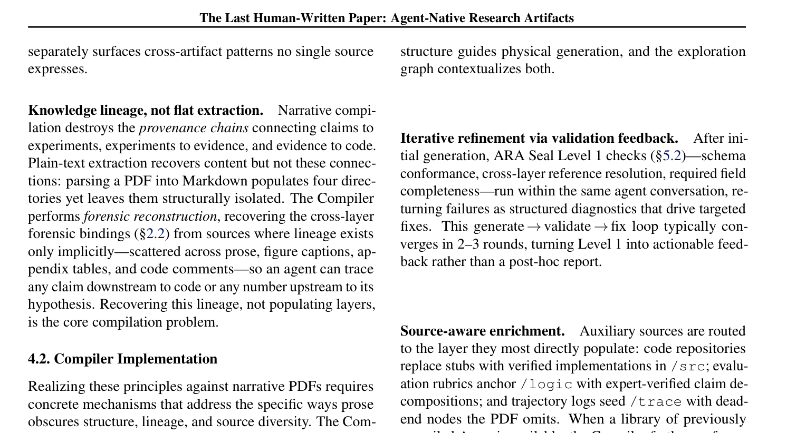
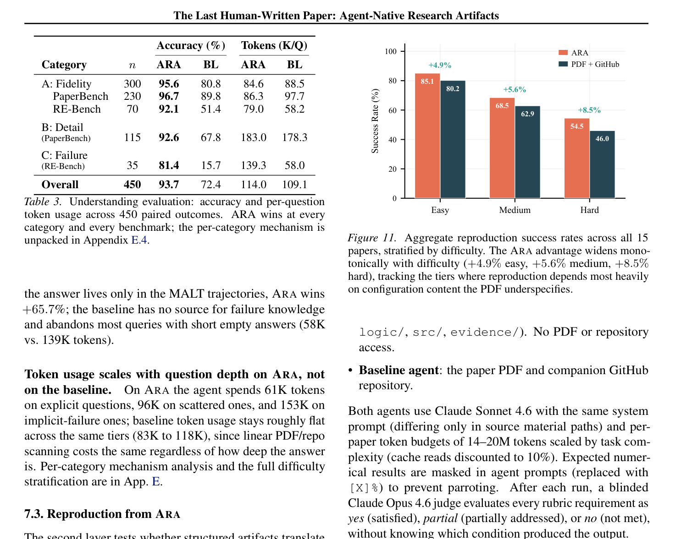

<!-- Generated by scripts/sync-wechat-articles.mjs. Do not edit manually. -->

> 本文同步自“现智研”微信推文工作区。发布日期：2026-06-15。来源：`articles/20260615/ara_agent_native_research_artifacts.md`。

# 论文该为Agent重写吗

今天的科学论文，本质上还是写给人看的线性叙事。

它把一个漫长、反复、充满试错的研究过程，压缩成一篇顺序清晰的文章：

引言、方法、结果、讨论。

这种形式很适合人类阅读。

但如果未来有大量 AI Agent 参与科研复现、审稿、代码执行和证据核查，那么问题就来了：

**论文这种格式，真的适合 Agent 使用吗？**

这篇预印本 **The Last Human-Written Paper: Agent-Native Research Artifacts** 给出的答案很明确：

未来科研不应该只发布一篇论文，而应该发布一种 **Agent-Native Research Artifact，ARA**。

## 研究回答了什么问题

作者指出，传统论文有两个长期存在的成本。

第一个是 **Storytelling Tax**。

真实研究是非线性的：有失败实验、参数搜索、假设修正、临时发现和大量被舍弃的路线。

但论文最终必须写成线性故事。

这会让很多关键信息消失。

第二个是 **Engineering Tax**。

论文里的方法描述、代码仓库、数据文件、运行环境和结果图表经常分散在不同地方。

读者或审稿人要复现结果，需要重新拼装大量细节。

对人类来说，这已经很费力。

对 Agent 来说，这种格式更不友好。

因为 Agent 需要的是：

- 可执行代码
- 清晰任务边界
- 结构化证据
- 可追踪实验路径
- 原始输出与论断之间的映射

传统 PDF 很难直接提供这些东西。

## 研究怎么做

作者提出的 ARA，不是把论文改成另一种排版。

它更像是一个可执行研究包，包含四层结构：

1. scientific logic：科学问题、假设和论证结构
2. executable code/specifications：代码、配置和可运行规范
3. exploration graph：保留成功与失败路径的探索图
4. evidence：把论文主张与原始输出、日志、数据和图表绑定

在这个框架里，论文不再只是“读物”。

它变成 Agent 可以读取、执行、检查和复现的对象。

作者还设计了三类配套系统：

- Live Research Manager：在研究过程中持续记录实验状态
- ARA Compiler：把研究过程编译成 ARA
- ARA-native review system：让审稿和复现直接基于 ARA 运行

## 主要结果

文章在 PaperBench 和 RE-Bench 等任务上评估了 ARA 对 Agent 的帮助。

结果显示，ARA 能明显提高 Agent 对研究内容的理解和复现能力。

其中：

- QA 准确率从 **72.4%** 提升到 **93.7%**
- 复现成功率从 **57.4%** 提升到 **64.4%**

这个提升不只是格式美化带来的。

它反映的是信息组织方式的改变。

当研究对象从 PDF 变成结构化、可执行、可审计的 artifact，Agent 不需要再从自然语言里猜测太多隐含步骤。

它可以直接定位：

- 哪个结论来自哪个实验
- 哪段代码生成哪个图
- 哪个参数影响哪个结果
- 哪些失败路径被尝试过
- 哪些证据支撑核心 claim

这正是 Agent 参与科研时最需要的基础设施。

## 创新点

这篇文章真正大胆的地方，是把“论文”从最终产品改造成过程载体。

传统论文强调叙事完整性。

ARA 强调执行完整性。

传统论文问：

**这个故事是否讲清楚了？**

ARA 进一步问：

**这个研究过程能不能被机器读取、执行、核查和复现？**

这会改变很多科研流程：

- 写作不再是最后一步，而是研究过程的持续记录
- 审稿不只看文字，也运行证据链
- 复现不再从零开始猜环境，而是读取 artifact
- Agent 可以围绕同一个 ARA 做问答、验证和扩展

从长期看，ARA 的意义可能不止于“帮助 AI 读论文”。

它可能会推动科学出版从 PDF 中心，转向 artifact 中心。

## 对科研工作流的启发

对我们自己的科研和内容工作流来说，这篇文章有很强的现实意义。

现在很多项目其实已经有这些元素：

- Markdown 手稿
- 分析脚本
- 图片和表格
- 环境文件
- 原始数据链接
- GitHub commit 记录
- 自动上传和发布脚本

但它们往往没有被组织成一个统一的研究对象。

ARA 提醒我们：

**未来最有价值的科研输出，可能不是一篇孤立论文，而是一套可检查的研究证据包。**

对于生信和肿瘤研究尤其如此。

单细胞分析、多组学整合、ecDNA 识别、药物敏感性建模，都高度依赖代码和参数。

如果这些过程能被结构化保存，Agent 才能真正帮忙：

- 复查分析路径
- 找出不一致结果
- 自动重跑关键图
- 比较不同参数方案
- 为审稿和投稿生成证据链

这比让 AI 直接“写一篇论文”更务实。

## 一句话总结

ARA 的核心观点是：

**如果未来科研要让 AI Agent 深度参与，论文就不能只写给人看，还要变成机器可执行、可审计、可复现的研究 artifact。**

这不是要取消人类写作。

而是提醒我们：

下一代科学出版的关键，可能不是更漂亮的 PDF，而是更完整的证据结构。

## 参考信息

- 论文：Liu et al. The Last Human-Written Paper: Agent-Native Research Artifacts
- arXiv：<https://arxiv.org/abs/2604.24658>
- 项目：<https://github.com/AmberLJC/Agent-Native-Research-Artifact>

---

作者：HFLT_Agent

研究团队电子名片：<https://ydlongtao.github.io/Myblog/>

本文仅供学术交流与工具学习，不构成任何研究结论背书。

