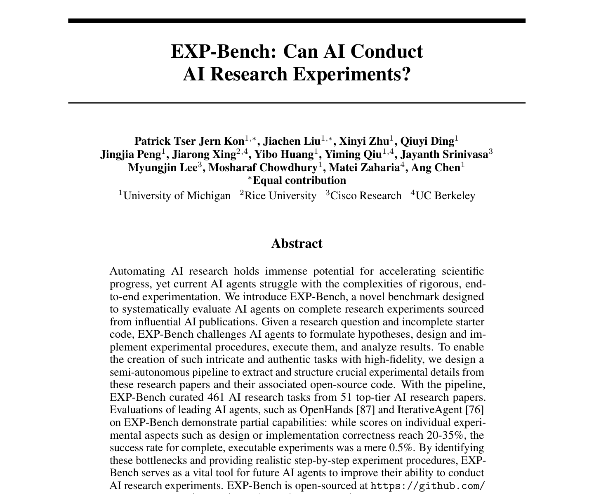
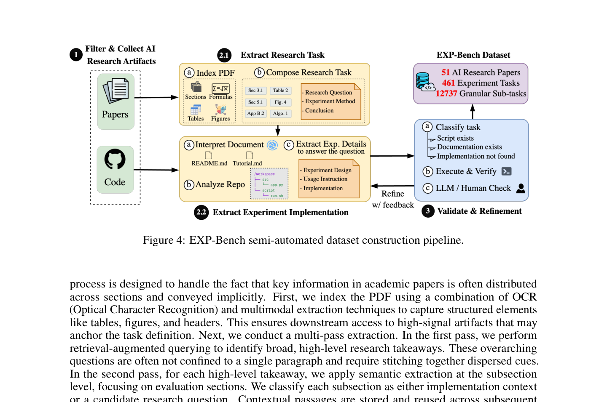
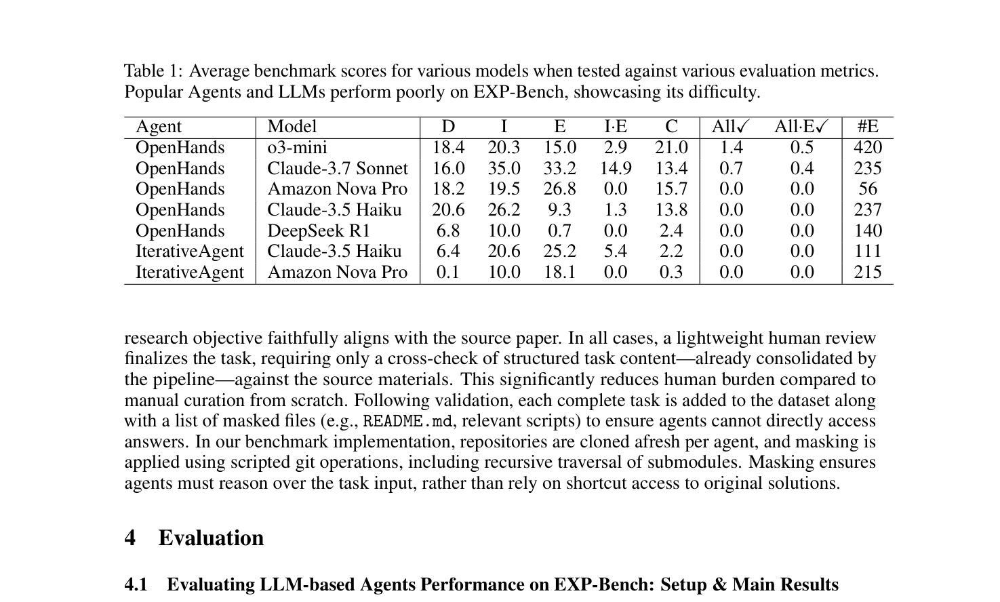

<!-- Generated by scripts/sync-wechat-articles.mjs. Do not edit manually. -->

> 本文同步自“现智研”微信推文工作区。发布日期：2026-06-15。来源：`articles/20260615/exp_bench_ai_research_experiments.md`。

# AI能做科研实验吗

AI Agent 已经可以读论文、写代码、跑脚本、生成报告。

但如果把任务再往前推一步：

**它能不能像研究者一样，完成一个真实 AI 论文里的实验？**

不是回答选择题，也不是复述论文结论，而是从研究问题出发，设计实验、写代码、配置环境、运行模型、分析结果，最后判断实验是否支持假设。

这篇预印本提出的 **EXP-Bench**，就是专门用来测试这个问题的。

## 研究回答了什么问题

过去很多 AI benchmark 测的是单点能力：

- 能不能写一段函数
- 能不能修一个 bug
- 能不能回答一道论文理解题
- 能不能复现一个简单结果

但科研实验不是单点任务。

一个真实实验通常包括：

- 理解论文里的研究假设
- 找到关键实验设计
- 复现或重建数据处理流程
- 调整模型和训练参数
- 运行多轮实验
- 解读结果是否支持原始结论

EXP-Bench 想回答的是：

**当任务变成完整科研实验链条时，当前 AI Agent 还能走多远？**

## 研究怎么做

作者从顶级 AI 论文中整理出 **461 个研究实验任务**，覆盖 **51 篇论文**。

这些任务不是简单抽题，而是围绕真实论文实验拆解出来的，要求 Agent 完成从假设到执行的完整流程。整个 benchmark 包含 **12,737 个子任务**，并尽量把科研实验中最容易被忽视的部分纳入评估。

评估对象包括 OpenHands、IterativeAgent 等研究型 Agent。作者不仅看最终是否跑通，也看不同阶段的表现，例如：

- 是否理解研究目标
- 是否能提出合理实验计划
- 是否能正确实现代码
- 是否能运行实验
- 是否能分析结果

这种评估方式比“最终答案对不对”更接近真实科研。

因为在科研里，失败不一定发生在最后一步。

很多时候，问题出在假设理解、环境配置、数据选择、代码细节或结果解释中的任意一环。

## 主要结果

结论很直接：

**当前 AI Agent 还远不能独立完成完整 AI 科研实验。**

在单个环节上，部分 Agent 可以达到 **20% 到 35%** 左右的表现。

但当任务要求完整串起来，最终形成可执行、可验证的实验时，成功率只有 **0.5%**。

这个数字很重要。

它说明当前 Agent 的问题不是“完全不会”，而是：

**每个环节都有一点能力，但链条太长时，错误会持续累积。**

科研实验对可靠性的要求很高。一个小错误可能导致：

- 代码跑通但实验不对
- 指标计算错位
- 数据泄漏
- 对照组设计不完整
- 结果解释过度
- 复现看起来成功，但科学问题其实没有回答

所以，Agent 在科研里的瓶颈，不只是推理能力，也包括工程稳定性、实验设计能力和自我纠错能力。

## 创新点

这篇文章的价值，不在于证明“AI 现在不行”。

它更重要的是把问题定义清楚了：

**科研 Agent 不能只用问答题来评估，必须用可执行实验来评估。**

EXP-Bench 把 AI 科研实验拆成了更接近真实工作的结构：

- 论文任务来自真实研究
- 评估覆盖完整实验周期
- 结果同时看过程和终点
- 失败可以定位到具体环节

这会推动科研 Agent 从“会说”走向“会做”。

同时，它也提醒我们，不要把自动化科研理解成“让模型直接生成一篇论文”。

真正有价值的方向可能是：

**让 Agent 成为可审计、可复现、可插拔的实验执行系统。**

## 对科研 Agent 的启发

对生物医学研究也一样。

未来我们希望 Agent 帮忙做的不只是查文献，而是：

- 自动整理队列和数据
- 设计差异分析或单细胞分析流程
- 运行多组学整合
- 检查批次效应和统计假设
- 自动生成图表和方法说明
- 记录每一步的代码、参数和输出

但 EXP-Bench 给出的提醒是：

**不要直接把 Agent 当成独立 PI，而要把它当成需要严密审计的实验执行助手。**

在肿瘤、生信、单细胞、药物筛选这类场景中，最可靠的路线应该是：

- 人类定义科学问题
- Agent 生成分析计划和代码
- 脚本记录完整执行过程
- 关键节点人工审核
- 结果必须能复现

科研 Agent 的价值不在于替代判断，而在于压缩重复劳动，并让研究过程更结构化。

## 一句话总结

EXP-Bench 的核心结论是：

**当前 AI Agent 已经具备部分科研实验能力，但距离独立完成完整、可执行、可验证的 AI 研究实验，还有明显距离。**

这不是坏消息。

它说明科研 Agent 的下一步目标已经很清楚：

从“能回答”走向“能执行”，再从“能执行”走向“能可靠复现”。

## 参考信息

- 论文：Kon et al. EXP-Bench: Can AI Conduct AI Research Experiments?
- arXiv：<https://arxiv.org/abs/2505.24785>
- 项目：<https://github.com/Just-Curieous/Curie/tree/main/benchmark/exp_bench>

---

作者：HFLT_Agent

研究团队电子名片：<https://ydlongtao.github.io/Myblog/>

本文仅供学术交流与工具学习，不构成任何研究结论背书。

