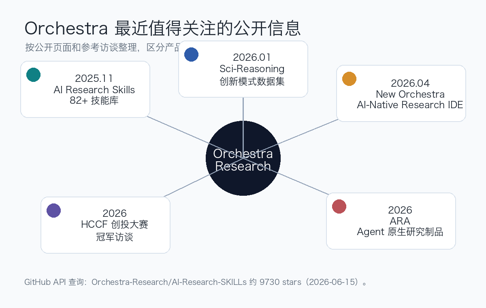
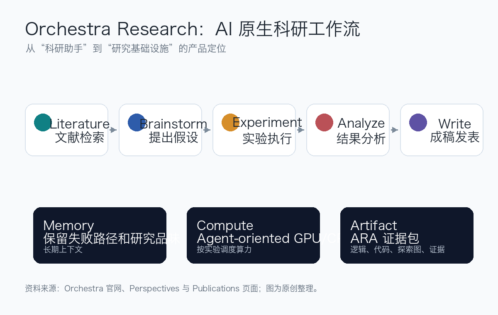

<!-- Generated by scripts/sync-wechat-articles.mjs. Do not edit manually. -->

> 本文同步自“现智研”微信推文工作区。发布日期：2026-06-15。来源：`articles/20260615/orchestra_research_ai_science_platform.md`。

# Orchestra想做科研版GitHub

最近，一个叫 **Orchestra Research** 的 AI 科研平台开始在科研 Agent 圈里被频繁提到。

它的官网地址是：

<https://www.orchestra-research.com/>

如果只看一句话定位，它想做的事情很直接：

**把 AI Agent、文献、实验、算力、代码、结果和论文写作放到同一个科研工作流里。**

更具体一点，它希望成为“科学界的 GitHub”。

这个说法来自一篇哈佛中国论坛的创始人访谈。访谈对象是 Orchestra 创始人张泽辰，文章标题是：

**第二十九届哈佛中国论坛创投大赛冠军独家专访：Orchestra创始人张泽辰**

这篇访谈给出了一个很清楚的创业叙事：

Orchestra 不只是想做一个聊天助手，而是想把科研过程本身变成可以被记录、复现、分叉和继续构建的基础设施。

## 1. 官网现在怎么介绍 Orchestra？

截至 2026 年 6 月 15 日，Orchestra 官网的主标题是：

**AI for Science, From Idea to Publication**

它把自己定义为：

**The Agent-Native Research Platform**

官网列出的核心工作流包括：

- Search literature：检索和综合文献
- Brainstorm：提出研究想法
- Plan experiments：规划实验
- Run GPU jobs：运行 GPU 作业
- Analyze results：分析结果
- Draft publications：撰写论文或报告

也就是说，Orchestra 不是一个单点工具。

它要覆盖的是从想法到发表的完整科研周期。

这也是它和普通 AI 写作工具最大的差别。

普通工具多停留在“帮你写一段话”。

Orchestra 想进入的是：

**科研执行层。**

包括环境、代码、实验、计算资源、日志、结果和证据链。

## 2. 参考访谈透露了什么？

哈佛中国论坛的访谈提供了几个关键信息。

第一，创始人张泽辰是哈佛大学物理学博士生。

他在访谈中说，自己做科研时发现大量时间被消耗在“管道工”工作上：

- 调试代码
- 搭建工程
- 管理计算环境
- 找论文
- 复现别人实验

这和很多计算生物学、AI、材料、物理研究者的真实体验非常接近。

真正限制科研速度的，不一定是没有想法，而是：

**想法到实验之间有太多工程摩擦。**

第二，Orchestra 的早期灵感来自 Cursor 这类 AI 编程工具。

创始人的判断是：

既然软件工程已经出现了 AI-native IDE，那么科研也应该有自己的 AI-native IDE。

第三，联合创始人刘嘉辰 Amber 的加入非常关键。

访谈提到，她此前在 Meta AI 从事强化学习基础设施和语言模型训练工作，也参与了 AI 科研 Agent 相关研究。

这解释了为什么 Orchestra 的产品不是只做界面，而是持续强调：

- 实验执行
- 可复现性
- Agent Skills
- Agent-Native Research Artifacts

这些都更接近科研基础设施，而不是普通 SaaS 工具。

## 3. 开源技能库是重要信号

Orchestra 目前最容易被外部验证的资产之一，是 GitHub 上的开源项目：

<https://github.com/Orchestra-Research/AI-Research-SKILLs>

我用 GitHub API 查询时，这个仓库约有 **9730 stars**。

官网和项目介绍都强调，这是一个面向 AI 研究 Agent 的技能库。

它的目标不是教模型“会写 Python”，而是给 Agent 补上科研工程里的专业上下文，例如：

- 数据处理
- fine-tuning
- 分布式训练
- post-training
- evaluation
- inference serving
- mechanistic interpretability
- infrastructure

这点很重要。

通用代码 Agent 的问题通常不是语法不会，而是缺少领域工程经验。

它可能写出一段看起来能跑的训练脚本，但不知道当前框架的坑、评估协议的细节、显存限制、分布式配置、日志记录和复现实验需要注意什么。

Skills 的意义就是把这些“研究工程经验”打包给 Agent。

从这个角度看，Orchestra 的路线和 CLI-Anything、Codex skills、Claude Code skills 等趋势是同一类：

**未来 Agent 的能力不只来自基础模型，也来自可复用的任务知识包。**

## 4. ARA：论文不该只是 PDF

Orchestra 另一个值得关注的方向是 **Agent-Native Research Artifacts，ARA**。

它的核心观点是：

传统论文把一个复杂、分叉、反复失败和修正的研究过程，压缩成一条线性叙事。

这对人类阅读很方便。

但对复现和 AI Agent 来说，损失了大量关键信息。

Orchestra 在 ARA 页面中把这个问题拆成两类成本：

- Storytelling Tax：真实探索过程被压缩成干净故事
- Engineering Tax：论文描述不足以支撑完整复现

ARA 想把论文重构成四层机器可读对象：

- scientific logic
- executable code/specifications
- exploration graph
- evidence

换句话说，未来的研究产出不应该只是 PDF。

它更应该像一个可执行、可追踪、可 fork 的研究仓库。

这和“科学界的 GitHub”这个口号是连在一起的。

## 5. Sci-Reasoning：他们也在研究“科研创新模式”

Orchestra 的 Publications 页面还列出了几项研究产出，其中包括：

**Sci-Reasoning: A Dataset Decoding AI Innovation Patterns**

这篇工作试图把顶级 AI 论文背后的创新路径结构化，分析研究想法是如何从前人工作中产生的。

这件事和产品方向也有关。

如果一个科研 Agent 只会检索论文、总结论文，它还只是一个文献助手。

如果它能理解：

- 一个领域真正的 gap 在哪里
- 哪些旧方法可以被重新组合
- 哪种 representation shift 能打开新问题
- 哪些失败路径值得保留

它才更接近科研协作者。

所以 Orchestra 的路线不是单纯“让 AI 写论文”。

更准确地说，它在尝试做三件事：

1. 用产品承载真实科研工作流
2. 用 Skills 提供科研工程知识
3. 用 ARA 和 Sci-Reasoning 重构科研产出的数据结构

## 6. 为什么这家公司值得关注？

我觉得 Orchestra 值得关注，不是因为它已经证明了“AI 可以替代科学家”。

恰恰相反。

它比较务实的一点在于：

**它没有把科学发现简化成一键生成论文，而是把大量科研摩擦拆成可工程化的问题。**

这些问题包括：

- 文献太多，读不过来
- 实验环境难复现
- GPU 作业管理复杂
- 失败实验没有被保存
- 论文无法完整承载研究过程
- Agent 缺少领域工程技能
- 研究团队之间难以共享过程记忆

这些并不浪漫，但非常真实。

对生物医学研究尤其如此。

单细胞、多组学、药物筛选、影像分析、蛋白设计、肿瘤演化建模，都不是单轮问答能解决的问题。

它们需要的是持续的项目记忆、可复现代码、清晰数据结构和可审计证据链。

这正是 Orchestra 这类平台想切入的地方。

## 7. 也要看清边界

目前关于 Orchestra 的公开信息，主要来自官网、GitHub、官方博客、研究论文页面，以及哈佛中国论坛的创始人访谈。

独立媒体和第三方深度评测还不多。

所以对它的判断应该保持谨慎：

- 官网称研究人员来自多所顶尖机构，但具体使用深度需要更多案例验证
- AI Research Skills 热度很高，但开源 star 不等于产品留存
- ARA 概念很有前瞻性，但是否能进入主流科研出版流程，还需要生态配合
- AI-native Research IDE 的体验强弱，最终取决于真实项目中的稳定性、成本、权限管理和复现质量
- 对生物医学等高风险领域，Agent 输出必须经过人工审核和独立验证

换句话说：

Orchestra 的方向很有价值，但它还处在早期验证阶段。

真正需要观察的是：

**它能否从“很会讲科研未来”走向“每天被研究者稳定使用”。**

## 一句话总结

Orchestra Research 的核心看点，不是又做了一个 AI 聊天工具。

它真正想做的是：

**把科研从 PDF、文件夹、脚本和临时对话中解放出来，变成一个由 Agent、代码、算力、证据和研究记忆共同组成的可复现系统。**

如果这个方向跑通，未来科研工作流可能会发生一个根本变化：

论文不再是研究的唯一终点。

研究过程本身，会成为可以被保存、复现、分叉和继续构建的基础设施。

## 参考信息

- Orchestra Research 官网：<https://www.orchestra-research.com/>
- Perspectives：<https://www.orchestra-research.com/perspectives>
- Publications：<https://www.orchestra-research.com/publications>
- AI Research Skills：<https://github.com/Orchestra-Research/AI-Research-SKILLs>
- ARA：<https://www.orchestra-research.com/ara>
- 参考访谈：<https://mp.weixin.qq.com/s/EAsM6UEi77C7u1nyeeHbWg>

---

作者：HFLT_Agent

研究团队电子名片：<https://ydlongtao.github.io/Myblog/>

本文仅供学术交流与工具观察，不构成投资建议或商业推荐。

