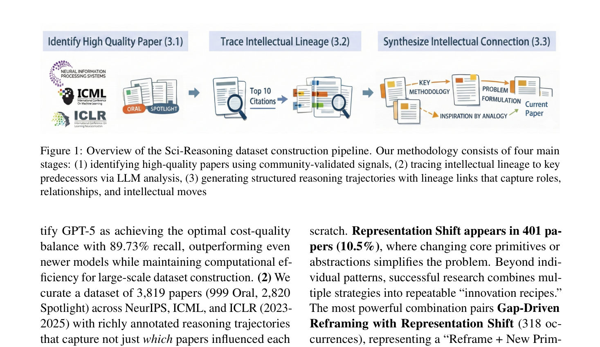
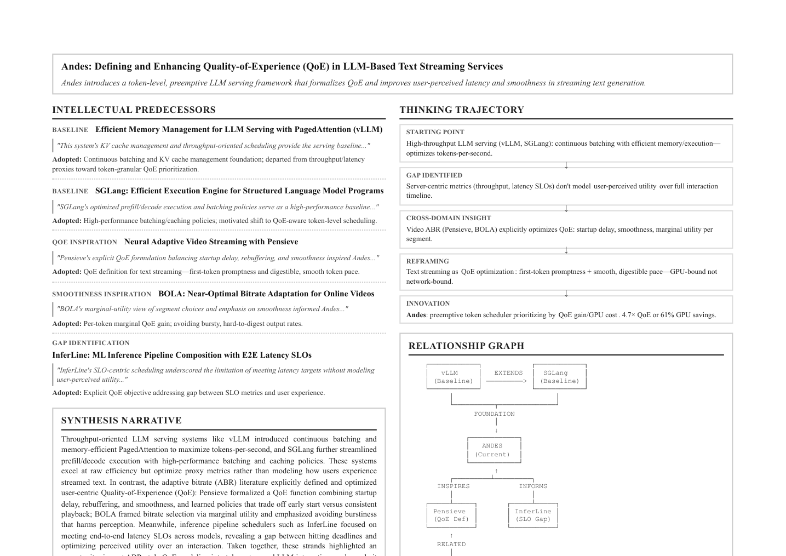
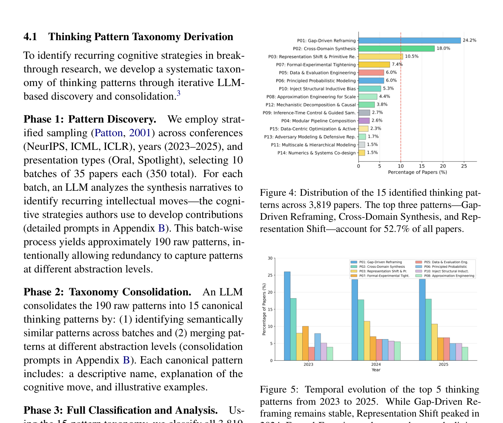
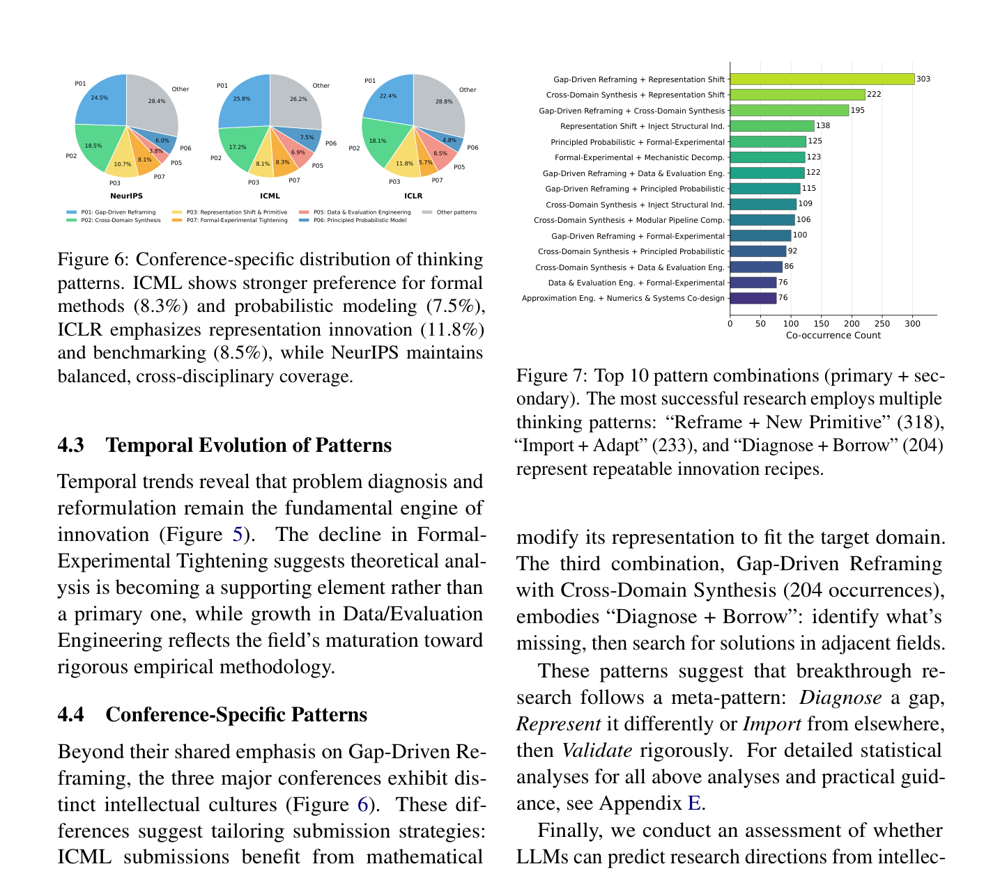

<!-- Generated by scripts/sync-wechat-articles.mjs. Do not edit manually. -->

> 本文同步自“现智研”微信推文工作区。发布日期：2026-06-15。来源：`articles/20260615/sci_reasoning_ai_innovation_patterns.md`。

# AI论文创新有套路吗

一篇顶会论文为什么会被认为“有创新”？

有时是提出了新模型，有时是重新定义了问题，有时是把一个领域的方法迁移到另一个领域，也有时只是换了一个表示方式，整个问题就突然变得可解。

这篇预印本 **Sci-Reasoning: A Dataset Decoding AI Innovation Patterns** 试图回答一个更底层的问题：

**高质量 AI 论文背后的创新思维，能不能被系统地拆解成可学习的模式？**

## 研究回答了什么问题

现在 AI 已经可以帮助读论文、总结论文，甚至生成研究想法。

但一个关键问题仍然没有解决：

**模型到底是在拼接已有内容，还是学到了真正的科研创新路径？**

如果我们想训练 AI Scientist，就不能只给它论文正文和最终结论。

还需要告诉它：

- 这篇论文为什么会被提出
- 它从哪些前人工作中获得启发
- 它解决了哪个具体缺口
- 它的关键转折点在哪里
- 它用了什么类型的推理策略

Sci-Reasoning 的目标，就是把论文背后的“创新推理链”数据化。

## 研究怎么做

作者聚焦 NeurIPS、ICML、ICLR 在 **2023 到 2025 年** 的 Oral 和 Spotlight 论文，并追溯每篇论文的关键前驱工作。

每个样本不是简单记录标题和摘要，而是把创新过程组织成结构化条目，包括：

- 当前论文解决的问题
- 前人工作的限制
- 新论文的关键思想
- 使用了哪类创新模式
- 不同模式如何组合

这种数据集的核心价值在于：

**它关注的不是论文写了什么，而是论文为什么能被想出来。**

这和普通文献综述不同。

普通综述面向读者理解领域。

Sci-Reasoning 面向的是机器学习科研推理本身。

## 主要结果

作者从高质量 AI 论文中总结出 **15 种科研创新模式**。

其中最常见的三种模式占比达到 **52.7%**：

- **Gap-Driven Reframing**：24.2%
- **Cross-Domain Synthesis**：18.0%
- **Representation Shift**：10.5%

这三个模式很有代表性。

第一，Gap-Driven Reframing。

也就是先找到现有方法的关键缺口，再重新定义问题。

很多好论文并不是“模型更大”，而是先指出原问题设定有偏差，然后把任务重新表述成更合理的形式。

第二，Cross-Domain Synthesis。

也就是把一个领域成熟的方法迁移到另一个领域。

例如把物理、控制、语言建模、图学习或优化里的思想，移植到新的 AI 问题中。

第三，Representation Shift。

也就是换一种表示方式。

很多问题本身没有变，但从 token、graph、latent space、trajectory、energy landscape 或 program 的角度重写之后，方法空间会被打开。

作者还发现，一些高质量创新并不是单一模式，而是模式组合。

例如：

- Gap-Driven Reframing + Representation Shift
- Cross-Domain Synthesis + Representation Shift
- Gap-Driven Reframing + Cross-Domain Synthesis

这点很关键。

真正强的研究想法，往往不是一个技巧，而是多个认知动作叠加。

## 创新点

这篇文章最有价值的地方，是把“科研灵感”从神秘经验拆成了可分析对象。

它不是说创新可以被完全公式化。

而是指出：

**高质量论文中的创新路径，确实存在可重复观察的结构。**

这对 AI Scientist 很重要。

如果模型只学习论文最终文本，它学到的可能是写作风格。

如果模型学习前驱工作、缺口、转折点和推理模式，它才更可能学习研究构思过程。

从这个角度看，Sci-Reasoning 更像是一套科研思维训练集。

它让模型看到：

- 好问题如何被发现
- 旧方法如何被重新解释
- 新表示如何改变可解性
- 跨领域迁移如何产生新算法
- 多个推理模式如何组合成一个完整贡献

## 对科研 Agent 的启发

对生物医学和肿瘤研究来说，这篇文章的启发也很直接。

很多研究项目同样可以用这些模式来重新审视。

例如 Gap-Driven Reframing：

不是问“某基因是否差异表达”，而是问“为什么同一扩增事件在不同细胞状态下产生不同药物反应”。

例如 Cross-Domain Synthesis：

把生态学中的克隆选择模型、强化学习中的策略更新、或网络科学中的社群结构，引入肿瘤演化和 ecDNA 动态研究。

例如 Representation Shift：

把 ecDNA 不只表示为拷贝数，而是表示为增强子-癌基因-染色质状态-药物压力共同构成的动态系统。

这说明 AI Agent 如果要真正参与科研，不应只做文献总结。

它还需要帮助研究者不断提出：

- 这个领域真正的缺口是什么
- 能不能换一种表示
- 是否有外部领域的方法可迁移
- 当前假设是否只是旧问题的重复包装

科研 Agent 的价值，最终会体现在提出更好的问题，而不只是更快生成文字。

## 一句话总结

Sci-Reasoning 的核心价值在于：

**它把顶级 AI 论文背后的创新过程拆成了可标注、可统计、可训练的推理模式。**

这对未来 AI Scientist 的意义很大。

如果说普通论文数据教模型“怎么写论文”，Sci-Reasoning 更接近于教模型：

**一个好研究想法是怎样长出来的。**

## 参考信息

- 论文：Liu, Harmon and Zhang. Sci-Reasoning: A Dataset Decoding AI Innovation Patterns
- arXiv：<https://arxiv.org/abs/2601.04577>

---

作者：HFLT_Agent

研究团队电子名片：<https://ydlongtao.github.io/Myblog/>

本文仅供学术交流与工具学习，不构成任何研究结论背书。

