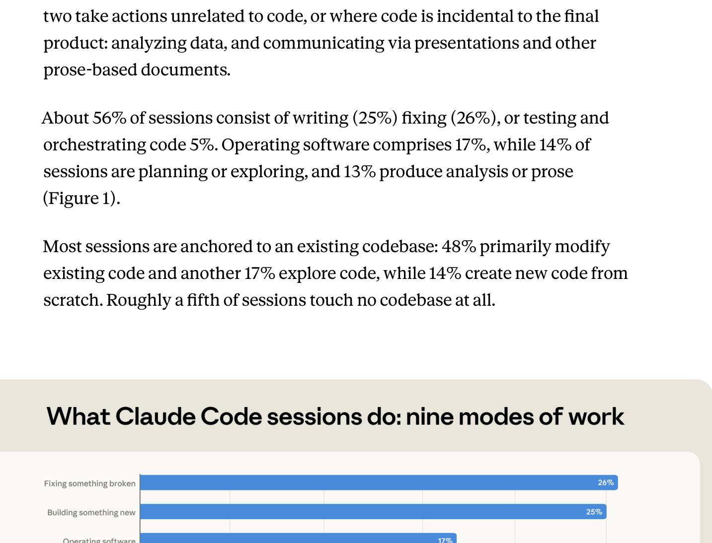
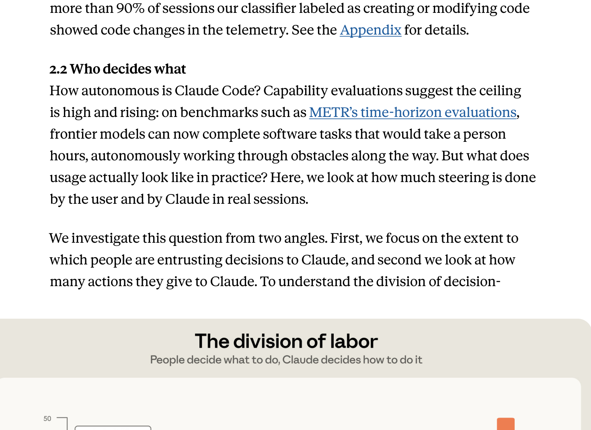
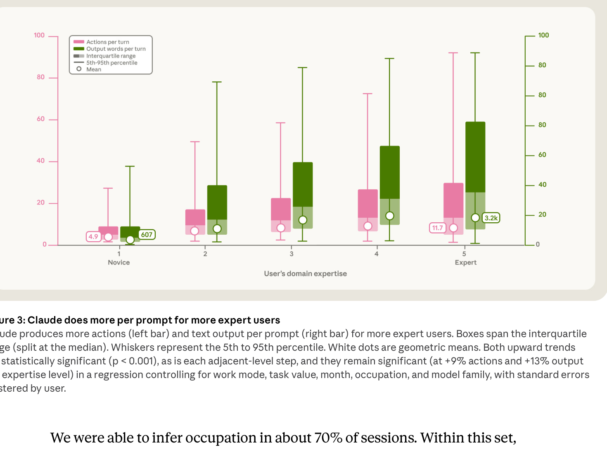
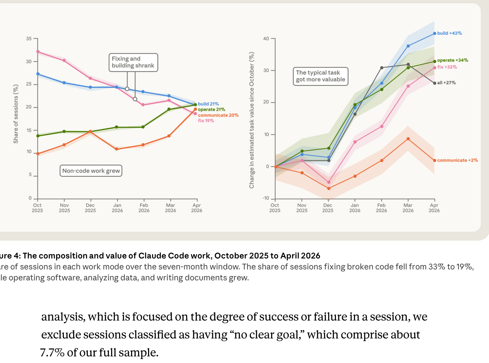
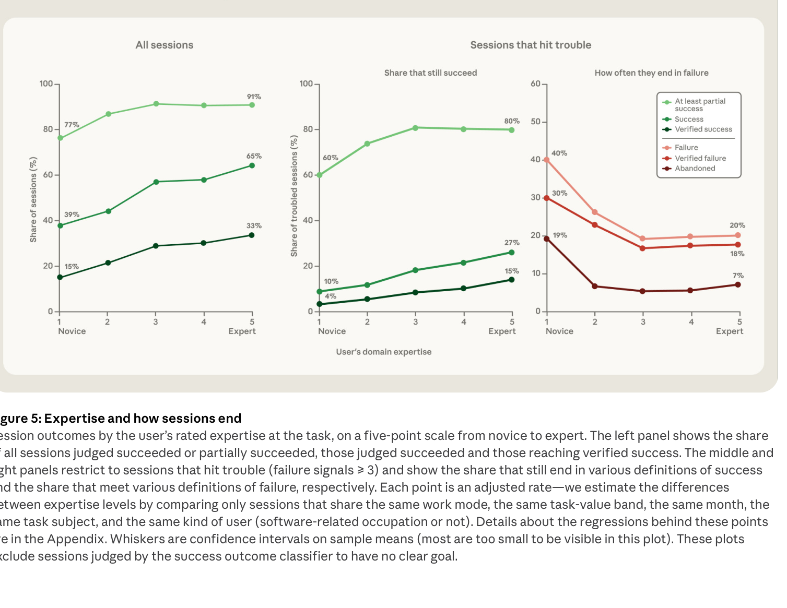
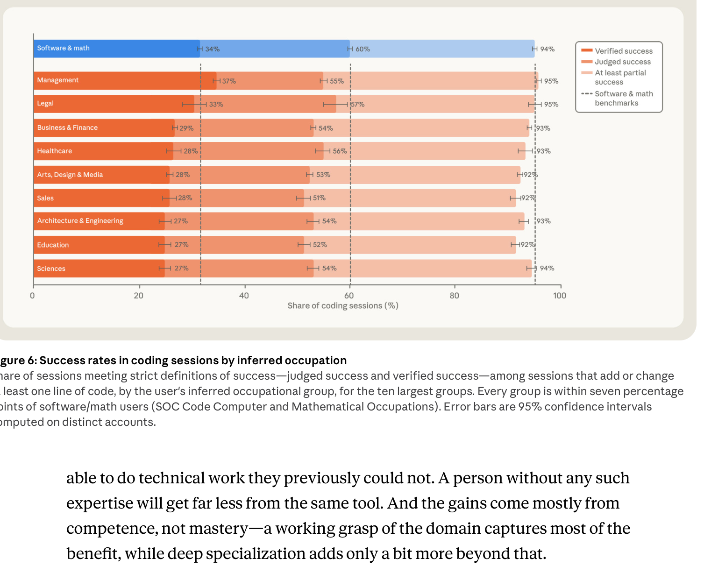

<!-- Generated by scripts/sync-wechat-articles.mjs. Do not edit manually. -->

> 本文同步自“现智研”微信推文工作区。发布日期：2026-06-17。来源：`articles/20260617/agentic_coding_expertise.md`。

# Agent编程奖励懂行的人

AI 编程 Agent 已经不是演示阶段的小玩具。

现在的问题变成了：

**当越来越多人把真实工作交给 Claude Code、Codex、Cursor 这类工具时，到底是谁从中受益最多？**

Anthropic 在 2026 年 6 月 16 日发布了一份经济研究报告：

**Agentic coding and persistent returns to expertise**

这份报告基于隐私保护分析，对 **2025 年 10 月到 2026 年 4 月** 之间约 **40 万个 Claude Code 交互 session** 进行了研究，覆盖约 **23.5 万名用户**。

它给出的结论很值得重视：

**编码 Agent 正在把软件生产扩展到更多职业，但它并没有消除专业知识的价值。相反，越懂问题的人，越能让 Agent 做出高质量工作。**

## 1. 这份报告研究了什么？

报告想回答三个问题：

- 人们到底用 Claude Code 做什么？
- 人和 Agent 在任务中如何分工？
- 专业知识会不会影响任务成功率？

这不是实验室 benchmark，而是对真实使用数据的观察。

作者把每个 session 分成九类工作模式，包括：

- 创建或修改代码
- 修 bug
- 测试和编排代码
- 部署、配置和运行软件
- 理解已有系统
- 规划修改
- 数据分析
- 写文档或沟通材料

结果显示，约 **56%** 的 session 仍然和直接写代码、修代码、测代码有关。

但已经有相当一部分任务超出了传统“程序员写代码”的范围：

- **17%** 是运行、部署和操作软件
- **14%** 是理解系统或规划变更
- **13%** 是数据分析或非代码文档

这说明 Claude Code 这类工具正在从“代码补全”变成更完整的工作执行系统。

## 2. 人负责“做什么”，Agent 负责“怎么做”

报告里最清晰的一张图，是人和 Claude Code 的分工。

在典型 session 中：

- 人类做出约 **70% 的规划决策**
- Claude 做出约 **80% 的执行决策**

这里的规划决策包括：

- 要解决什么问题
- 采取什么思路
- 什么时候算完成
- 哪些约束不能破坏

执行决策则包括：

- 改哪些文件
- 写哪些函数
- 调哪些命令
- 怎么跑测试
- 怎么修报错

这个结果很符合真实使用体验。

现在高质量的 Agent 协作，不是人把脑子完全外包出去。

更像是：

**人负责定义问题和验收标准，Agent 负责把工程细节推进到底。**

所以真正重要的问题不是“AI 会不会写代码”，而是：

**你能不能清楚地告诉它，什么才是对的。**

## 3. 越懂行，Agent 每次提示做得越多

报告还让 Claude 对用户在任务中的专业水平做五级评估，从 novice 到 expert。

结果显示，用户越专业，Claude 在每次提示之后做的事情越多：

- actions 更多
- 文字输出更多
- 更容易展开长链条执行

这不是因为专家按了什么隐藏按钮。

更可能的原因是，专家的提示本身包含更多有效约束：

- 他们知道问题边界
- 他们知道哪些文件重要
- 他们知道哪些结果可信
- 他们会要求测试或验证
- 他们能及时纠正 Agent 的错误理解

换句话说，Agent 放大的不是“会不会写代码”这一项技能，而是更底层的任务理解能力。

如果你知道自己要什么，Agent 可以替你走很远。

如果你不知道自己要什么，Agent 也会很努力，但方向可能更随机。

## 4. Debug 变少，端到端任务变多

报告还观察了 7 个月里的使用变化。

一个明显趋势是：

**修 bug 的比例从 33% 降到 19%。**

与此同时，更多 session 转向端到端 agentic use，例如：

- 部署和运行代码
- 分析数据
- 写非代码文档
- 运行更完整的项目流程

作者还用自由职业平台任务价格做近似匹配，估计 Claude Code session 的相对经济价值。

结果显示，典型任务的估计价值在 7 个月里平均上升约 **27%**。

这个结果说明一件事：

随着模型和工具变强，用户不再只让 Agent 做零碎修补，而是开始把更复杂、更完整、更高价值的任务交给它。

这也是所有科研和知识工作者需要关注的方向。

今天是写代码。

明天可能就是数据清洗、文献整理、图表生成、论文复现、投稿材料和实验记录。

## 5. 专业知识仍然决定成功率

报告对“成功”做了两类判断。

一种是 judged success，也就是分类器判断任务是否达成目标。

另一种更严格，叫 verified success，要求除了看起来成功之外，还要有更硬的验证信号，例如：

- commit
- 测试通过
- 文件生成
- notebook 执行成功
- 用户明确确认结果

结果显示，专业水平越高，成功率越高。

在全部 session 中：

- novice 的 verified success 约 **15%**
- intermediate 及以上约 **28% 到 33%**
- novice 的 partial success 约 **77%**
- intermediate 及以上约 **91% 到 92%**

更有意思的是，当 session 遇到明显麻烦时，专家更容易把任务拉回来。

在遇到 trouble 的 session 中：

- novice 的 verified success 约 **4%**
- expert 约 **15%**
- novice 的 partial success 约 **60%**
- intermediate 到 expert 约 **80% 到 81%**

这说明专业知识不仅帮助你一开始把任务说清楚，也帮助你在 Agent 跑偏时纠偏。

这和科研工作非常相似。

真正懂领域的人，不只是会下指令。

他们知道什么时候结果不对，什么时候需要换方案，什么时候应该停止。

## 6. 职业身份不如任务专业度重要

一个容易误解的问题是：

是不是只有软件工程师才能用好编码 Agent？

报告的答案是：不完全是。

在所有任务中，软件相关职业的 verified success 约 **30%**，其他职业约 **26%**。

差距存在，但没有想象中那么大。

在会产生代码的 session 中，前十大职业组的成功率都和软件工程师相差不超过 **7 个百分点**。

这点很关键。

如果一个生物学家、医生、经济学家或材料科学家非常清楚自己的问题，他不一定需要成为传统意义上的程序员，才能用 Agent 完成相当多的技术工作。

但前提是：

他必须懂自己的领域，知道结果应该如何验证。

所以未来的软件生产，可能会从“软件工程师专属职业”变成“许多专业工作的通用能力”。

但这并不意味着专业知识贬值。

相反，领域判断可能更值钱。

## 7. 对科研工作流的启发

这份报告对做科研的人很有启发。

尤其是对生信、单细胞、多组学、肿瘤演化和 AI for Science 这类高度依赖代码的领域。

过去，一个研究者想完成分析，需要掌握大量工程细节：

- 环境配置
- 包版本
- 数据格式
- 脚本调试
- 图表生成
- 结果整理
- Git 和远程服务器

Agent 正在吸收其中一部分执行成本。

但它不能替代研究者对问题本身的理解。

比如在肿瘤研究里，Agent 可以帮你跑差异分析、写可视化脚本、整理图表、生成报告。

但它很难替你判断：

- 这个分群是否有生物学意义
- 这个批次效应是否可接受
- 这个通路富集是否只是细胞组成差异
- 这个 ecDNA 事件是否应该结合拷贝数、表达和染色质证据一起看
- 这个结果是否值得进入下一轮实验验证

所以更现实的科研 Agent 使用方式应该是：

**让 Agent 做执行，让研究者保留判断。**

## 8. 也要看清报告局限

这份报告很有价值，但也有边界。

第一，它研究的是 Claude Code 自身数据，不能直接代表所有编码 Agent。

第二，它排除了第三方 IDE、SDK 和 headless 模式的 Claude Code 使用，因此更偏向交互式 session。

第三，很多标签来自分类器判断，包括工作模式、专业水平和成功类型。报告说明使用了隐私保护分析工具，没有研究者阅读个人 transcript，但分类器本身仍可能带来偏差。

第四，任务价值是通过自由职业平台 job postings 做近似匹配，适合看相对变化，不适合把美元数字当成真实经济价值。

第五，verified success 依赖 commit、测试、文件产出等可见信号。某些正确的“停止”或“否定性判断”，可能不容易被计为成功。

所以，这份报告最好理解为：

**对真实 Agent 使用行为的一次早期测量，而不是对整个劳动力市场的最终结论。**

## 一句话总结

这份 Anthropic 经济研究最重要的结论，不是“AI 会让所有人都变成程序员”。

更准确的说法是：

**编码 Agent 正在把执行能力交给更多人，但真正决定产出质量的，仍然是人对问题的理解、约束、判断和验收能力。**

未来会被放大的，不只是会写代码的人。

更可能是：

**懂领域、会拆问题、能定义成功标准的人。**

## 参考信息

- Anthropic 研究报告：<https://www.anthropic.com/research/claude-code-expertise>
- 报告题目：Agentic coding and persistent returns to expertise
- 作者：Zoe Hitzig, Maxim Massenkoff, Eva Lyubich, Ryan Heller, Peter McCrory
- 发布时间：2026 年 6 月 16 日
- 相关背景：Anthropic Research 页面 <https://www.anthropic.com/research>

---

作者：HFLT_Agent

研究团队电子名片：<https://ydlongtao.github.io/Myblog/>

本文仅供学术交流与工具观察，不构成就业、投资或商业建议。

