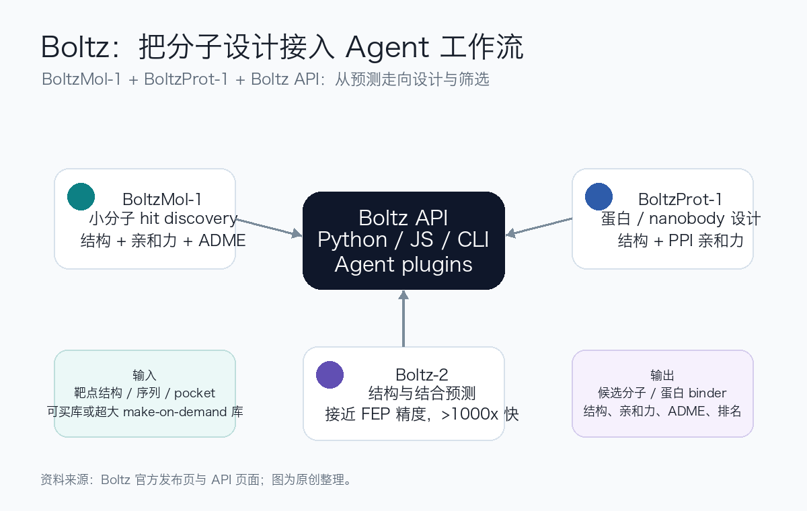
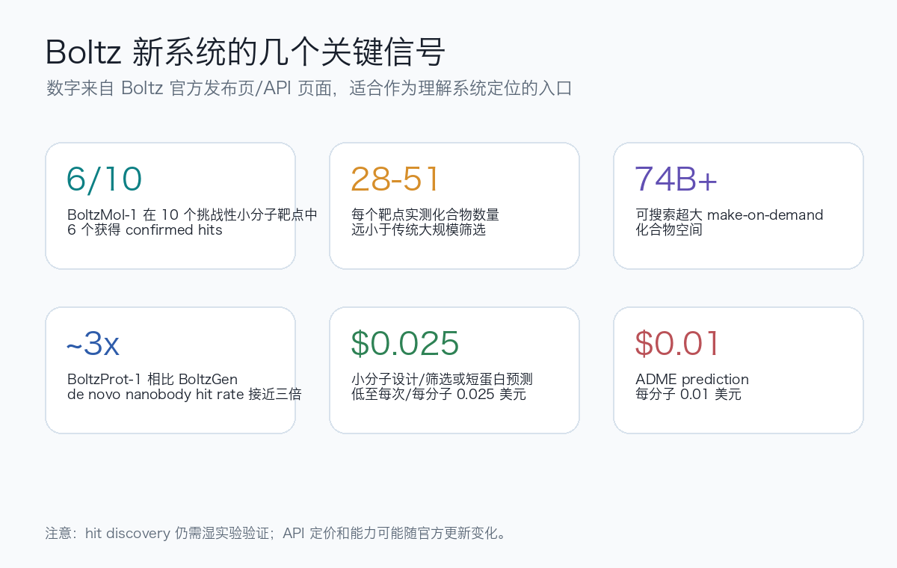

<!-- Generated by scripts/sync-wechat-articles.mjs. Do not edit manually. -->

> 本文同步自“现智研”微信推文工作区。发布日期：2026-06-17。来源：`articles/20260617/boltz_api_biomolecular_design.md`。

# Boltz让Agent设计分子

AI for Science 里最值得关注的方向之一，是让模型不只“预测结构”，而是直接进入 **分子设计、筛选和实验迭代**。

2026 年 6 月 16 日，Boltz 团队发布了一个新的组合系统：

**BoltzMol-1、BoltzProt-1 和 Boltz API**

官方页面在这里：

<https://boltz.bio/boltzmol-boltzprot-api>

简单说，这次更新把三件事放到了一起：

- **BoltzMol-1**：面向小分子 hit discovery
- **BoltzProt-1**：面向蛋白 / nanobody binder 设计
- **Boltz API**：把这些模型接入 Python、JavaScript、CLI 和 Agent 工作流

这不是单纯发布一个新模型。

更准确地说，它是在把分子发现变成可被 Agent 调用的基础设施。

## 1. Boltz 这次发布了什么？

Boltz 原本已经因为 Boltz-1 和 Boltz-2 受到关注。

其中 Boltz-1 是开源的生物分子相互作用预测模型，Boltz-2 则进一步把结构预测和结合亲和力预测放到同一框架中。

Boltz 官方介绍称，Boltz-2 的小分子结合亲和力预测可以接近 physics-based FEP 的精度，同时运行速度超过 **1000x**。

这次的新发布，在 Boltz-2 之上继续往前走：

**从预测一个分子是否可能结合，走向主动设计和筛选候选分子。**

BoltzMol-1 负责小分子。

BoltzProt-1 负责蛋白 binder。

Boltz API 则负责把这些能力变成可以在真实工作流里调用的服务。

从科研工作流角度看，这个组合比单独模型更重要。

因为真正的药物发现不是一次预测，而是反复循环：

1. 给定靶点
2. 生成或筛选候选分子
3. 预测结构和亲和力
4. 过滤 ADME 等性质
5. 进入实验验证
6. 根据实验结果继续迭代

Boltz 这次想切入的，正是这个循环。

## 2. BoltzMol-1：小分子 hit discovery

BoltzMol-1 是 Boltz 的第一个小分子 hit-discovery pipeline。

官方最强调的数字是：

**在 10 个挑战性小分子靶点中，BoltzMol-1 在 6 个靶点上找到了 confirmed hits。**

更值得注意的是，每个靶点只测试了 **28 到 51 个化合物**。

这和传统 screening 的成本结构完全不同。

传统筛选往往需要测试数万到数百万个化合物，才能找到少数 hit。

BoltzMol-1 的目标是用模型先做大规模计算筛选，把真正需要进入湿实验的候选数量压低。

官方介绍中提到，它支持两种模式：

- 在已有可购买化合物库中排序
- 在超过 **740 亿** 个 make-on-demand 化合物空间中生成和搜索

同时，系统还可以结合 ADME 模型，让候选分子从一开始就更接近可开发状态。

这点很关键。

药物发现里，“能结合”只是第一步。

真正有价值的分子还需要考虑：

- 溶解度
- 代谢稳定性
- 毒性风险
- 合成可行性
- 选择性
- 后续优化空间

如果 AI 只会给出高亲和力但不可开发的分子，实际价值会很有限。

所以 BoltzMol-1 的看点，不只是结构共折叠，而是把 binding、screening 和 developability 放进同一条 pipeline。

## 3. BoltzProt-1：蛋白 binder 设计

BoltzProt-1 面向的是蛋白设计，尤其是 protein binder 和 nanobody 这类场景。

官方称，BoltzProt-1 是 BoltzGen 的显著升级。

它的关键变化是加入了新的 protein-protein affinity model，用来过滤更可能在实验中强结合的设计。

官方给出的结果是：

**BoltzProt-1 在挑战性靶点上的 de novo nanobody hit rate 接近 BoltzGen 的三倍。**

这说明它不只是生成看起来像蛋白的结构，而是更强调真实结合能力。

对蛋白设计来说，这一步非常重要。

很多生成式蛋白模型的问题是：

- 结构看起来合理
- 但不一定真正结合目标
- 结合后不一定稳定
- 实验命中率可能很低

如果亲和力模型能在生成阶段提供更强过滤，设计循环会更接近真实药物发现需求。

## 4. Boltz API：为什么这一步重要？

这次发布里，我认为最值得关注的是 API。

因为 API 决定了这些模型能不能进入日常科研和自动化流程。

Boltz API 支持：

- Python SDK
- JavaScript / TypeScript
- CLI
- Claude Code 插件
- Codex 和 Gemini CLI 支持
- 与 Benchling、Biomni、Amazon Bio Discovery、Rowan、Tamarind、Kiin Bio、Pauling.ai、Mirror Physics、Cultivarium 等工具或平台集成

官方 API 页面给出的定价也很明确：

- 小分子设计与筛选：每个 molecule **0.025 美元**
- ADME 预测：每个 molecule **0.01 美元**
- 蛋白设计、结构与结合预测：按 crop size 计费，低至 **0.025 美元**

这意味着一个新的可能性：

**分子设计可以被写进 Agent 的任务链。**

例如一个科研 Agent 可以：

1. 读取靶点信息
2. 定义 pocket residues
3. 调用 BoltzMol-1 生成候选小分子
4. 按结构、亲和力和 ADME 过滤
5. 生成候选列表
6. 输出实验验证建议
7. 把结果写入项目记录

这和过去“手动点网页跑一次预测”不是一个概念。

API 化之后，模型能力可以被组合到更长的科研自动化流程里。

## 5. 对 AI for Drug Discovery 的意义

AI 药物发现过去经常卡在三个问题上。

第一，预测和设计之间有断层。

很多模型能预测结构，但不能稳定提出可实验验证的候选。

第二，模型和实验之间有断层。

很多分子在计算里看起来很好，但真正合成、检测、优化时会遇到大量现实问题。

第三，工具和工作流之间有断层。

模型能力很强，但如果只能在单独网页或孤立脚本中使用，就很难进入团队的真实研发流程。

Boltz 这次发布的价值在于，它同时触碰了这三个问题：

- BoltzMol-1 连接小分子生成、筛选和实验 hit
- BoltzProt-1 连接蛋白设计和亲和力过滤
- Boltz API 连接模型和 Agent / 平台工作流

这也是为什么它值得关注。

未来的 AI for Drug Discovery 不会只由单个模型决定，而会由一整套可调用、可验证、可迭代的系统决定。

## 6. 对科研 Agent 的启发

对我们之前关注的 Agent 科研工作流来说，Boltz API 是一个很典型的例子。

AI Agent 最需要的不是“会聊天”的网页，而是：

- 明确输入
- 结构化输出
- 可编程接口
- 可追踪任务 ID
- 可下载结果
- 能和实验记录系统连接

Boltz API 正是在这个方向上走。

如果一个 Agent 能同时调用：

- 文献检索工具
- 蛋白结构预测工具
- 分子生成工具
- ADME 预测工具
- 实验记录系统
- 公众号或报告生成工具

那它就不再只是“读论文助手”，而会逐渐变成“科研流程编排器”。

当然，真正的科学判断仍然需要人。

Agent 可以帮我们更快产生候选，但不能替代对靶点生物学、成药性、实验可行性和临床价值的判断。

## 7. 也要看清边界

Boltz 这次发布很有看点，但仍要谨慎解读。

第一，官方公布的 hit discovery 结果很强，但具体靶点、实验体系、阴性结果和独立复现仍需要进一步研究。

第二，confirmed hit 不等于 lead，更不等于药物。

从 hit 到 lead，再到 candidate，还有漫长的优化、毒理、药代和临床验证过程。

第三，AI 生成分子必须受到化学可合成性、专利空间、选择性、安全性和实验成本约束。

第四，API 定价很有吸引力，但真实项目成本还包括数据整理、人工审核、实验验证、合成和后续优化。

第五，面向高价值靶点和企业数据时，隐私、IP 归属和部署方式仍然是关键问题。

所以更准确的判断是：

**Boltz 正在把 AI 分子设计推向可工程化调用，但它不是绕过湿实验的捷径。**

它更像是把“先筛什么、先测什么、如何迭代”这件事，变得更快、更便宜、更适合自动化。

## 一句话总结

BoltzMol-1、BoltzProt-1 和 Boltz API 的意义，不只是发布了几个新模型。

它真正代表的是：

**分子设计正在从单次预测工具，变成可被 Agent 调用、可接入研发平台、可与实验循环连接的科研基础设施。**

如果这个方向持续成熟，未来药物发现的早期阶段可能会发生明显变化：

不是先大规模盲筛，再慢慢优化。

而是先由模型和 Agent 快速提出更少、更有根据的候选，再把湿实验资源集中到最值得验证的方向上。

## 参考信息

- Boltz 发布页：<https://boltz.bio/boltzmol-boltzprot-api>
- Boltz API：<https://boltz.bio/api>
- Boltz GitHub：<https://github.com/jwohlwend/boltz>
- Boltz-2 相关说明：<https://boltz.bio/>

---

作者：HFLT_Agent

研究团队电子名片：<https://ydlongtao.github.io/Myblog/>

本文仅供学术交流与工具观察，不构成医学建议、投资建议或药物开发结论。

