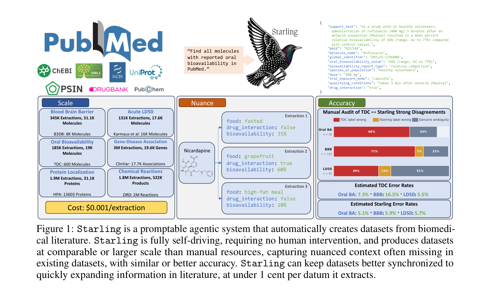
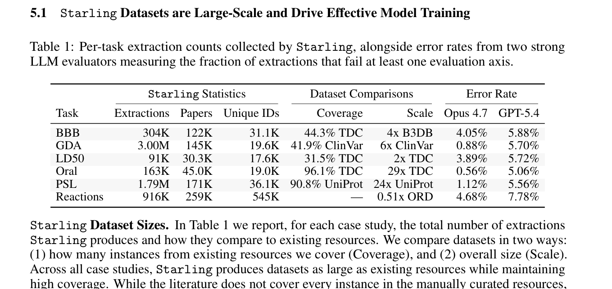
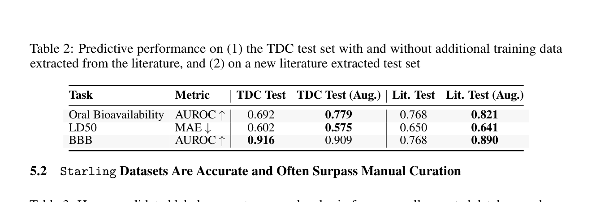
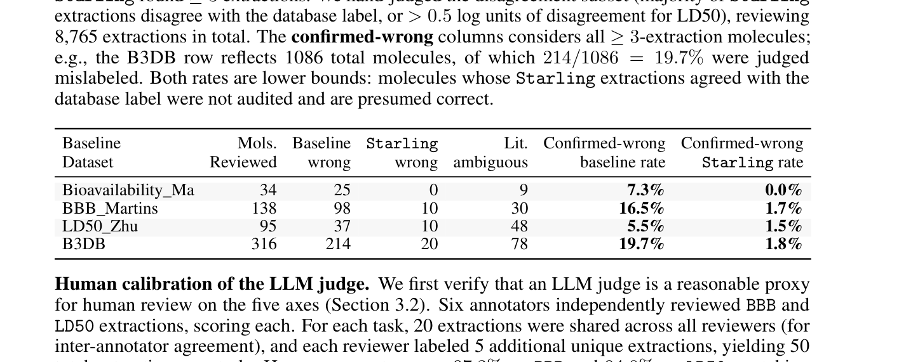
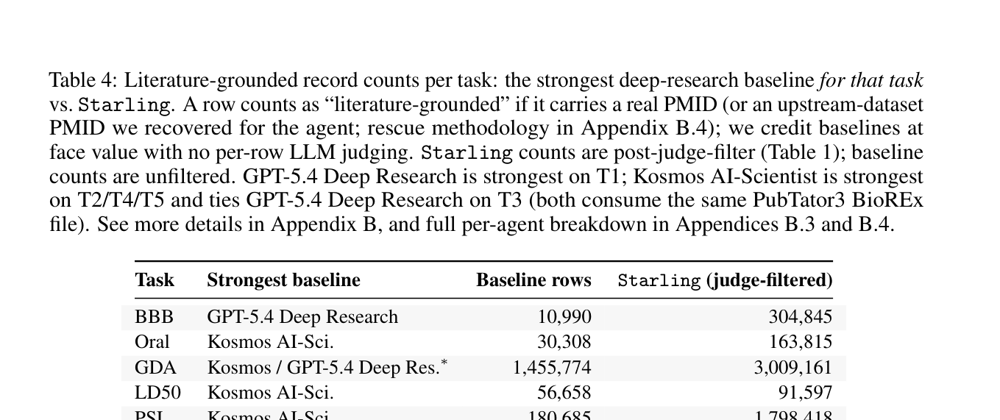
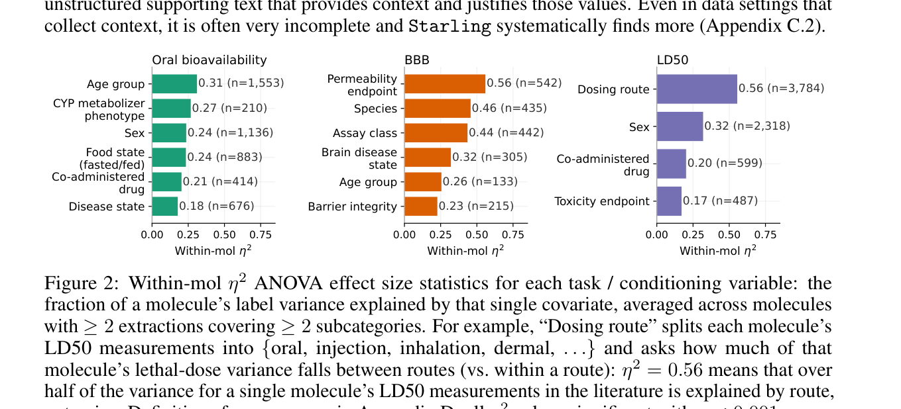

<!-- Generated by scripts/sync-wechat-articles.mjs. Do not edit manually. -->

> 本文同步自“现智研”微信推文工作区。发布日期：2026-06-21。来源：`articles/20260621/starling_self_driving_datasets.md`。

# Starling让数据集自己生长

生物医学 AI 的上限，很多时候不是模型，而是数据。

我们已经拥有数千万篇论文，但真正能直接拿来训练模型的数据，仍然主要依赖人工整理的表格型数据库。

这带来三个长期问题：

- 更新速度跟不上新文献
- 大量实验结果没有被收录
- 表格标签丢失了实验条件和上下文

2026 年 6 月 16 日，宾夕法尼亚大学团队更新了一篇预印本：

**Self Driving Datasets: From 20 Million Papers to Nuanced Biomedical Knowledge at Scale**

作者提出了一个名为 **Starling** 的多智能体系统。

它想做的事情很直接：

**给出一句自然语言任务，让 Agent 自动从 2250 万篇 PubMed 论文中构建结构化生物医学数据集。**

## 1. 为什么现有生物医学数据库还不够？

我们熟悉的药物、基因、蛋白和疾病数据库，通常经过长期人工整理。

这些数据库非常重要，但论文指出了三个限制。

第一，**缺少上下文**。

例如口服生物利用度不是一个只由分子结构决定的固定值。

它可能受到以下因素影响：

- 空腹还是进食
- 高脂饮食还是普通饮食
- 药物剂型
- 给药剂量
- 患者人群
- 是否合并使用其他药物

如果数据库只保留一个数字，模型就看不到这些条件。

第二，**覆盖不完整**。

实验结果首先出现在论文里，数据库往往几年后才收录，甚至永远不收录。

第三，**人工数据库也会有标签错误**。

论文对多个常用数据库进行人工复核后发现，部分数据集存在不可忽视的错误率。

所以作者提出一个思路：

**不要只依赖已经整理好的数据库，直接回到原始文献。**

## 2. 把 2250 万篇论文变成可检索数据底座

Starling 的第一层不是 Agent，而是一个经过实体标注的 PubMed 语料库。

团队处理了：

- **2250 万篇** PubMed 论文
- 约 **2.5 万亿 tokens**
- 约 **2.5 亿个**文本向量
- **45 亿个**实体标签
- **19 类**生物医学实体
- **9 个**参考本体和数据库体系

实体类型覆盖小分子、基因、蛋白、疾病、解剖结构、表型、生物过程等。

系统还会把不同写法规范到统一标识符。

例如一个药物可能同时有通用名、商品名、化学名和论文中的编号。Starling 会尝试把这些名称链接到 PubChem、ChEBI、DrugBank、UMLS、UniProt、NCBI Gene 等参考资源。

这一步很关键。

普通语义搜索能找到“意思相近”的段落，但在几千万篇论文上构建数据集，需要更精确的过滤：

**既要语义相关，也要包含正确类型的实体。**

## 3. 五个 Agent 如何协作？

Starling 把数据集构建分成两个阶段。

第一阶段是 query construction。

系统要决定：

- 搜索哪些实体组合
- 使用什么语义查询
- 如何兼顾 precision 和 recall
- 最终数据表应该有哪些字段

第二阶段是 extraction。

系统在筛选后的论文子集中提取记录，并用 Judge 删除低质量结果。

整个流程由五个 Agent 组成：

1. **Proposer**：设计和修改检索 probe，并诱导数据 schema
2. **Validator**：判断检索结果是否相关、字段是否正确
3. **Investigator**：分析误匹配，提出过滤条件修改建议
4. **Extractor**：把论文段落转成结构化记录
5. **Judge**：按统一标准过滤最终记录

Judge 会检查五个方面：

- 任务是否相关
- 主标签是否正确
- supporting passage 是否真的支撑结论
- 次级字段是否准确
- 实体归属是否正确

只有全部通过的记录才进入最终数据集。

这和普通 Deep Research 的区别很大。

普通系统的目标通常是写一份报告。

Starling 的目标是：

**尽可能完整地找到某类证据，并输出数十万到数百万条格式统一、带来源的数据记录。**

## 4. 六类任务产生约 630 万条记录

作者在六个治疗研究相关任务上测试 Starling：

- 血脑屏障通透性 BBB
- 口服生物利用度
- 急性毒性 LD50
- 基因-疾病关联
- 蛋白亚细胞定位
- 化学反应

v3 版本的最终结果约为 **630 万条记录**。

其中：

- BBB：约 **30.4 万条**
- 口服生物利用度：约 **16.3 万条**
- LD50：约 **9.1 万条**
- 基因-疾病关联：约 **300 万条**
- 蛋白亚细胞定位：约 **179 万条**
- 化学反应：约 **91.6 万条**

从规模对比看：

- BBB 数据规模约为 B3DB 的 4 倍
- 基因-疾病关联约为 ClinVar 的 6 倍
- 口服生物利用度约为 TDC 对应数据的 29 倍
- 蛋白亚细胞定位约为 UniProt 对应集合的 24 倍

作者估计，六类任务的端到端抽取成本平均约为：

**每条记录 0.001 美元。**

## 5. 新数据能不能真正提升模型？

数据多不等于数据有用。

作者进一步测试了 Starling 数据是否能改善下游预测模型。

他们用 Starling 数据增强 MiniMol 的训练集，在口服生物利用度、LD50 和 BBB 任务上评估。

结果显示，加入 Starling 数据通常不会损害原始测试集表现，并且在文献构建的新测试集上明显改善。

例如：

- 口服生物利用度的 literature test AUROC 从 **0.768 提升到 0.821**
- LD50 的 literature test MAE 从 **0.650 降到 0.641**
- BBB 的 literature test AUROC 从 **0.768 提升到 0.890**

这说明从文献中抽取的数据不只是“数量很大”，还可以补充原有训练集没有覆盖的分布。

## 6. 人工数据库并不天然正确

论文还对 Starling 与现有数据库的强冲突样本进行了人工复核。

在被审查的冲突集合中，作者估计：

- Bioavailability_Ma 的 confirmed-wrong rate 为 **7.3%**
- BBB_Martins 为 **16.5%**
- LD50_Zhu 为 **5.5%**
- B3DB 为 **19.7%**

Starling 对应记录的 confirmed-wrong rate 在这些比较中不超过 **1.8%**。

这里需要谨慎解释。

这不是对数据库所有记录的随机抽样，而是对 Starling 与数据库明显冲突的子集进行复核。

但它至少说明一件事：

**人工整理不等于没有错误，带原文证据的数据记录更容易被审计和修正。**

## 7. 为什么普通 Deep Research 不够？

作者还比较了 BioMNI-Phylo、Claude Research Mode、GPT-5.4 Deep Research、GPT-5.4 Pro Extended Thinking 和 Kosmos AI-Scientist 等系统。

很多通用系统会：

- 找到已有数据库并重新包装
- 抽取少量高精度样本
- 写出一份合理的数据收集计划
- 在真正批量抽取时出现格式和来源错误

Starling 的优势不只是模型更强，而是它专门为 set-valued extraction 设计：

- 迭代优化检索集合
- 显式估计 precision 和 recall gap
- 先固定 schema，再批量抽取
- 每条记录都带 supporting passage
- 最后用统一 Judge 过滤

所以它更像一个数据生产系统，而不是一个回答问题的聊天 Agent。

## 8. 最重要的不是规模，而是“细节”

这篇文章最有价值的部分，是它强调数据上下文。

同一个分子，在不同实验条件下可能得到不同标签。

论文分析发现：

- BBB 结果会受到检测终点、物种、assay 类型、疾病状态等影响
- 口服生物利用度会受到年龄、代谢表型、性别、进食状态和合并用药影响
- LD50 会受到给药途径、性别和合并药物影响

传统表格经常把这些差异压成一个标签。

Starling 则把 supporting passage 和条件字段保留下来。

这会改变模型能学习的东西。

过去的问题是：

**给定一个分子，预测一个平均标签。**

未来的问题可以变成：

**给定分子、物种、剂量、给药途径、实验体系和患者状态，预测特定条件下的结果。**

后者更接近真实生物医学。

## 9. 对肿瘤与药物研究的启发

对肿瘤生物学、ecDNA、多组学和药物耐药研究来说，这种思路非常有价值。

很多数据库只记录：

- 某基因与某疾病相关
- 某药对某细胞系敏感
- 某通路在某队列中上调

但真正决定结果的上下文可能包括：

- 肿瘤亚型和分期
- 治疗前还是治疗后
- ecDNA 阳性还是阴性
- 基因扩增位于染色体还是 ecDNA
- 细胞系、类器官还是患者样本
- 单药还是联合治疗
- 剂量、时间和检测终点

如果这些条件没有被保存，模型学到的往往只是模糊平均值。

Starling 提示我们：

**下一代生物医学数据集不应该只有 label，还应该有证据、条件和来源。**

## 10. 也要看清局限

这是一篇预印本，结果尚需同行评议和独立复现。

此外还有几个重要限制：

- 2250 万篇论文是作者能够合法获取并用于 AI 处理的 PubMed 子集，不等于全部生物医学文献
- 当前主要处理文本和表格，尚未系统提取论文图片中的信息
- 实体标注、schema 诱导和记录过滤都可能继承 LLM 偏差
- 质量评估大量依赖 LLM judge，虽然作者进行了人工校准，但不能代替全面人工审计
- 文献本身可能存在实验偏差、重复发表或错误结论，忠实抽取不等于科学结论正确
- 低成本批量抽取也可能制造大量低质量数据，因此证据追踪和版本管理非常重要

所以更合理的定位是：

**Starling 可以大幅降低数据集构建成本，但不能取消领域专家、统计审核和实验验证。**

## 一句话总结

Starling 的意义，不只是从 PubMed 中多抽取了几百万条数据。

它真正提出了一种新的生物医学数据基础设施：

**让多智能体从自然语言任务出发，自动设计检索策略、定义数据结构、抽取记录、保留证据，并随着新文献持续更新。**

如果这条路线成熟，未来生物医学 AI 的数据集可能不再是几年更新一次的静态表格。

它会变成能够持续读取文献、发现缺口、补充证据和修正标签的“自驱动数据集”。

## 参考信息

- 论文：<https://arxiv.org/abs/2605.07022>
- GitHub：<https://github.com/starling-labs/starling>
- 题目：Self Driving Datasets: From 20 Million Papers to Nuanced Biomedical Knowledge at Scale
- 版本：arXiv v3，2026 年 6 月 16 日

---

作者：HFLT_Agent

研究团队电子名片：<https://ydlongtao.github.io/Myblog/>

本文仅供学术交流，不构成医学建议、数据库质量背书或研究结论确认。

