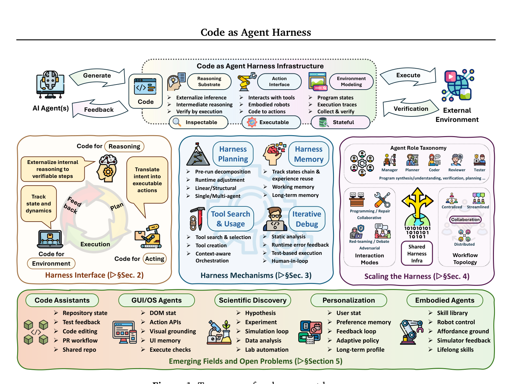
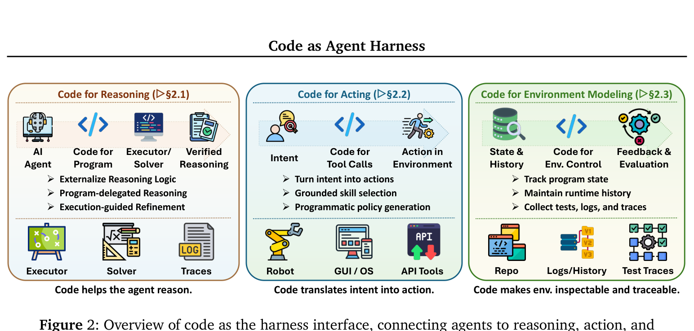
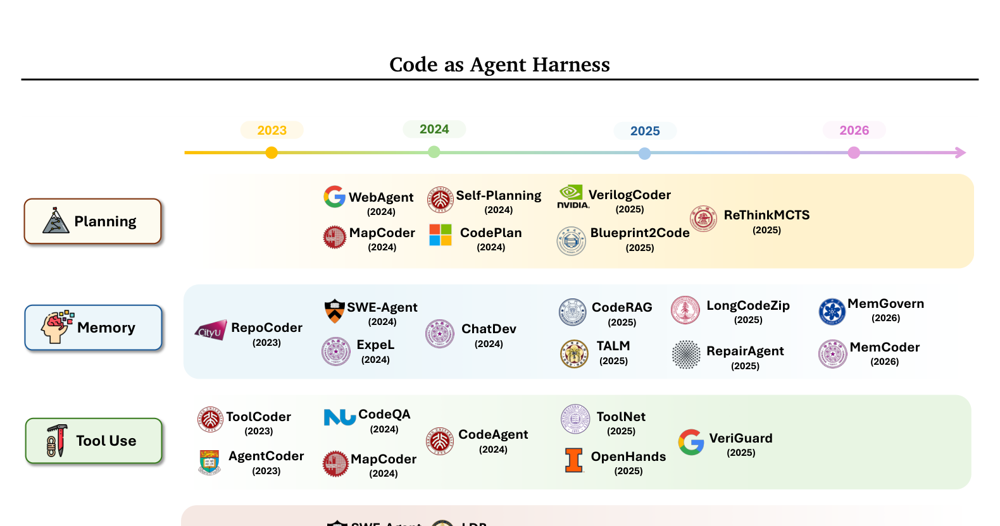
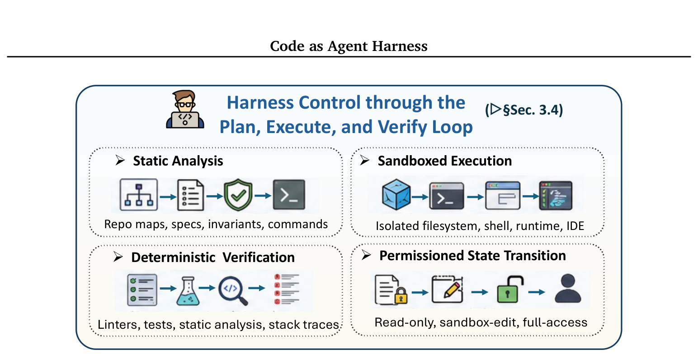
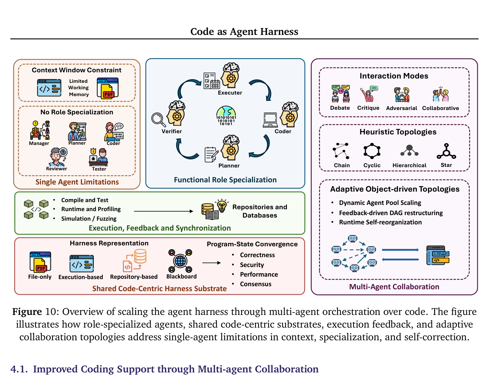
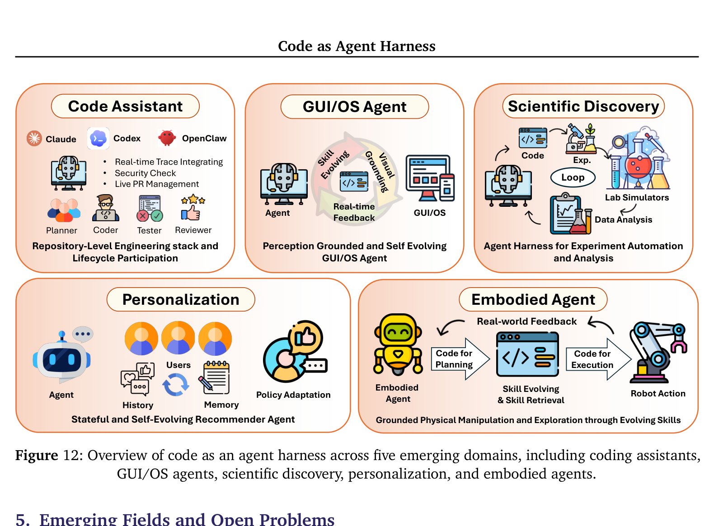

<!-- Generated by scripts/sync-wechat-articles.mjs. Do not edit manually. -->

> 本文同步自“现智研”微信推文工作区。发布日期：2026-06-22。来源：`articles/20260622/code_as_agent_harness.md`。

# 代码正在成为Agent底座

## 亮点

- 这篇 102 页综述提出一个统一视角：**代码不再只是 Agent 最后生成的结果，而正在成为 Agent 推理、行动、记忆、验证和协作的运行底座。**
- 作者把 Agent 能力拆成三个部分：模型自身能力、系统提供的 harness 基础设施，以及 Agent 在任务中持续创建和修改的代码产物。
- 代码能够成为 harness，是因为它同时具备三个关键属性：**可执行、可检查、有状态。**
- 论文用三层框架组织整个领域：接口层、机制层和多智能体扩展层。
- 对可靠 Agent 来说，真正关键的不是“模型会不会调用工具”，而是规划、沙箱、权限、状态、测试、日志和反馈如何构成闭环。
- 论文指出，多智能体系统最危险的问题之一不是 Agent 数量不足，而是不同 Agent 对共享代码状态的理解已经分叉，却没有被及时发现。
- 未来 harness 自身也会成为可学习、可进化的对象，但任何自我修改都必须通过回归测试、安全约束和可回滚机制。

最近两年，我们讨论 Agent 时经常把注意力集中在模型上。

哪个模型推理更强？

哪个模型会写更长的代码？

哪个模型在 benchmark 上得分更高？

但真实使用中经常出现一个现象：

**同一个模型，换一套外围系统，完成任务的可靠性可以完全不同。**

原因是，模型只是 Agent 的“大脑”。

真正让它能够读取文件、运行命令、调用工具、保存进度、检查结果、控制权限并持续工作的是外面的软件系统。

这层系统，就是 **agent harness**。

UIUC、Meta 和 Stanford 的研究者在预印本 **Code as Agent Harness** 中提出：

**代码正在从“模型要生成的对象”，变成“Agent 借以运行的基础设施”。**

## 先把三个概念分清楚

论文首先区分了长程 Agent 系统中的三个组成部分。

### 1. 模型内在能力

包括模型自身的：

- 推理
- 感知
- 规划
- 模拟
- 评估

这是基础模型本身提供的能力。

### 2. 系统提供的 harness 基础设施

包括：

- 工具和 API
- 文件系统
- 代码执行环境
- 沙箱
- 权限边界
- 记忆系统
- 校验器
- 日志和遥测
- 工作流和人工审批节点

这些组件把模型的输出连接到真实世界。

### 3. Agent 主动创建的代码产物

这是论文特别强调的一层。

Agent 在执行任务时会不断创建、运行、修改和复用代码对象，例如：

- 临时脚本
- 回归测试
- 配置文件
- API schema
- 可执行工作流
- 数据处理程序
- 任务计划文件
- 可复用技能
- 中间状态和执行轨迹

这些产物不只是最终结果。

它们会反过来帮助 Agent 思考、行动、保存状态和验证进度。

## 为什么是代码？

自然语言很灵活，但作为长程任务的运行底座，它有明显缺陷。

一句“帮我把项目部署好”，可能包含几十个隐含步骤。

如果所有过程都只存在于对话中，系统很难回答：

- 哪一步已经执行？
- 哪个文件被修改？
- 当前环境是什么状态？
- 哪个假设已经失效？
- 结果是否真的通过验证？

代码则提供了三个关键属性。

### 可执行

Agent 的意图可以变成实际操作。

脚本可以运行，API 可以调用，测试可以执行，工作流可以触发。

### 可检查

代码、diff、测试结果和日志都可以被人或其他 Agent 检查。

失败不再只是“感觉不对”，而可以具体定位到某个状态转移。

### 有状态

仓库、文件、数据库、日志和执行轨迹可以跨对话、跨会话保存。

Agent 不必每次都从聊天记录中重建整个世界。

这三点决定了代码可以成为 Agent 的操作介质，而不只是输出格式。

## 第一层：代码作为 Harness 接口

论文的第一层框架讨论代码如何连接模型和环境。

它把接口分成三个方向。

### 代码用于推理

模型不必在自然语言里完成所有计算。

它可以生成程序，把算术、符号推导、搜索或数据处理交给解释器执行，再读取结果继续推理。

这使中间步骤可以被验证。

形式化证明也是同一个思路。

Lean、Coq 等系统允许模型提出证明，而验证器负责检查每一步是否合法。

### 代码用于行动

当 Agent 需要操作外部系统时，代码成为行动接口。

例如：

- 调用 shell
- 编辑文件
- 操作浏览器或 GUI
- 调用科研数据库
- 控制机器人
- 提交 GPU 作业
- 调用实验设备

自然语言负责表达目标，代码负责把目标转换成具体动作。

### 代码用于环境建模

Agent 还需要知道环境当前是什么状态。

仓库、DOM 树、测试、模拟器、运行日志和执行 trace 都是可编程的环境表示。

Agent 可以通过它们观察：

- 哪些文件发生了变化
- 哪些测试失败
- 哪个服务正在运行
- 哪个对象可以被操作
- 某个动作之后环境是否按预期变化

## 第二层：让 Agent 能持续工作的 Harness 机制

有了代码接口，并不代表 Agent 就能可靠完成长任务。

它还需要一套维持运行的机制。

### 规划

规划不是模型脑中的一段思考，而应该成为可检查的控制对象。

例如：

- `PLAN.md`
- 验收标准
- 依赖图
- 待办列表
- 回滚点
- 验证命令

计划被写入文件之后，人类可以审查，子 Agent 可以消费，任务在上下文重置后也能恢复。

### 记忆与上下文工程

论文把记忆理解成状态管理，而不只是向量数据库。

Harness 需要决定：

- 哪些信息进入当前上下文
- 哪些信息压缩成摘要
- 哪些日志保留完整版本
- 哪些经验可以长期复用
- 哪些过期信息必须删除

真正重要的不是“记得更多”，而是让 Agent 在正确时刻拿到正确状态。

### 工具使用

工具不是随便调用的插件。

可靠 harness 必须管理：

- 工具 schema
- 参数校验
- 权限等级
- 执行环境
- 输出清洗
- 失败重试
- 高风险操作审批

例如读取文件和向生产环境部署服务，显然不应该拥有相同权限。

## Plan-Execute-Verify：可靠 Agent 的控制环

论文把规划、执行和验证统一成一个 **PEV 控制环**。

### Plan

把用户意图变成明确的状态变更契约：

- 要改什么
- 哪些约束必须保留
- 用什么方式验收
- 出错时如何回滚

### Execute

在受限环境中执行：

- 使用沙箱
- 限制文件和网络权限
- 记录实际命令
- 控制资源使用
- 对高风险动作要求确认

### Verify

用尽量确定性的信号检查结果：

- 编译器
- 单元测试
- 集成测试
- 静态分析
- 安全扫描
- 运行时监控
- 人工审核

这里最重要的观点是：

**可靠性来自受治理的状态转移，而不是更漂亮的提示词。**

## 第三层：多智能体如何共享代码底座

当系统从单 Agent 扩展到多个 Agent，代码会成为共享工作空间。

不同 Agent 可以承担：

- Manager
- Planner
- Coder
- Tester
- Reviewer
- Security checker

它们通过共享仓库、测试、日志、计划和执行状态协作。

但 Agent 越多，不代表系统越可靠。

论文指出，多智能体系统经常依赖对话历史隐式重建共享状态。

这会产生一个严重问题：

**每个 Agent 以为自己理解的是同一个项目，实际上它们看到的版本、假设和约束已经不同。**

例如：

- Planner 根据旧版本代码拆解任务
- Coder 已经改变 API
- Tester 仍在执行旧测试
- Reviewer 的反馈基于过期 diff
- 人类新增的约束没有同步到其他 Agent

这不是普通的“沟通不畅”。

它是共享状态失去一致性。

未来需要的不是更长的群聊记录，而是事务化共享状态：

- 明确读取和写入范围
- 标记版本依赖
- 检测语义冲突
- 合并后重新验证
- 支持回滚和审计

## 五类应用已经出现

论文把 code-as-harness 映射到五个应用领域。

### 编码助手

Claude Code、Codex、OpenHands、SWE-agent 等系统已经从代码补全转向仓库级任务执行。

### GUI 和操作系统 Agent

Agent 需要把视觉观察映射到可执行操作，并验证界面状态是否真的变化。

### 科学发现

代码串联假设、数据分析、模拟、实验流程和结果验证。

### 个性化系统

用户偏好被保存成可编辑状态，反馈不断修改后续策略。

### 具身 Agent

机器人把语言目标转成程序化动作，并通过视觉、力觉和模拟器反馈修正技能。

这些领域看起来差异很大，但共同点是：

**模型必须在一个持续变化的环境中行动，并对行动结果负责。**

## 七个尚未解决的问题

论文最后提出七个开放方向。

### 1. Harness 级评测

不能只看任务最后是否成功，还要测工具调用成本、恢复能力、状态一致性、安全性和可回放性。

### 2. 超越“测试通过”的语义验证

绿色测试不等于真正正确。

测试可能不完整，科学脚本可能使用了错误假设，GUI checker 也可能漏掉危险的中间动作。

### 3. Harness 自我进化不能引入回归

如果 Agent 能修改自己的提示词、工具、记忆规则和工作流，每次修改都必须像安全关键代码一样接受回归测试、灰度部署和回滚约束。

### 4. 事务化共享程序状态

多 Agent 需要同步的不只是文件，还包括计划、假设、测试、权限、记忆和用户意图。

### 5. 人在环安全与责任记录

人工审批不能只是偶尔弹出的确认框。

每次批准、拒绝和例外都应该成为可审计状态。

### 6. 多模态 Harness

截图、显微图像、分子结构、机器人传感器和实验读数，需要被保存为可查询、可验证的状态，而不是一次性塞入模型上下文。

### 7. 建立 Harness Engineering 的系统科学

未来需要像软件工程研究运行时、数据库和操作系统那样，系统研究 Agent 的上下文、工具、执行、反馈、权限和协作机制。

## 对科研 Agent 的启发

这篇综述对科研自动化尤其重要。

一个科研 Agent 是否可靠，不取决于它能不能生成一段看起来专业的结论。

真正的关键是：

- 文献来源是否可追踪
- 分析代码是否能执行
- 环境和版本是否被记录
- 原始数据是否保持不变
- 每张图能否回溯到脚本和输入
- 失败实验是否被保留
- 统计假设是否被验证
- 上传、发布或覆盖文件前是否有权限边界

我们现在使用的公众号工作流，本质上也已经是一个小型 harness：

- 手稿文件是输入状态
- Python 脚本负责 PDF 提取和图片处理
- Markdown 保存文章结构
- assets 目录保存可追踪配图
- dry-run 负责上传前验证
- 微信 API 完成最终状态转换
- media_id 是可审计结果

Agent 的价值不是“替人写完一切”。

而是把自然语言目标放进一套可执行、可验证、可恢复的工作系统。

## 也要看清边界

这是一篇综述和概念框架，不是一个已经证明优于所有 Agent 架构的新算法。

它提出的许多问题仍然没有统一解法。

此外，代码并不能表示所有现实状态。

人的意图、实验伦理、隐性知识、物理风险和科学意义，不能因为被序列化成字段就自动变得正确。

执行反馈也不是最终真理。

一段代码可以运行，一个测试可以通过，但研究结论仍可能是错的。

所以更准确的理解是：

**代码让 Agent 的行为更可执行、更可观察，但可靠性仍取决于验证器、权限、数据和人类判断。**

## 一句话总结

Code as Agent Harness 最重要的观点是：

**未来 Agent 的竞争不只发生在模型层，也发生在围绕模型构建的执行系统层。**

真正成熟的 Agent 不只是会生成答案。

它应该拥有一套能够保存状态、约束行动、运行工具、检查结果、协调多个角色并在失败后恢复的代码底座。

模型决定 Agent 能想到什么。

Harness 决定这些想法能否安全、可靠地变成现实。

## 参考信息

- 论文：<https://arxiv.org/abs/2605.18747>
- 项目主页：<https://code-as-harness.github.io/code-as-harness-webpage/>
- GitHub：<https://github.com/YennNing/Awesome-Code-as-Agent-Harness-Papers>
- 参考推文：<https://mp.weixin.qq.com/s/0IcK37qVQEpWG4q21OZt3w>

---

作者：HFLT_Agent

研究团队电子名片：<https://ydlongtao.github.io/Myblog/>

本文仅供学术交流与工具研究，不构成安全、工程或商业部署建议。

