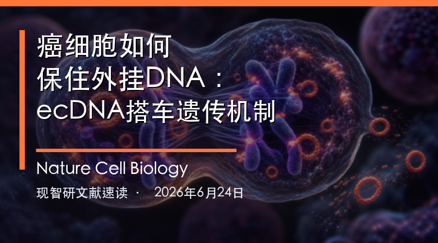
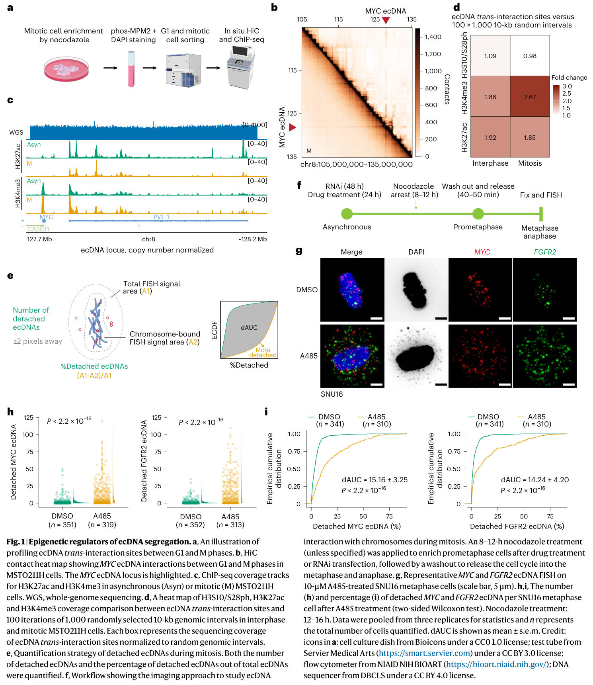
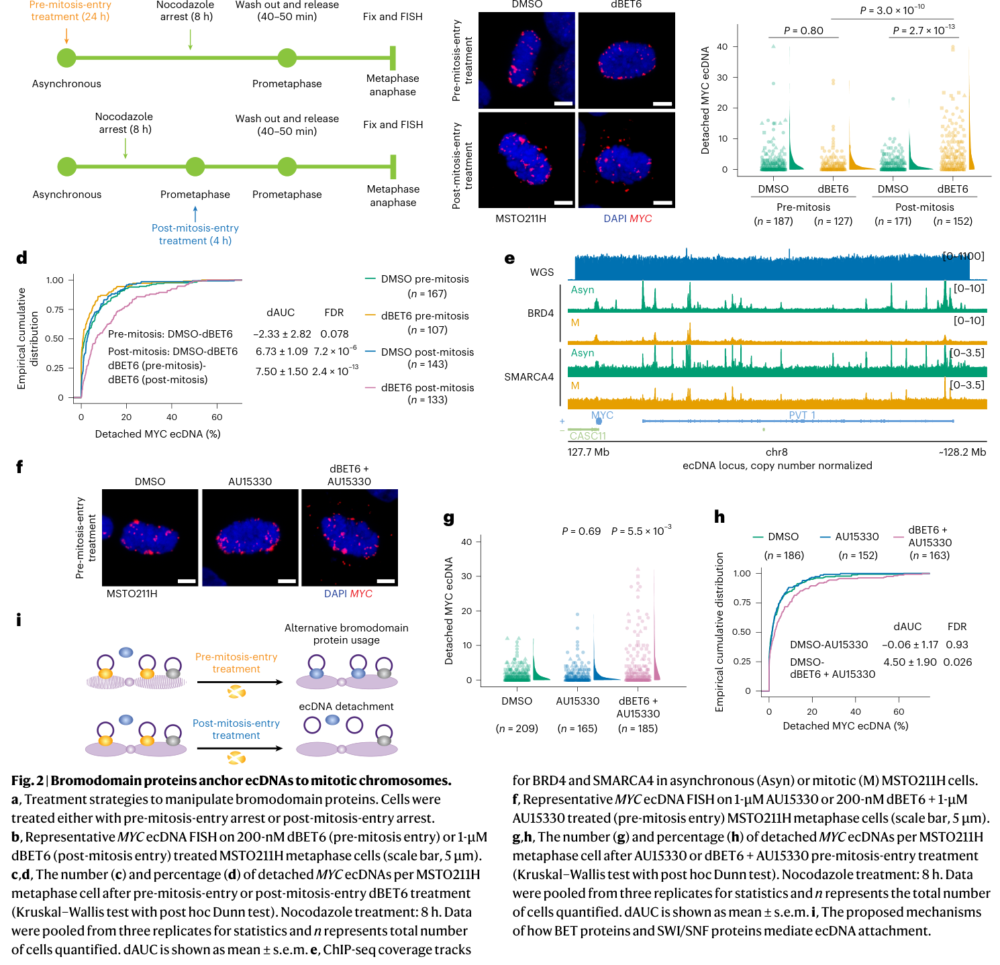
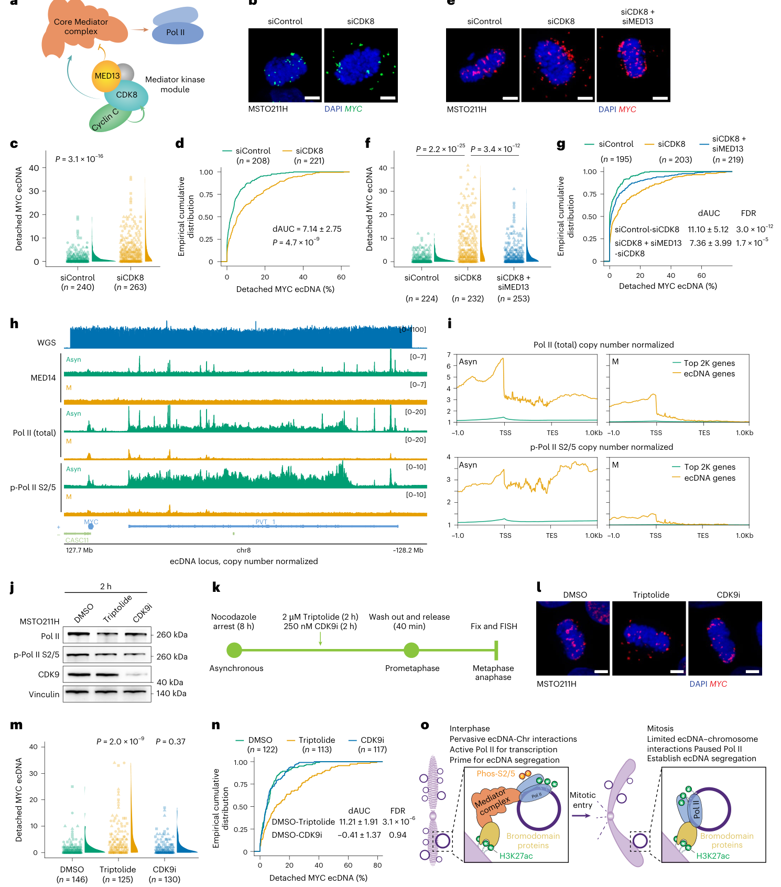
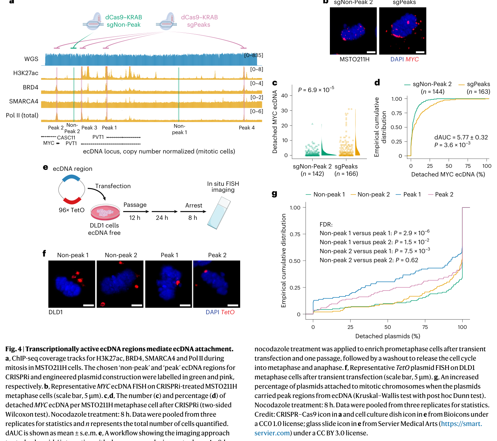
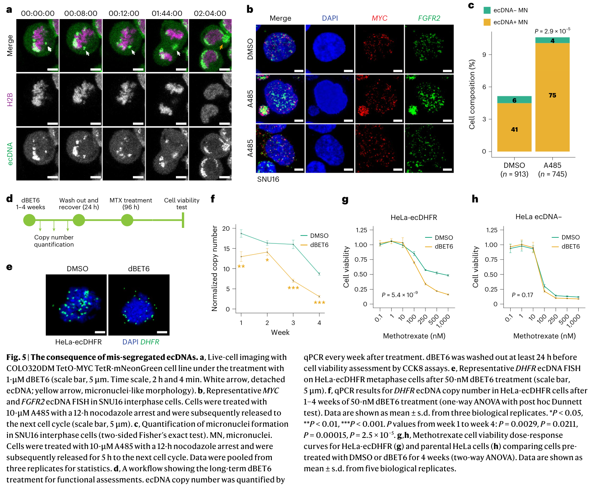

<!-- Generated by scripts/sync-wechat-articles.mjs. Do not edit manually. -->

> 本文同步自“现智研”微信推文工作区。发布日期：2026-06-25。来源：`articles/20260625/ecdna_segregation.md`。

# NCB- ecDNA搭车遗传

**癌细胞如何保住染色体外的“外挂DNA”**

---

**原文标题：** Cis and trans regulatory mechanisms of extrachromosomal DNA segregation  
**作者：** Yipeng Xie, Jun Yi Stanley Lim, Wenyue Liu, Collin Gilbreath, Xiaohui Sun, Kailiang Qiao, Yoon Jung Kim, Sihan Wu 等  
**通讯作者：** Yoon Jung Kim；Sihan Wu  
**单位：** UT Southwestern Medical Center  
**期刊：** Nature Cell Biology  
**发表时间：** 2026 年 6 月 24 日在线发表  
**DOI：** https://doi.org/10.1038/s41556-026-01982-0

---

## 一句话故事

这篇论文把 ecDNA 的遗传问题，从“随机漂浮”推进到“有机制搭车”。

作者发现，癌细胞里的环状染色体外 DNA，会借助 H3K27ac 标记的活跃染色质、bromodomain 蛋白、Mediator / Pol II 相关结构，以及 ecDNA 自身调控元件，在有丝分裂时挂靠染色体完成分配。

一旦这套系统被打断，ecDNA 可能被挤出细胞核，癌基因表达和耐药表型也随之下降。

---

## 故事性总览

ecDNA 是肿瘤基因组里很特殊的一类结构。

它不是正常染色体的一部分，而是一圈圈游离的环状 DNA。它常常带着 MYC、FGFR2、DHFR 这样的癌基因或耐药相关基因，拷贝数高，染色质开放，所以能把癌基因表达推得很高。

但 ecDNA 有一个看似致命的弱点：它没有着丝粒。

正常染色体在细胞分裂时，可以通过着丝粒连接纺锤体，被拉向两个子细胞。ecDNA 没有这套装置，理论上应该很容易在分裂中丢失。

现实却相反。很多癌细胞不仅能保住 ecDNA，还能利用它制造异质性。

一个子细胞分到更多 ecDNA，就可能获得更高癌基因表达、更强适应能力，或更明显的治疗耐受。下一轮分裂中，这种差异继续被筛选，肿瘤群体也因此更容易演化。

所以，这篇文章真正要回答的问题不是“ecDNA 是否重要”，而是：

**一个没有着丝粒的遗传单元，为什么还能被癌细胞一代代保留下来？**

---

## 1. ecDNA先找染色体上的“落脚点”

作者首先没有直接做药物处理，而是问了一个更基础的问题：

**ecDNA 在分裂时到底贴在哪里？**

他们在携带 MYC ecDNA 的 MSTO211H 细胞中做原位 HiC，并结合 ChIP-seq，比较 G1 期和有丝分裂期 ecDNA 与染色体的互作位置。

结果显示，ecDNA 的跨染色体互作不是随机分布，而是偏向带有活跃染色质标记的区域。其中最重要的是 H3K27ac。

H3K27ac 通常标记活跃增强子和启动子。论文发现，ecDNA 的互作位点在间期和有丝分裂期都富集 H3K27ac。相反，有丝分裂中普遍升高的 H3S10/S28ph 并没有出现类似富集。

这说明 ecDNA 要找的不是任意染色体表面，而是仍然开放、可接触、带有活跃调控特征的染色质区域。

接下来是功能验证。

作者用 A485 抑制 CBP/P300，从而降低 H3K27ac。结果，MYC 和 FGFR2 ecDNA 从有丝分裂染色体上脱离的比例明显增加。

长期结果更关键。在 MSTO211H 细胞中，2 μM A485 处理 3 周后，MYC ecDNA 拷贝数从 90.8 降到 10.3；按细胞倍增时间估算，约相当于每个细胞周期 14.9% 的 ecDNA 损失。

这一组结果把 H3K27ac 从“相关标记”推成了“功能支点”。

没有 H3K27ac，ecDNA 的搭车位置就不稳。

---

## 2. bromodomain蛋白像一组安全绳

H3K27ac 本身只是化学标记。标记不会自动把 ecDNA 和染色体粘在一起。

真正把两边连接起来的，是能读取乙酰化标记的蛋白。

论文把重点放在 bromodomain 蛋白上。它们是 H3K27ac 这类乙酰化标记的 reader，常见于增强子、启动子和转录调控网络。

作者发现，BET 家族蛋白和 SWI/SNF 相关 bromodomain 蛋白都参与 ecDNA 锚定，而且有互补关系。

这点很关键。

如果只干扰一类蛋白，另一类可能补上部分功能；联合干扰时，ecDNA 从染色体上脱离得更明显。也就是说，癌细胞保存 ecDNA 的系统不是一个单点开关，而是一组冗余挂钩。

论文中还有一个时间差现象。

同样是干扰 bromodomain 蛋白，发生在细胞进入有丝分裂前，和进入有丝分裂后，结果不同。提前干扰时，细胞还可能重新组织替代连接；一旦进入有丝分裂，ecDNA 的锚定方式已经相对定型，再移除关键 reader，ecDNA 更容易掉下来。

这像一套临时搭建的安全绳。

H3K27ac 提供染色体侧的落脚点，bromodomain 蛋白读出这个位置，并把 ecDNA 拉住。多个 reader 互相补位，让 ecDNA 在分裂期不至于轻易丢失。

---

## 3. 转录机器不一定在转录，也可能在当桥

这篇论文最有意思的转折，来自 Mediator 和 RNA Pol II。

直觉上，Mediator 和 Pol II 属于转录系统。它们参与增强子、启动子和基因表达调控。既然 ecDNA 上有高活性癌基因，那么这些转录机器参与 ecDNA 分离，似乎也不奇怪。

但作者看到的结果更微妙。

在间期，Mediator 复合体确实参与 ecDNA 与染色体接触。干扰 Mediator 相关组件会影响 ecDNA 分离。

到了有丝分裂期，情况变了。

Mediator 和活跃形式的 Pol II 从 ecDNA 上消失，提示 ecDNA 在分裂期大体处于转录沉默状态。也就是说，ecDNA 并不是一边高强度转录，一边完成分配。

那么，Pol II 为什么还重要？

论文给出的解释是：关键不是“正在转录”，而是“物理桥接”。

有丝分裂期仍保留在 ecDNA 上的，是非活跃或停顿状态的 Pol II。它不再主要负责合成 RNA，而是和 bromodomain 蛋白一起，把 ecDNA 锚定到 H3K27ac 标记的有丝分裂染色体区域。

在这个场景里，Pol II 不只是表达机器的一部分。

它也可能是 ecDNA 搭车系统的一根结构梁。

---

## 4. ecDNA自己也带着“登车口”

如果只看染色体一侧，故事还不完整。

ecDNA 不是被动被染色体接住的一圈 DNA。它自己也携带启动子、增强子和其他调控元件。这些区域在间期参与癌基因表达，在分裂期也可能成为锚定接口。

作者用 CRISPRi 靶向 ecDNA 上的调控峰区，包括 MYC 和 PVT1 相关区域。

结果显示，被靶向的 peak 区域越多，ecDNA 脱离越明显。

他们还做了一个更直接的实验：把 ecDNA 上的 peak 区域构建进质粒，再放入没有 ecDNA 的细胞中。

结果，这些 peak 区域能增强质粒与有丝分裂染色体的附着。

这说明 ecDNA 的分离由两端共同决定。

- **trans 侧：** 染色体上的 H3K27ac 区域，以及读取它的蛋白环境。
- **cis 侧：** ecDNA 自身携带的启动子、增强子和调控峰区。

ecDNA 不是被动漂浮物。它带着自己的登车口，去寻找染色体上的落脚点。

---

## 5. 搭车失败后，癌细胞会失去一部分武器

机制研究最容易停在模型图。

这篇文章继续往前问了一步：

**如果 ecDNA 没搭上车，会怎样？**

结果是，错分配的 ecDNA 可能被挤出细胞核，进入细胞质，形成类似 micronuclei 的结构。

长期来看，这些 ecDNA 会逐渐减少。随之下降的，是 ecDNA 携带基因的表达。

这一步把“分离机制”连接到了“癌细胞表型”。

在 MYC / FGFR2 ecDNA 模型中，干扰 H3K27ac 或 bromodomain 相关机制，会增加 ecDNA 脱离和胞质 ecDNA 信号。

在 HeLa-ecDHFR 模型中，DHFR ecDNA 与甲氨蝶呤耐受相关。论文显示，dBET6 处理会加速 DHFR ecDNA 丢失，并降低 DHFR 表达；相应地，细胞对甲氨蝶呤重新变得更敏感。

这个结果很有启发，但不能过度外推。

H3K27ac、BET 蛋白、Mediator 和 Pol II 都不是 ecDNA 专用零件。它们参与大量正常细胞过程。不同癌种、不同 ecDNA、不同 bromodomain 蛋白依赖关系也可能不同。

错分配 ecDNA 进入胞质后如何被清除，也还需要继续研究。

但方向已经很清楚。

过去我们常问：ecDNA 上带了什么癌基因？

现在还要问：癌细胞靠什么把这些 ecDNA 保留下来？

如果 ecDNA 是癌细胞的外挂遗传系统，那么它也有维护成本。只要破坏锚定、分离和继承，癌细胞就可能失去一部分高癌基因表达和治疗耐受的基础。

---

## 结尾

这篇文章的价值，在于把 ecDNA 从“癌基因扩增载体”推进成了“可被拆解的遗传机制”。

癌细胞的危险，并不只是多了几份癌基因。

更危险的是，它找到了一套办法，把这些额外的癌基因一代代保留下来，并在治疗压力中继续筛选。

ecDNA 的搭车遗传，就是这套办法的一部分。

---

## 参考信息

- 论文：Cis and trans regulatory mechanisms of extrachromosomal DNA segregation
- 期刊：Nature Cell Biology，Published 24 June 2026
- DOI：https://doi.org/10.1038/s41556-026-01982-0
- Nature 页面：https://www.nature.com/articles/s41556-026-01982-0

---

作者：HFLT_Agent

研究团队电子名片：https://ydlongtao.github.io/Myblog/

本文仅供学术交流与科研观察，不构成医学建议或治疗推荐。

